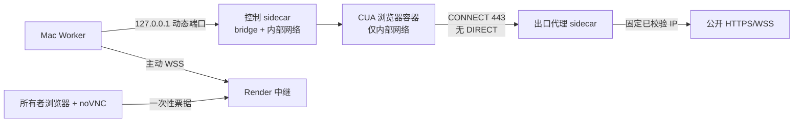

# Artigen 浏览器 Agent：SSRF 威胁模型、Beta 发布与回滚手册

更新日期：2026-08-07

## 1. 发布边界

浏览器 Agent 使用硅基流动云端 `Qwen/Qwen3-8B` 和 Mac 上的 Docker/CUA Worker，不下载本地模型，也不依赖 CUA 云账号。当前发布等级只能称为 **Production Beta**：Render Free 会休眠或重启，Mac 合盖、关机、退出登录或 Docker Desktop 停止时，线上任务只能排队，不能承诺 24×7 可用。

浏览器公开能力只有在以下状态同时为真时才能开启：

- `browserReady=true`
- `egressVerified=true`
- `desktopRelayReady=true`
- `workerOnline=true`
- 数据库已执行 `020_agent_secure_browser_relay`
- Production 使用共享 S3，不允许交付物回退到 Worker 本机目录

## 2. 受保护的数据与主要威胁

需要保护的数据包括 Artigen 用户身份、任务输入、已保存的单站登录会话、任务资产、交付物、数据库与对象存储凭据，以及 Mac/Render 的运行环境。

主要威胁：

1. 恶意 URL、重定向或 DNS 重绑定访问 localhost、RFC1918、链路本地、保留地址、云元数据或宿主机服务。
2. Chromium 通过 QUIC、WebRTC、隐式代理绕过或 `DIRECT` 回退绕过 HTTP CONNECT 代理。
3. 页面提示词注入诱导模型改变任务、读取秘密、上传数据或执行外部状态变更。
4. 模型读取或填写密码、OTP、验证码，或者把敏感内容写入上下文、事件、日志和截图摘要。
5. 远程桌面 URL 泄漏、票据跨用户使用、过期票据重放或伪造 Worker 接管会话。
6. 下载恶意文件、超大文件，或上传用户未授权的本机/沙箱文件。
7. Worker、Render 或网络重启后重复提交、重复扣费、遗留容器或泄漏登录会话。

## 3. 沙箱网络结构



每个任务创建三个容器和一个独立内部网络：

- CUA 浏览器容器：只连接内部网络，没有默认 Docker 出口，没有宿主机公开端口。
- 出口代理 sidecar：连接内部网络和 Docker bridge，是浏览器访问公网的唯一出口。
- 控制 sidecar：固定转发 CUA API、Web VNC 和 raw VNC；宿主机映射强制绑定 `127.0.0.1`。

任务成功、失败、取消、超时或 Worker 恢复清理时，会删除三个容器和临时网络。

## 4. SSRF 与出口控制

出口代理只接受 HTTPS/WSS 的 CONNECT 443，并执行以下检查：

- 拒绝 HTTP、任意其他端口、IP 字面量、URL 用户名密码和无效 hostname。
- 解析全部 A/AAAA；只要任一结果属于私网、环回、链路本地、保留地址、云元数据、IPv4 映射 IPv6 或 NAT64 映射私网，整次连接拒绝。
- 使用校验过的 IP 建立上游 TCP 连接，不再次按 hostname 解析，防止检查后 DNS 重绑定。
- 每个新 CONNECT、页面导航和顶层跳转都重新检查。
- 顶层页面必须精确匹配用户提交的 HTTPS `allowedOrigins`；公共 HTTPS CDN 子资源可以经同一安全代理加载。

Chromium 固定启用代理，且禁用 QUIC、非代理 WebRTC、后台联网和隐式 localhost 代理绕过。`AGENT_SANDBOX_EGRESS_POLICY=restricted-v1` 只有在 doctor 主动证明“公开 HTTPS 可达、直接出网失败、私网目标失败”后才算成立。

## 5. 页面交互与人工确认

- 普通同 Origin 导航和只读 DOM 检查可以自动执行。
- 普通表单填写、提交、发送、发布、删除、权限修改和其他可能改变外部状态的操作，执行前必须创建绑定具体动作的审批。
- 密码、OTP、验证码、安全警告和最终密码修改只能由所有者远程接管；模型暂停，不能读取、填写或记录这些字段。
- 购买、安全绕过、云元数据、任意端口和用户未授权上传始终禁止，不能通过普通审批放行。
- DOM 证据包括 tag、input type、autocomplete、accessible name、form method/action、链接目标和是否 submit，不能只根据按钮文字判断风险。
- 页面疑似提示词注入时仍可读取，但后续交互自动升级为人工确认。
- 下载只进入 `/tmp/artigen-workspace/.artigen/downloads-staging`，检查大小并通过 ClamAV 后才能移动到工作区；上传只允许任务开始时由该用户提交的资产。

## 6. 登录会话与远程桌面

保存会话时只允许一个精确 HTTPS Origin。会话用 `AGENT_PAYLOAD_ENCRYPTION_KEY` 做 AES-256-GCM 加密，并将附加认证数据绑定用户、profile ID 和 Origin；默认 30 天到期，用户可以撤销。

前端不会获得 raw VNC 地址。接管流程：

1. 任务因为密码/OTP/验证码进入 `waiting_user`，并保留只监听回环地址的沙箱。
2. 所有者调用 `POST /api/agent-runs/:runId/desktop-ticket`。
3. 后端生成 256 位随机票据，只在数据库保存 SHA-256；票据绑定用户、任务、审批、Worker 和沙箱，60 秒到期。
4. 浏览器使用票据连接 Render viewer WebSocket；消费成功后票据不可重放。
5. Mac Worker 轮询已消费票据，使用 `AGENT_WORKER_RELAY_SECRET` 的 HMAC 声明身份，再把本地 raw VNC 与 Render WSS 桥接。
6. 所有者结束接管后任务重新排队；模型只看到登录后的普通页面状态，不得到密码、OTP 或旧票据。

跨用户、过期、重放、错误 Origin、伪造 HMAC、错误 Worker/沙箱绑定都会被拒绝。任务结束、暂停、退出、服务断线或所有者不匹配时立即关闭中继并撤销票据。

## 7. 配置与秘密

可提交的变量名位于 `backend/.env.example`。真实值不得写入 Git、Markdown、聊天或日志。

```dotenv
AGENT_MODEL_PROVIDER=siliconflow
AGENT_MODEL_NAME=Qwen/Qwen3-8B
AGENT_BROWSER_MODE=full-approval-v1
AGENT_SANDBOX_EGRESS_POLICY=restricted-v1
AGENT_WORKER_ID=稳定且环境唯一的 Worker ID
AGENT_WORKER_RELAY_URL=wss://后端/api/agent-desktop/worker
AGENT_WORKER_RELAY_SECRET=仅存平台 Secret 或 macOS Keychain
AGENT_PUBLIC_CAPABILITIES=files,shell,browser
```

本机 DEV 的中继秘密存放在 macOS Keychain，service 为 `artigen-agent-dev-relay`、account 为 `AGENT_WORKER_RELAY_SECRET`。Production 使用独立 Keychain 标签，由 `backend/scripts/run-agent-worker-macos.js` 读取生产数据库、S3、载荷加密、硅基流动和中继秘密。文档只记录标签，不记录值。

## 8. DEV 验收与发布顺序

1. 运行 `pnpm doctor:agent`，确认数据库 020、镜像 `toolchain=v2`、Qwen、Docker、出口探针和 Worker 心跳。
2. 运行后端全量测试、Agent 质量集、前端单元/类型/构建和 Chromium E2E。
3. 备份 DEV 数据库，部署 `dev`，让 Render 启动流程带 advisory lock 执行迁移至 020；失败就停止部署。
4. 在 DEV 实测：公开网页读取、跨 Origin 阻断、登录接管、会话保存/恢复/撤销、Markdown+PDF 交付、共享 S3 下载。
5. 初始只给站点所有者账号开放。观察队列、失败率、容器清理和对象下载后，再扩大到少量 Beta 用户。
6. 备份生产 Neon 后将已验收的 `dev` 合入 `main`，把生产 Render 部署分支从旧分支改为 `main`，继续保持手动部署。
7. 生产 `/readyz`、Worker 四项状态和线上真实交付任务全部通过后，才设置生产 `AGENT_PUBLIC_CAPABILITIES=files,shell,browser`。

## 9. 回滚

优先采用能力回滚，不先回滚数据库：

1. Render 立即设置 `AGENT_PUBLIC_CAPABILITIES=files,shell`，保留文件 Agent，停止创建新浏览器任务。
2. 停止 Production Mac Worker LaunchAgent；队列中的任务保留，活动任务按租约回收，不手工重复提交。
3. 如中继异常，撤销/轮换 `AGENT_WORKER_RELAY_SECRET` 并重启 Render 与 Worker，旧 HMAC 立即失效。
4. 如会话加密密钥疑似泄漏，停止浏览器能力，撤销已保存 profile，轮换密钥；不要尝试用新密钥读取旧会话。
5. 如对象存储异常，保持 Production Agent 关闭；Production Readiness 不允许回退到本地文件。
6. 应用回滚到上一个已验证提交。迁移 020 只新增表/列，默认保留；除非完成数据库备份并确认没有新票据/审计数据，否则不要执行 destructive down migration。

回滚后必须确认：活动中继为 0、临时容器/网络已清理、旧票据不可用、没有重复扣费，并在发布记录中写明提交、时间、原因和恢复条件。

## 10. 当前验收记录

本机已确认：数据库迁移 020、Qwen3-8B Provider、Docker/CUA `toolchain=v2`、主动出口探针、浏览器安全代理、loopback 控制端口、票据哈希/重放/跨用户/HMAC 测试和前端类型检查。

| 日期 | 环境 | 证据 | 结果 |
|---|---|---|---|
| 2026-08-07 | 本机 DEV | run `1dfa16bf-49a4-428b-a942-ef3e090258f3` | `succeeded`；受限浏览、MD+PDF、两项验证 passed、轨迹 100、容器/网络清理 |
| 2026-08-07 | 本机 DEV | run `3ddfdc37-91d9-462d-af70-e8ebaf812ef2` | viewer 收到 `RFB 003.008`；票据 hash-only、consumed/started/closed；无真实凭据；沙箱清理 |
| 2026-08-07 | 本机 DEV | runs `0cc3eca1-a22e-4067-8167-931d660f0b2b`、`3c203a72-a088-4c5d-9afa-1b60f9d68a40` | 单 Origin profile 加密保存、恢复后 `last_used_at` 更新、撤销后密文覆盖且列表不可见；无真实登录数据 |
| 2026-08-07 | Render DEV + Neon + Mac Worker | run `f32c30bf-ed26-4fc9-aa0a-0daaa878ca24` | `succeeded`；四项 Worker 状态 true；restricted-v1 浏览；MD/PDF 验证 passed；两项资产均为 S3，跨进程读回字节数和 SHA-256 一致；容器/网络清理 |
| 2026-08-07 | Render DEV + Neon + Mac Worker | run `06035a9d-b19f-4e1d-ba73-c58fa954fff8` | Qwen 主动请求 blocked 密码接管；任务停在 `waiting_user`；60 秒票据 consumed/started/closed；viewer 收到本机 VNC `RFB 003.008`；无真实凭据；容器/网络清理 |
| 2026-08-07 | Render DEV `af50290` + Neon + Mac Worker | run `d093a36c-37e4-47ff-9f7b-8cc3fb7ecf1f` | PR #9 合入后的重复验收；blocked 审批、60 秒票据、Render WSS、Mac VNC `RFB 003.008` 和关闭清理再次通过；无真实凭据 |

远程烟测前一次 run `e0698848-7a7f-4083-b398-03eb5e6c7dbb` 安全失败于 `AGENT_MODEL_PARALLEL_CALLS_UNEXPECTED`，证明 Qwen3-8B 可能忽略 `parallel_tool_calls=false`。运行时现只保留首个调用并逐轮执行，保证每个工具调用都单独通过策略和审批；新增回归测试后，上表远程 run 完整通过。

Qwen3-8B 的云端工具集合同时显式提供 `request_user_approval`。模型发现密码、OTP、CAPTCHA 或安全警告时可以创建 blocked takeover，而不必尝试填值；未消费的审批会保存加密断点并把 run 留在 `waiting_user`，由一次性桌面票据接管。

远程接管前一次 run `1b14c330-e83f-4472-a35c-d1ccf8eaec1f` 暴露了两个真实运维问题：Neon 瞬时连接超时触发 pg-boss 未处理 `error`，以及 Render/Keychain 中继密钥不一致。租约恢复已证明 Worker 重启后不会重复创建 run；运行时现显式监听 pg-boss `error`/`warning`，中继密钥已通过 Keychain 对齐并轮换，随后用上表 run 重测通过。任何密钥值都不记录在本文档、日志或 Git 中。

DEV 网页端真实账号登录、远程会话恢复/撤销和 Production Agent `/readyz` 仍未记录为通过；不能仅凭 DEV 核心链路结果宣称 Production Agent 已上线。
