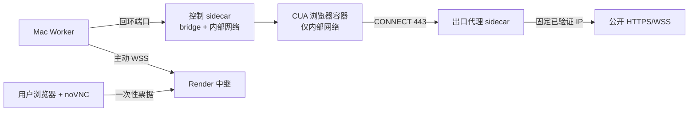

# Artigen 浏览器 Agent 安全模型

本文定义浏览器、沙箱、网络、审批、远程桌面、会话、父子 Agent、文件和回执的长期安全边界。发布步骤和实时状态分别见运维手册与正式 Handoff。

## 1. 受保护对象

- 用户身份、会话与授权；
- prompt、附件、项目和沙箱工作区；
- 保存的单站浏览器 profile；
- 数据库、S3、Provider 与 Worker Secret；
- 钱包、hold、预算、工具/模型回执；
- 生成文件、图片、来源和验证记录；
- Mac、Docker、Render 和远程桌面通道。

安全目标是：未经用户授权不访问资源、不改变外部状态、不泄漏内容、不重复副作用、不重复收费，并且失败时能够证明收口状态。

## 2. 主要威胁

1. SSRF、重定向或 DNS 重绑定访问环回、私网、链路本地、保留地址、云元数据或宿主机服务。
2. Chromium 经 QUIC、WebRTC、隐式 bypass 或 `DIRECT` 回退绕过代理。
3. 页面提示注入诱导模型改变任务、外传数据、读取秘密或执行未授权操作。
4. 模型读取或填写密码、OTP、验证码、付款和安全警告。
5. 桌面票据泄漏、跨用户使用、过期重放或伪造 Worker。
6. 恶意下载、像素炸弹、病毒、错误 MIME 或上传非授权文件。
7. Worker/数据库/网络重启造成重复工具副作用、重复结算或遗留沙箱。
8. 子 Agent 越过父任务授权，获得浏览器、图片、连接器、审批或最终交付权。
9. 模型通过重复计划、Shell、产物声明或来源纠错循环持续消耗预算。
10. 不完整测试、合成占位或旧 SHA 报告被误用为发布证据。

## 3. 沙箱与网络结构

- CUA 容器没有默认 Docker 出口，不公开宿主机端口。
- 出口代理是浏览器访问公网的唯一通道。
- 控制 sidecar 的宿主机映射只绑定回环地址。
- 每个 Run 使用独立工作区、容器和临时网络。
- 成功、失败、取消、超时和恢复清理都必须删除对应临时资源。

## 4. SSRF 与出口控制

受限出口只接受 HTTPS/WSS 的 CONNECT 443：

- 拒绝 HTTP、其他端口、IP 字面量、URL 用户名密码和非法 hostname；
- 解析全部 A/AAAA；任一结果属于私网、环回、链路本地、保留、云元数据、IPv4 映射 IPv6 或 NAT64 私网映射时整次拒绝；
- 使用已验证 IP 建立上游连接，不在校验后再次按 hostname 解析；
- 每个 CONNECT、导航和顶层跳转重新检查；
- 顶层页面必须匹配任务允许的 HTTPS Origin；公共 HTTPS 子资源仍经过同一安全代理；
- 禁用 QUIC、非代理 WebRTC、后台联网和隐式 localhost bypass；
- 代理异常时 fail-closed，不能回退 `DIRECT`。

`restricted-v1` 只有在主动探针同时证明公开 HTTPS 可达、直接出网失败、私网目标失败后才成立。

## 5. 页面提示注入

- 网页内容永远是未信任数据，不是系统或用户指令。
- 页面要求改变目标、忽略策略、读取秘密、上传文件或执行外部操作时，不改变原任务授权。
- DOM 观察与来源证据记录页面事实，但不把页面文字提升为工具权限。
- 疑似提示注入后，后续交互升级为审批或停止；不能因“页面要求”自动提交。
- 来源必须来自当前 Run 实际观察的精确 URL；模型自行补充未访问来源会被验证器拒绝。

## 6. 审批与禁止动作

允许自动执行：

- 同 Origin 普通导航；
- 只读 DOM、截图、下载前检查；
- Run 授权范围内的离线文件处理。

需要一次性审批：

- 表单提交、发送、发布、删除；
- 权限、账号、订阅或外部状态修改；
- 上传已授权输入之外的内容；
- 其他可能产生不可逆外部影响的动作。

始终禁止由模型执行：

- 读取/填写密码、OTP、验证码；
- 最终付款或购买决定；
- 绕过安全警告；
- 访问云元数据、任意端口或用户未授权文件；
- 把普通审批扩展为会话之外的持续授权。

审批绑定用户、Run、Origin、动作类型和规范化参数，消费一次后不可重放。

## 7. 远程桌面

1. 模型发现敏感登录步骤后暂停到 `waiting_user`。
2. 所有者请求短时随机桌面票据；数据库只保存 hash。
3. 票据绑定用户、Run、审批、Worker 和沙箱，过期或消费后失效。
4. 浏览器通过 Render viewer WebSocket 连接；前端不获得 raw VNC 地址。
5. Worker 使用独立 HMAC 身份主动连接中继，再桥接本机回环 VNC。
6. 用户归还控制后模型只观察登录后的普通页面状态，不获得敏感输入。

跨用户、跨 Run、过期、重放、错误 Origin、错误 Worker/沙箱或伪造 HMAC 全部拒绝。断线、取消或任务终态立即关闭中继和票据。

## 8. 浏览器会话

- profile 只允许一个精确 HTTPS Origin；
- 使用 payload 密钥进行 AES-256-GCM 加密，AAD 绑定用户、profile 与 Origin；
- 默认按产品保留期到期，用户可提前撤销；
- 撤销后密文不可继续恢复，旧 Cookie 不写入日志、事件或交付物；
- profile 不能跨用户、跨 Origin 或自动授予外部副作用权限。

## 9. 下载、上传和图片

下载：

- 先进入隔离 staging；
- 检查大小、MIME、magic bytes 和病毒；
- 通过后才能进入 Run 工作区；
- 可执行内容、超限文件或校验失败内容拒绝。

上传：

- 只允许该用户为本任务授权的资产；
- 核对数据库所有权、用途、MIME、大小和哈希；
- 子 Agent 不能自行新增上传来源；
- 未经审批不把沙箱生成内容发送到外站。

图片：

- 只允许 Kolors Provider 路径；
- 参考图上限在 Provider 调用前验证；
- 结果必须解码并检查像素、字节、MIME 与哈希；
- 重新从 S3 读取一致后才可结算和交付。

## 10. 父子 Agent 权限

- 子 Agent 的授权是父 Run 权限、任务输入和子 Agent 固定能力的交集。
- 子 Agent 只使用离线 shell/files/update_plan 等明确工具。
- browser、desktop、integration、Kolors、审批和最终产物声明只属于父 Agent。
- 子 Agent 不能创建更深层子 Agent，也不能扩大 allowed Origins 或预算。
- 父 Agent 必须重新验证子 Agent 输出，不能把子 Agent 的文字声明直接当作来源或文件证据。
- 单个子任务失败不自动授权重试副作用，也不允许伪造父任务成功。

## 11. 租约、回执与重复执行

- Run、模型调用和工具调用使用持久租约、epoch/call ID 与回执。
- 工具副作用在沙箱记录 started/done；恢复时只复用能够证明完成且参数一致的结果。
- 已释放预算只有在 received/consumed 回执证明实际费用时才能恢复。
- ambiguous 回执不得自动重放或重新收费，保持人工恢复/fail-closed。
- 相同脚本、相同成功动作、相同失败动作和未解决 artifact 纠错均有服务端循环限制。
- Worker、数据库或 campaign lock 断连时停止新 dispatch，不通过重连重新获得旧 gate。

## 12. 预算与结算

- 报价、预算上限和 hold 由服务端决定，客户端不能提交价格。
- Provider/工具开始前预留预算，所有并发调用共享父 Run 上限。
- 只有验收与资产持久化通过后结算一次。
- 失败、取消、超时和未验证产物释放未结算 hold。
- 账本、hold、receipt 和 audit 记录不可通过直接删除或钱包更新绕过。

## 13. 日志与隐私

允许记录：

- opaque 对象引用、状态码、工具名、耗时、枚举、字节数和哈希；
- 脱敏错误类别、租约/回执状态和验证结论。

禁止记录：

- 密码、OTP、验证码、Cookie、Token 和 Secret；
- 原始 prompt、用户输入、完整页面内容、图片/文件 URL；
- 真实邮箱、用户标识、余额、订单和桌面票据；
- 数据库连接串、Keychain 值或 Environment Export。

## 14. 验证与发布

安全单元/集成测试至少覆盖：

- 私网、重绑定、IP 字面量、错误端口和无 `DIRECT` 回退；
- 审批绑定、一次性消费、禁止动作；
- 桌面票据过期、重放、跨用户和伪造 Worker；
- profile 加密、单 Origin、撤销与过期；
- 恶意下载、上传所有权、图片和 S3 回读；
- 父子 Agent 能力交集；
- 租约丢失、ambiguous 回执、重复副作用和预算收口；
- 中断后的 Run、hold、queue、subagent 和沙箱清理。

Runtime V2 生产放行还要求完整 exact-SHA 真实 campaign 与图片匿名盲审。确定性测试、局部 smoke 或“配置已开启”都不能替代真实证据。

操作与回滚见 [`AGENT_OPERATIONS_RUNBOOK.zh-CN.md`](./AGENT_OPERATIONS_RUNBOOK.zh-CN.md)；生产发布见 [`PRODUCTION_RUNBOOK.zh-CN.md`](./PRODUCTION_RUNBOOK.zh-CN.md)。
