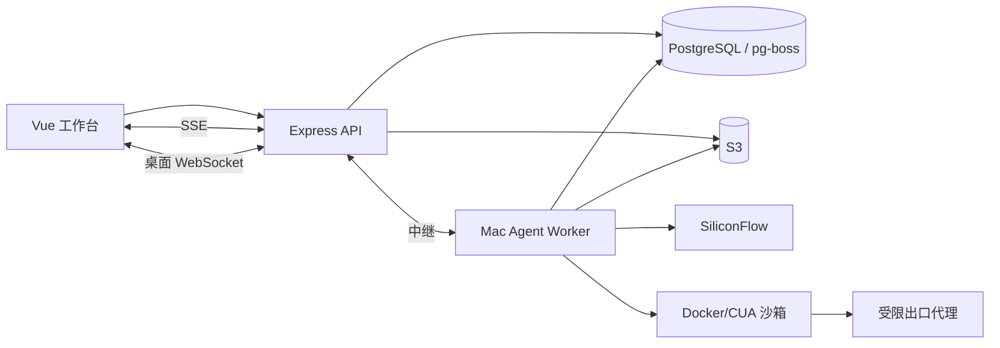

# Artigen Agent 运维手册

本文说明 Mac Worker、Docker/CUA、队列、对象存储、图片、子 Agent、Runtime 验收和故障处理。动态生产/DEV 状态以 `/api/meta`、`/readyz` 和 `/api/agent/status` 为准。

## 1. 运行架构



- API 创建报价、冻结预算、Run、审批、事件和桌面票据。
- PostgreSQL/pg-boss 持久排队；Worker 主动领取，不从公网暴露本机端口。
- Worker 创建 Run 私有 CUA、出口和控制容器，执行 browser/shell/files/LibreOffice/图片工具。
- 产物验证后写入共享 S3，数据库保存所有权和校验元数据。
- 文字与工具决策只使用 `Qwen/Qwen3-8B`；图片只使用 `Kwai-Kolors/Kolors`。

## 2. 前置条件

本机 Worker 需要：

- macOS 当前用户保持登录；
- Node.js 24、pnpm 10；
- Docker Desktop 正常；
- 项目指定的 Python/CUA 工具链；
- 对应环境的 PostgreSQL、S3、payload 加密、Provider 和桌面中继 Secret；
- 受控网络能够访问数据库、S3、SiliconFlow 和 Render。

不需要 CUA 云账号，也不在文档中保存 Docker、数据库、S3 或 Provider 的真实凭据。

生产和 DEV 使用完全独立的数据库、S3 命名空间、Worker ID、relay secret、Keychain 项目和 LaunchAgent 配置。

## 3. 模型与能力

允许能力由 API 配置、Worker readiness 和任务授权交集决定：

- `files`
- `shell`
- `browser`
- `generate_images`
- `subagents`

环境变量或数据库记录声明能力不等于实际 ready。公开状态只有在 Worker 心跳、CUA 镜像、浏览器、出口探针、桌面中继、对象存储和 Provider 全部满足对应条件时才为真。

模型硬边界：

- `AGENT_MODEL_PROVIDER=siliconflow`
- `AGENT_MODEL_NAME=Qwen/Qwen3-8B`
- 图片模型由服务端 allowlist 固定为 Kolors
- 客户端不能提交 Runtime 版本或内部模型 ID

## 4. 配置与秘密

可提交的变量名称和默认关闭值以 `backend/.env.example` 为准。关键类别：

- 数据库与迁移连接；
- S3 endpoint、bucket、region 与 credentials；
- payload 加密密钥；
- SiliconFlow API 与模型 allowlist；
- Worker ID、relay URL 与 relay secret；
- CUA 镜像、浏览器模式和出口策略；
- public capabilities、子 Agent 与 Runtime V2 开关；
- 定价、预算、并发、租约和保留期。

真实值只存部署 Secret 或 macOS Keychain。运行脚本不得打印 Secret、连接串或完整认证请求。

## 5. 安装与检查

安装锁定依赖：

```bash
pnpm install --frozen-lockfile
```

构建/确认项目 CUA 镜像：

```bash
pnpm build:cua-image
```

运行安全 doctor：

```bash
pnpm doctor:agent
```

doctor 用于检查最低本机/浏览器基线，不等于最新迁移、完整 Runtime、账务或发布证据。最终 readiness 必须同时核对目标环境 `/readyz` 和 `/api/agent/status`。

## 6. 前台启动

本机普通 Worker：

```bash
pnpm start:agent-worker
```

使用环境隔离的 macOS runner：

```bash
pnpm --filter backend start:agent-worker:dev-mac
pnpm --filter backend start:agent-worker:production-mac
```

首次排障优先前台启动，确认日志不含 Secret、数据库/S3 目标正确、Worker 注册和出口探针成功后，再安装为 LaunchAgent。

## 7. LaunchAgent

```bash
pnpm --filter backend install:agent-worker:dev-mac
pnpm --filter backend install:agent-worker:production-mac
```

安装前后检查：

- 程序和 WorkingDirectory 指向目标不可变 worktree；
- 环境标识、Worker ID、数据库和 S3 属于同一环境；
- subagents、图片和 Runtime 开关符合本次发布；
- 生产 runner 不能读取 DEV Secret，DEV runner 不能读取生产 Secret；
- 旧 Worker 已停止，同一环境没有两个 Worker 使用相同 ID；
- Docker 可用，CUA 镜像与工具链符合目标代码。

不要把生成的 plist、Environment Export 或 Keychain 值提交仓库。

## 8. Readiness

API 深度检查：

```bash
curl --fail --silent <base-url>/readyz
curl --fail --silent <base-url>/api/agent/status
```

重点字段：

- `workerOnline`
- `browserReady`
- `egressVerified`
- `desktopRelayReady`
- `subagentsReady`
- `queueDepth`
- Runtime public flag 与 rollout
- database migration、S3、Provider、pricing 和 payload readiness

Worker 在线但 browser/egress/desktop 未就绪时，只能暴露真实可用的能力。queue 为 0 不代表浏览器或模型链路通过。

## 9. 沙箱生命周期

每个 Run 使用独立工作区和容器/网络：

1. Worker 领取租约并核对预算、回执和 Runtime profile。
2. 创建 CUA、受限出口和控制 sidecar。
3. 只把该 Run 的授权输入放入工作区。
4. 工具执行记录 started/done 或 ambiguous 回执。
5. 产物经过格式、来源、病毒、大小和哈希验证后上传 S3。
6. 成功、失败、取消、超时或恢复收尾后删除容器和临时网络。

Worker 重启只恢复能够用持久回执证明的动作；不能证明的副作用进入 waiting_user 或失败，不自动重放。

## 10. 浏览器与桌面接管

- CUA 浏览器只能经受限代理访问公开 HTTPS/WSS。
- 用户允许的顶层 Origin 与公共子资源分别检查；任一私网/保留 IP 解析都拒绝。
- 页面外部副作用需要审批；密码、OTP、验证码和付款只能接管。
- 桌面票据一次性、短时并绑定用户、Run、Worker、沙箱和审批。
- Worker 主动连接 Render 中继，本机 VNC/CUA 端口只监听回环。

详见 [`AGENT_BROWSER_SECURITY_MODEL.zh-CN.md`](./AGENT_BROWSER_SECURITY_MODEL.zh-CN.md)。

## 11. 子 Agent

- 最多三个、深度一层、独立 Qwen3 上下文。
- 只能读取父 Run 授权输入，使用能力交集内的离线 shell/files/update_plan。
- 不获得 browser、desktop、integration、Kolors、审批或最终 artifact 声明权。
- 子 Agent 成本计入父 Run 预算；父 Agent负责合并和最终验证。
- 取消或失败必须释放对应活动预算，不能重复执行已完成副作用。

运行前确认 `subagentsReady`，不能只检查前端页签或环境变量。

## 12. 图片与文件交付

图片：

- 只允许 Kolors；
- 输入资产必须属于当前用户和 Run；
- Provider 响应先校验 MIME、magic bytes、像素和大小；
- S3 回读字节数和 SHA-256 后才能结算；
- 未知网络/Provider 结果保持 ambiguous，只有明确允许的确定性错误可重试。

文件：

- Markdown/PDF、XLSX、PPTX、静态网站和图片使用不同解析/渲染验证器；
- 来源必须来自本 Run 的实际浏览观察；
- LibreOffice/浏览器渲染失败不能只凭扩展名判成功；
- text-only Run 使用独立验收，不强制生成文件。

## 13. DEV smoke

只有在目标 DEV SHA、Render、Vercel Preview 和 Mac Worker 对齐后运行：

```bash
pnpm --filter backend smoke:agent:dev-mac
pnpm --filter backend smoke:agent:dev-subagents-mac
pnpm --filter backend smoke:agent:dev-image-mac
pnpm --filter backend smoke:agent:dev-relay-mac
pnpm --filter backend smoke:agent:dev-login-mac
```

使用 `.invalid` 合成身份和明确预算。未获授权时不调用真实 Provider；fixture/mock 结果必须标明，不得写成真实链路通过。

## 14. Runtime V2 与 Harness

DEV 分支提供：

```bash
pnpm eval:agent:deterministic
pnpm test:agent:chaos
pnpm eval:agent:live:gate
pnpm eval:agent:live
pnpm eval:agent:live:prepare-review
pnpm eval:agent:live:score
pnpm eval:agent:live:finalize
```

正式顺序：

1. 完整本机检查、PostgreSQL/MinIO Harness、50 项质量集和 chaos；
2. 三端对齐不可变 DEV SHA；
3. 签发一次性 exact-SHA gate；
4. 完整执行 12 类 × V1/V2 的 24-slot campaign；
5. 准备并完成 12 图匿名盲审；
6. finalizer 验证自动门槛、人工评分、账务和清理；
7. 才能讨论生产 canary。

中断、失败或不完整 campaign 不重跑同一 gate，不用合成 slot 补齐。旧 SHA 报告不能为新候选放行。

## 15. 故障处理

### Worker 离线

检查 macOS 登录、Docker、LaunchAgent、工作目录、依赖、数据库、S3 和 Provider。不要启动第二个同 ID Worker或手工重派 Run。

### 出口代理退出

保留容器事件和有界错误，停止真实 campaign；检查 client/upstream socket、CUA 网络和 restricted-v1 探针。不要临时改为 DIRECT 或全局代理绕过。

### 数据库断连

campaign advisory lock 或 checked-out client 丢失时立即 fail-closed。禁止重连后重新获取同一 gate 或继续付费 slot。

### hold/预算未释放

使用正式取消/结算服务，检查 Run 终态、receipt、reservation 和 provider queue。禁止直接改钱包或删审计行。

### 沙箱残留

先按 Run/Worker 精确识别，再使用项目清理路径。不要按宽泛名称删除无关 Docker 资源。

## 16. 停止与回滚

1. 关闭新 Agent 能力或 rollout；
2. 停止目标 Worker，让活动任务走取消/租约收口；
3. 切回上一不可变 worktree 和匹配配置；
4. 核对 Worker/browser/egress/desktop/subagents；
5. 核对 active Run、hold、reservation、queue、receipt、沙箱和冻结余额；
6. 记录实际回滚证据。

完整环境发布与生产回滚见 [`PROJECT_OPERATIONS_GUIDE.zh-CN.md`](./PROJECT_OPERATIONS_GUIDE.zh-CN.md) 和 [`PRODUCTION_RUNBOOK.zh-CN.md`](./PRODUCTION_RUNBOOK.zh-CN.md)。
