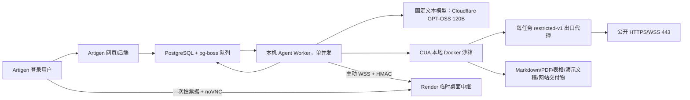

# Artigen Agent 本机运行与上线运维手册

更新日期：2026-09-02

## 0. 运维账号与免费边界

- 平台账号由账户所有者管理；具体邮箱不写入版本库，注册或验证时以当次用户授权和本机安全记录为准。
- 密码、OTP、恢复码、API Token、Secret 和付款信息不得写入 Git、本文档、Issue、聊天记录或普通 `.env`；本机凭据使用 macOS 钥匙串，云端凭据使用对应平台 Secret 管理。
- 注册或绑定新服务前必须确认免费/付费边界。Cloudflare 模型链只允许专用 Workers Free 账户，不启用 Workers Paid，也不配置免费额度耗尽后的收费回退。

## 1. 当前结论

当前 GitHub `dev` exact SHA 为 `2cbb97fbc0b9b307ce0d0fb336df7e2ecf307217`（文档历史澄清 PR [#163](https://github.com/FengFan-1997/Artigen/pull/163) merge）；运行时代码仍以 PR [#161](https://github.com/FengFan-1997/Artigen/pull/161) merge `7cd1f842ca6e93887d1bd5e5710d4e5a6b6e4d8d` 为不可变证据，文档同步 PR [#162](https://github.com/FengFan-1997/Artigen/pull/162) 已合入。当前 `dev` 未对齐或部署到 Render、Vercel production 或 Mac Worker。

Artigen Agent 继续使用“云端文本模型 + 本机 CUA 沙箱”：`dev` 已合入 PR [#153](https://github.com/FengFan-1997/Artigen/pull/153)、硬锁修复 PR [#155](https://github.com/FengFan-1997/Artigen/pull/155)、边界补丁 PR [#157](https://github.com/FengFan-1997/Artigen/pull/157)、readiness 部署意图补丁 PR [#160](https://github.com/FengFan-1997/Artigen/pull/160)、文档同步 PR [#159](https://github.com/FengFan-1997/Artigen/pull/159) 和 follow-up PR [#161](https://github.com/FengFan-1997/Artigen/pull/161)。运行时硬锁收尾 merge commit 为 `7cd1f842ca6e93887d1bd5e5710d4e5a6b6e4d8d`：所有部署环境文本统一为 Cloudflare Workers AI Free `@cf/openai/gpt-oss-120b`，SiliconFlow 仅负责 `Kwai-Kolors/Kolors` 图片生成。Render、Vercel 和 Mac Worker 尚未以该运行时 exact SHA 对齐，完整 DEV 实机矩阵和图片盲审尚未执行，不能把本地门禁当作部署或生产切换证据。

> 文档合并会让 `origin/dev` 继续生成新的 merge SHA；上面的 `7cd1f842…` 是运行时代码 PR #161 的不可变证据，不代表后续文档合并后的分支尖端。部署前必须重新执行 `git rev-parse origin/dev` 并核验 Render、Vercel、Mac Worker 和 readiness。

> **历史快照（不代表当前候选或线上状态）**：下方 2026-08-07 的 Production Beta 记录、旧模型/迁移号和状态表仅用于审计回溯；当前模型、开关、迁移与部署状态以本节首段、`PROJECT_HANDOFF.zh-CN.md` 顶部和实时 readiness 为准。

**2026-08-07 Production Beta 更新：** 生产提交 `9bcc77d593e0747d5265f96f1f45b1dcb956b0bd` 已部署到 Render `main`，数据库迁移 020、共享 S3、Production Mac Worker、四项浏览器状态和 owner-only 白名单全部通过。生产登录捕获 run `0bfa9eef-a989-4400-9fcd-0bcb043c211d` 与会话恢复 run `20317cd5-77e8-40ca-ac74-ad845385bf96` 均为 `succeeded`，4 个 Markdown/PDF 交付物验证通过并存入 S3；会话随后撤销并擦除。完整交付与账号登录方式见 [ARTIGEN_AGENT_BETA_DELIVERY.zh-CN.md](./ARTIGEN_AGENT_BETA_DELIVERY.zh-CN.md)。

当前本机的 `files + shell` Agent 已真实端到端跑通，不再只是单元测试通过。2026-08-06 的内容级烟测 run `e8262300-085b-4db4-b5e7-e2df2919ed56` 最终为 `succeeded`，轨迹评分 100；生成的 `agent-smoke.md` 经回读确认为 5 个真实物理行且不含字面量 `\\n`，并通过文件打开、ClamAV 病毒扫描、SHA-256 和数据库登记，任务结束后沙箱已销毁。

2026-08-07 完成了受限出口后的发布级浏览器烟测 run `1dfa16bf-49a4-428b-a942-ef3e090258f3`：硅基流动 Qwen3-8B 经独立 CONNECT 代理打开 `https://example.com`，读取 DOM，生成 `example-summary.md` 与 `example-summary.pdf`。两份文件都通过打开、ClamAV、SHA-256、来源和格式验证，轨迹评分 100，run 最终 `succeeded`，沙箱/代理/控制 sidecar 和临时网络均已销毁。

同日完成远程桌面真实传输烟测 run `3ddfdc37-91d9-462d-af70-e8ebaf812ef2`：一次性票据只存哈希，viewer 和 Mac Worker 经 Render 同构 WebSocket 中继配对，前端侧收到真实 VNC 握手 `RFB 003.008`；票据状态为 consumed/started/closed，烟测任务取消后沙箱已销毁。该测试没有输入任何真实账号或密码。

单站会话也完成真实生命周期烟测：run `0cc3eca1-a22e-4067-8167-931d660f0b2b` 加密保存 `https://example.com` profile，run `3c203a72-a088-4c5d-9afa-1b60f9d68a40` 恢复后更新时间；随后撤销，密文被覆盖为不可解密占位、profile 不再出现在列表中。测试不含真实 Cookie、账号、密码或 OTP。

2026-08-07 又完成了真正的远程 DEV 分布式烟测 run `f32c30bf-ed26-4fc9-aa0a-0daaa878ca24`：任务和队列位于 Render DEV/Neon，Mac Worker 从同一远程队列领取，Qwen3-8B 经 `restricted-v1` 访问 `https://example.com`，生成 `artigen-dev-smoke.md` 和 `artigen-dev-smoke.pdf`，两项独立验证均为 `passed`。Worker 将文件写入共享 Neon S3，烟测进程再从对象存储读回，逐项比对字节数和 SHA-256；最终 `succeeded`，沙箱、出口代理和临时网络均已清理。第一次远程 run 暴露出 Qwen 会忽略 `parallel_tool_calls=false`，运行时已改为只保留并顺序执行首个调用，并增加回归测试后重跑通过。

同日远程接管 run `06035a9d-b19f-4e1d-ba73-c58fa954fff8` 在 Render DEV + Neon + Mac Worker 上通过：Qwen3-8B 访问允许站点后主动调用 `request_user_approval`，任务停在 `waiting_user`；Render 签发 60 秒一次性票据，viewer 与 Mac Worker 配对并收到本机 VNC `RFB 003.008`。票据依次记录 consumed/relay_started/closed，关闭后任务取消，沙箱、出口代理和临时网络全部清理；测试没有输入真实账号、密码或 OTP。此前一次测试同时验证了 Worker 在 Neon 短时连接超时后可按租约恢复任务；现在 pg-boss 的 `error`/`warning` 事件也已显式监听，瞬时数据库错误只记录状态码，不再因未处理事件退出进程。

PR #9 合入后的 Render DEV 提交 `af50290` 又以 run `d093a36c-37e4-47ff-9f7b-8cc3fb7ecf1f` 重复通过同一远程接管链路，证明结果不是旧实例或一次性偶然状态。第一次复跑在创建任务阶段被 `INSUFFICIENT_CREDITS` 拒绝，原因是共享 S3 与接管烟测共用 DEV 内部账号、当日验收额度已经消耗；两种烟测现使用独立无密码账号，避免相互影响。这次拒绝发生在预算预留阶段，没有创建沙箱或调用模型。

| 检查项 | 当前状态 | 说明 |
|---|---:|---|
| Agent 单元/运行时测试 | 通过 | 包括硅基流动工具循环、小模型漏计划兜底、SSRF、票据、中继、路径和交付验证 |
| 后端完整测试 | 通过 | 381 个测试，343 通过、38 跳过、0 失败 |
| 前端单元测试 | 通过 | 211/211 |
| 前端 TypeScript/生产构建 | 通过 | noVNC 按需分包，Agent 工作台可编译并完成 Vite 构建 |
| 本机数据库 | 通过 | 已迁移到 `020_agent_secure_browser_relay` |
| 硅基流动 Provider | 通过 | 真实完成规划、文件命令、交付声明三步工具循环 |
| 硅基流动真实密钥 | 通过 | 从 macOS 钥匙串安全读取，不写入仓库或 `.env` |
| CUA Python SDK | 通过 | 安装在 `backend/.venv-agent` |
| Docker/CUA doctor | 通过 | Docker 29.6.2，本机 runtime 可用 |
| Worker 启动与心跳 | 通过 | 已真实记录 online 心跳，单并发 |
| CUA 真实容器 | 通过 | 使用官方 `0.1.15` 多架构 arm64 底座和 Artigen v2 工具镜像 |
| 最小真实 Agent 烟测 | 通过 | 云端模型、队列、CUA、文件执行、病毒扫描、资产登记、结算和销毁全部完成 |
| 浏览器 Agent 技术链路 | Production Beta 通过 | 受限代理、CDP、`browser_dom`、登录接管、会话恢复、Markdown+PDF、独立验证和销毁均真实通过 |
| 浏览器 Agent 接管中继 | Render DEV 通过 | 远程票据、HMAC、WebSocket、raw VNC 握手和清理均真实通过 |
| 浏览器 Agent 公开能力 | Production owner-only 已开启 | `files,shell,browser`；仅 `876458930@qq.com` 对应 UUID 可用，其他用户拒绝 |
| Playwright 多浏览器矩阵 | 通过 | 本地六项目 405 通过、3 条条件跳过、0 失败；PR #12 Release gate 通过 |
| DEV Render | 通过核心分布式烟测 | 迁移 020、四项 Worker 状态、浏览、MD/PDF、共享 S3 上传和读回均通过 |
| 生产 Agent | Production Beta 在线 | Render SHA `9bcc77d`、迁移 020、共享 S3、Mac Worker 和四项状态均通过 |

系统盘当前约有 19.3GB 可用，所需 CUA v2 镜像和 Playwright Chromium 1.61.1 对应浏览器已安装并保留。Hugging Face、Ollama、PostgreSQL/Redis 数据卷和项目环境未被清理。

## 2. 运行架构



关键点：

- 所有部署环境的 Agent 文本模型唯一固定为 Cloudflare Workers AI 免费层 `@cf/openai/gpt-oss-120b`，不能由客户端传模型名或 API Origin；旧 Qwen 配置只保留在隔离的历史 fixture 中，禁止部署。
- 图片生成继续复用 `SILICONFLOW_API_KEY`，唯一图片模型为 `Kwai-Kolors/Kolors`；视觉方向分析属于文本链，使用 Cloudflare GPT-OSS。Cloudflare 免费额度耗尽时 fail closed，不回退到收费文本模型。
- CUA 运行在本机 Docker，不使用 CUA 云端账户或云端 API Key。
- 本机 DEV 可获得 `files`、受限 `shell` 和 `browser`；浏览器顶层页面必须属于用户填写的精确 HTTPS Origin，跨 Origin 顶层跳转由服务器和沙箱双重阻断。
- 浏览器容器没有默认 Docker 出口。所有公网连接经过每任务代理，代理解析全部 A/AAAA、拒绝任一非公网结果并固定已验证 IP；CUA/VNC 端口只绑定 Mac 的 `127.0.0.1`。
- 密码、OTP、验证码和安全警告只能由所有者通过一次性票据接管；模型暂停且看不到这些值。
- Worker 并发为 1。Worker 不在线时任务保留在数据库队列，最长等待 24 小时。
- 新用户一次性体验额度为 20 credits；当前不发每日免费额度。
- 任务私密输入和模型断点使用独立 AES-256-GCM 密钥加密后存入数据库。

## 3. 需要哪些账号，怎样登录

### 3.1 Artigen 用户账号

需要。用户通过 Artigen 正常登录页登录，Agent 不使用共享账号，也没有“Agent 专用万能账号”。本地开发时使用本地数据库中自己的测试用户；线上使用生产站正常注册/登录的用户。

不要把管理员密码、用户密码或登录 Cookie 写进 Agent 提示词、Markdown 文件或 Git。

### 3.2 硅基流动

需要现有硅基流动账号和 API Key，仅用于图片生成。Agent 的规划、对话、方向分析和配料整理等文本调用统一走 Cloudflare GPT-OSS，不再使用 SiliconFlow 文本模型。

- 登录地址：<https://account.siliconflow.cn/zh/login>
- 控制台：<https://cloud.siliconflow.cn>
- API 地址：`https://api.siliconflow.cn/v1`
- 当前唯一允许的图片模型：`Kwai-Kolors/Kolors`（SiliconFlow 仅作为图片 Provider）
- 密钥位置：本机 macOS 钥匙串 `Artigen SiliconFlow API Key`；部署平台使用 Secret `SILICONFLOW_API_KEY`

不要把 API Key 发到前端、Markdown、日志或 Git。模型探针只报告“已配置/无效/不可用”，不会输出密钥。

Agent 的文本调用不读取 SiliconFlow thinking 配置；图片任务固定使用 SiliconFlow 上的 `Kwai-Kolors/Kolors`，任何非生图文本回退都会被 fail closed。

### 3.2.1 Cloudflare Workers AI（长期免费文本升级档）

Cloudflare Workers Free 每天提供自动恢复的免费 Workers AI 配额；Artigen 所有部署环境只允许 `@cf/openai/gpt-oss-120b`，API Base 由 32 位 `CLOUDFLARE_ACCOUNT_ID` 在服务端拼接，不能手填任意地址。为保证绝不产生账单，必须使用专门的 Workers Free 账户（不启用 Workers Paid，也不允许 AI 超额计费），显式设置 `AGENT_CLOUDFLARE_FREE_ACCOUNT_ATTESTED=true`，并令 `AGENT_CLOUDFLARE_FREE_ACCOUNT_ID` 精确等于该账户 ID；否则 Worker 就绪检查失败。这样即使 Keychain 凭据被换成另一个账户，旧声明也不会继续生效。

- 控制台：<https://dash.cloudflare.com>
- 当前专用账户已经由账户所有者在控制台确认显示 `Free / $0 / Current plan`；精确账户 ID 只保存在 DEV Secret/Keychain，并通过免费账户声明绑定，不写入本文档。
- 当前 DEV Token 名称：`artigen-workers-ai-free`，无到期日且只含整个当前账户的 `Workers AI Read`；没有 Workers Edit、DNS、Billing 或其他权限。Token 明文只存于 `artigen-agent-dev-worker / CLOUDFLARE_API_TOKEN`，不得复制到文档或日志。
- Keychain account 标签：`CLOUDFLARE_ACCOUNT_ID`、`CLOUDFLARE_API_TOKEN`
- 启动探针只调用模型目录查询，不消耗推理配额。免费配额耗尽（Cloudflare `3036`）或模型要求 Paid（`5035`）时必须明确失败且不得自动重试或回退；暂时容量不足（`3040`）才允许有界重试。
- 生产或公开切换前必须在 DEV 对 GPT-OSS 重新跑完整 Agent 质量矩阵；最小真实全链路烟测只能证明主链可用，不构成公开上线证据。

### 3.3 CUA 本地沙箱

不需要 CUA 云账号，不需要 `CUA_API_KEY`。本地模式依赖 Python 3.12 和 Docker Desktop。

Artigen 使用的 Python 环境：

```text
/Users/fengfan/Public/personal/Artigen/backend/.venv-agent/bin/python
```

CUA 官方说明：

- [本地沙箱教程](https://cua.ai/docs/tutorials/your-first-local-sandbox)
- [Sandbox SDK 参考](https://cua.ai/docs/reference/sandbox-sdk)

### 3.4 Docker Desktop

本地运行公开镜像不要求登录 Docker Hub。需要启动 Docker Desktop，但不需要把 Docker 账号交给 Agent。

检查：

```bash
docker info
```

### 3.5 PostgreSQL

本地数据库信息：

| 项目 | 值 |
|---|---|
| 地址 | `127.0.0.1:5432` |
| 数据库 | `artigen_dev` |
| 本地角色 | `artigen` |
| 密码位置 | `backend/.env` 的 `LOCAL_PG_PASSWORD`，禁止复制到文档/Git |

如必须手工登录：

```bash
psql -h 127.0.0.1 -U artigen -d artigen_dev
```

日常维护优先使用项目命令，不要在终端历史中粘贴完整数据库 URL：

```bash
pnpm db:local:setup
pnpm --filter backend db:migrate
pnpm db:audit
```

### 3.6 线上数据库和对象存储

线上本机 Worker 需要连接与网站后端相同的 PostgreSQL 数据库，并使用共享对象存储交付文件。这部分需要已有的部署平台数据库凭据、S3 兼容存储凭据、Cloudflare 文本凭据和 SiliconFlow 图片凭据，但不需要 OpenAI/CUA 云账号。

账户归属、域名和现有基础设施审计见 [ARTIGEN_INFRA_ACCOUNT_AUDIT.zh-CN.md](./ARTIGEN_INFRA_ACCOUNT_AUDIT.zh-CN.md)。任何真实密钥只应保存在部署平台 Secret 或本机 `backend/.env`，不能写入该审计文件。

## 4. 本机配置

本机私密配置位于：

```text
/Users/fengfan/Public/personal/Artigen/backend/.env
```

可提交的模板位于：

```text
/Users/fengfan/Public/personal/Artigen/backend/.env.example
```

当前本机烟测配置重点：

```dotenv
AGENT_FEATURE_ENABLED=true
AGENT_WORKER_ENABLED=1
AGENT_RUNTIME_DRIVER=live
AGENT_MODEL_PROVIDER=cloudflare
AGENT_MODEL_NAME=@cf/openai/gpt-oss-120b
AGENT_TEXT_MODEL_HARD_LOCK=true
AGENT_SILICONFLOW_MAX_TOKENS=4096
AGENT_SILICONFLOW_ENABLE_THINKING=false
AGENT_SILICONFLOW_MIN_INTERVAL_MS=6500
AGENT_SANDBOX_PROVIDER=cua
AGENT_SANDBOX_MODE=local
AGENT_CUA_DOCKER_PLATFORM=
AGENT_CUA_IMAGE_REF=artigen/cua-xfce:0.1.15-tools-v2
AGENT_CUA_IMAGE_HAS_TOOLCHAIN=true
AGENT_BROWSER_MODE=full-approval-v1
AGENT_SANDBOX_EGRESS_POLICY=restricted-v1
AGENT_WORKER_ID=artigen-dev-mac-1
AGENT_WORKER_RELAY_URL=ws://127.0.0.1:8080/api/agent-desktop/worker
AGENT_WORKER_CONCURRENCY=1
AGENT_QUEUE_MAX_WAIT_HOURS=24
AGENT_PUBLIC_CAPABILITIES=files,shell,browser,generate_images
AGENT_IMAGE_CREDITS=8
AGENT_IMAGE_REFERENCE_CREDITS=12
```

长期免费 Cloudflare 文本模型是默认且唯一的文本配置；`SILICONFLOW_API_KEY` 仍只用于 Kolors 图片：

```dotenv
AGENT_MODEL_PROVIDER=cloudflare
AGENT_MODEL_NAME=@cf/openai/gpt-oss-120b
AGENT_TEXT_MODEL_HARD_LOCK=true
CLOUDFLARE_ACCOUNT_ID=从 Cloudflare 控制台读取
CLOUDFLARE_API_TOKEN=只通过环境 Secret 或 macOS Keychain 注入
CLOUDFLARE_KEYCHAIN_SERVICE=本机服务名（DEV 使用 artigen-agent-dev-worker，Production 使用 artigen-agent-production-worker）
AGENT_CLOUDFLARE_FREE_ACCOUNT_ATTESTED=true
AGENT_CLOUDFLARE_FREE_ACCOUNT_ID=与 CLOUDFLARE_ACCOUNT_ID 完全相同
AGENT_CLOUDFLARE_MAX_TOKENS=4096
AGENT_CLOUDFLARE_MIN_INTERVAL_MS=2000
AGENT_CLOUDFLARE_REQUESTS_PER_MINUTE=30
```

`generate_images` 使用 Kolors，可执行纯文生图或最多 1 张已扫描任务图片的图生图。多参考图必须在供应商派发前失败。

以下值必须存在，但绝不能复制到文档或提交。硅基流动密钥既可以由环境变量提供，也可以在 macOS 本机通过钥匙串服务名和账户标签读取：

```dotenv
SILICONFLOW_API_KEY=
SILICONFLOW_KEYCHAIN_SERVICE=Artigen SiliconFlow API Key
SILICONFLOW_KEYCHAIN_ACCOUNT=fengfan
# 本机服务进程若使用 Cloudflare 文本模型，也从该服务的以下 account 标签读取：
# CLOUDFLARE_ACCOUNT_ID、CLOUDFLARE_API_TOKEN、AGENT_CLOUDFLARE_FREE_ACCOUNT_ID、AGENT_CLOUDFLARE_FREE_ACCOUNT_ATTESTED
AGENT_PAYLOAD_ENCRYPTION_KEY=本机独立随机密钥
DATABASE_URL=本机或目标环境数据库连接
AGENT_WORKER_RELAY_SECRET=从 macOS Keychain 读取，不写入本文件
```

本机 DEV 中继密钥的 Keychain service 为 `artigen-agent-dev-relay`，account 为 `AGENT_WORKER_RELAY_SECRET`。Production 使用独立 service `artigen-agent-production-worker`，数据库、S3、加密、Cloudflare 文本、SiliconFlow 图片和中继各自使用变量名作为 account 标签；只记录标签，不记录或打印秘密值。

本机初始化脚本会只填充缺失密钥，不覆盖已有非空密钥：

```bash
pnpm db:local:setup -- --no-migrate
```

## 5. 安装与准备

在仓库根目录执行：

```bash
cd /Users/fengfan/Public/personal/Artigen

python3.12 -m venv backend/.venv-agent
backend/.venv-agent/bin/python -m pip install -r backend/agent_runtime/requirements.txt

pnpm --filter backend db:migrate
```

当前机器这些步骤均已完成。

前端 E2E 使用与 `@playwright/test` 完全匹配的浏览器版本。本机已执行：

```bash
pnpm --filter personal exec playwright install chromium
```

本次发布已在本机完成 Chromium、Firefox、WebKit 的六项目 Playwright 矩阵：405 通过、3 条条件跳过、0 失败。GitHub PR #12 的分片浏览器 E2E 和 Release gate 也已通过。

本地模式使用基于 Cua 官方 `0.1.15` 多架构 manifest 构建的 Artigen 工具镜像；
Docker 会自动选择原生 arm64/amd64。先拉取底座，再一次性构建 Chromium、
LibreOffice、Node、Python 文档工具和 ClamAV 病毒库层：

```bash
open -a Docker
docker pull trycua/cua-xfce@sha256:3bf8536d354d4212aa7a2ed6309f63b573f587da50abb42692fc37e230832d91
pnpm build:cua-image
```

不要执行 `ollama pull qwen3:8b`；Agent 文本从 Cloudflare Workers AI `@cf/openai/gpt-oss-120b` 调用，图片从 SiliconFlow 上的 `Kwai-Kolors/Kolors` 调用。

注意：`trycua/cua-xfce:latest`/`0.2` 压缩约 7.44GB、解压后约 23GB，且当前
latest 只有 amd64，不适合作为 Apple Silicon 本机默认镜像。固定的 `0.1.15`
manifest 压缩约 1.39GB并同时提供 arm64/amd64。不要把本机配置改回 `latest`。
生产云端仍应换成经过独立加固的自定义不可变 digest。

## 6. 一键体检

```bash
pnpm doctor:agent
```

体检包含：

- Agent 功能开关与 Worker 开关；
- 私密载荷加密密钥；
- 最新 `026_agent_live_eval_capacity_counter` 数据库迁移、Agent 表、票据表和 Worker readiness 字段；
- restricted-v1 主动探针：代理公网成功、直接出网失败、私网目标失败；
- Cloudflare GPT-OSS 120B 凭据、官方 API 地址及免费账户绑定是否可用；
- CUA SDK 与 Docker runtime；
- 首次镜像下载所需磁盘容量；
- 最近一次 Worker 心跳。

只有顶层输出为：

```json
{"ok": true}
```

才进入真实任务烟测。Worker 心跳为 `offline` 或 `stopping` 不代表配置失败，只代表 Worker 当前没有运行。

## 7. 启动方法

准备两个终端。Cloudflare 文本和 SiliconFlow 图片都是云端 API，不需要启动本地模型服务。

终端 1：启动网站前后端。

```bash
cd /Users/fengfan/Public/personal/Artigen
pnpm dev
```

终端 2：启动独立 Worker。

```bash
cd /Users/fengfan/Public/personal/Artigen
pnpm start:agent-worker
```

成功日志示例：

```text
Artigen Agent worker started: agent-worker-...
```

Mac 常驻 Worker 使用 LaunchAgent + `caffeinate`。DEV 只按需启动；Production 只有在 Keychain 凭据完整、DEV 验收通过和生产数据库完成备份后才安装：

```bash
# DEV：生成按需启动的 plist
pnpm --filter backend install:agent-worker:dev-mac

# Production：仅在发布窗口执行
pnpm --filter backend install:agent-worker:production-mac
```

`start:agent-worker:dev-mac` 和 DEV LaunchAgent 从独立的 `artigen-agent-dev-worker` Keychain service 读取远程 DEV Aiven、共享 S3、Agent 载荷密钥、Cloudflare 文本凭据、SiliconFlow 图片凭据和桌面中继配置；它不会复用或改写 `backend/.env`。普通的 `pnpm start:agent-worker` 仍是本机数据库/本机中继开发入口。Production 对应 `artigen-agent-production-worker`，两套配置不能混用。

本机显式配置 `SILICONFLOW_KEYCHAIN_SERVICE` 时，Keychain 值优先于 `.env` 中的旧值；本机开发的 Agent 载荷密钥默认优先读取 `artigen-agent-dev-worker / AGENT_PAYLOAD_ENCRYPTION_KEY`。Render/Linux 没有 macOS Keychain，仍只从平台环境变量读取。

Production runner 会先检查 Docker，再从 `artigen-agent-production-worker` Keychain service 读取数据库、S3、载荷加密、Cloudflare 文本、SiliconFlow 图片和中继配置。缺任何一项会输出错误码并退出，不打印值；LaunchAgent 30 秒后重试。Mac 必须接通电源、保持用户登录且 Docker Desktop 运行，合盖睡眠和关机会让任务继续排队。

网页会每 15 秒请求：

```text
GET /api/agent/status
```

状态接口只返回是否在线、队列深度、最早排队时间、并发数、模型系列和沙箱模式，不暴露密钥、数据库地址或内部 Worker ID。

## 8. 真实烟测标准

本机已经完成的最小真实烟测为：创建 Markdown、声明 source 交付物并由独立验证器验收。结果：

```text
run: e8262300-085b-4db4-b5e7-e2df2919ed56
status: succeeded
trajectory score: 100
artifact: agent-smoke.md
verification_status: passed
malwareScan: passed
charged free credits: 3
sandbox: destroyed
```

这证明 `files + shell` 主链路真实可用。

以下两段是 Cloudflare 切换前的历史 Qwen/SiliconFlow 浏览器证据，仅用于回溯，
不代表当前模型配置：

旧的内部只读浏览器链路也曾完成真实烟测：

```text
run: 5e8e8558-5cec-4f18-8bee-22eed5780715
status: succeeded
model: SiliconFlow Qwen/Qwen3-8B
browser: browser_dom -> https://example.com
artifact: browser-smoke.md (text/markdown, 166 bytes)
verification_status: passed
malwareScan: passed
trajectory score: 100
charged free credits: 2
sandbox: destroyed
```

回读交付物确认包含 3 行真实字段：`Title: Example Domain`、最终 URL，以及以 `This domain` 开头的正文；文件不含字面量 `\\n`。

2026-08-07 发布级浏览器烟测已进一步完成（历史 Qwen/SiliconFlow 文本链路）：

```text
run: 1dfa16bf-49a4-428b-a942-ef3e090258f3
status: succeeded
model: SiliconFlow Qwen/Qwen3-8B
browser: restricted-v1 -> https://example.com
artifacts: example-summary.md + example-summary.pdf
verification_status: passed + passed
trajectory score: 100
charged free credits: 3
sandbox/control/egress/network: destroyed
```

远程接管传输烟测：

```text
run: 3ddfdc37-91d9-462d-af70-e8ebaf812ef2
viewer handshake: RFB 003.008
ticket: hash-only, consumed=true, relay_started=true, closed=true
real credentials entered: none
sandbox: destroyed
```

远程 DEV + 共享 S3 烟测可重复执行：

```bash
pnpm --filter backend smoke:agent:dev-mac
```

远程 DEV 接管中继烟测可重复执行：

```bash
pnpm --filter backend smoke:agent:dev-relay-mac
```

该命令让 Qwen 显式请求密码接管，只验证一次性票据、Render WSS 中继、Mac Worker 和本机 VNC 握手，不输入任何真实凭据；成功后自动关闭票据、取消任务并触发沙箱清理。

脚本只从 `artigen-agent-dev-worker` Keychain 读取秘密，不接受 Production Keychain service，也不打印账号、连接串或密钥。共享 S3 烟测使用固定内部账号 `agent-smoke@dev.artigen.invalid`，接管中继烟测使用独立的 `agent-relay-smoke@dev.artigen.invalid`，避免两类验收互相消耗当日免费额度；两个账号都没有密码、会话或生产权限，只用于 DEV 服务级验收。

2026-08-07 的通过记录（历史 Qwen/SiliconFlow 文本链路）：

```text
run: f32c30bf-ed26-4fc9-aa0a-0daaa878ca24
status: succeeded
model: SiliconFlow Qwen/Qwen3-8B
browser: restricted-v1 -> https://example.com
artifacts: artigen-dev-smoke.md (246 bytes) + artigen-dev-smoke.pdf (2861 bytes)
verification_status: passed + passed
storage_driver: s3 + s3
download verification: byte size + SHA-256 matched
sandbox/control/egress/network: destroyed
```

2026-09-01 Cloudflare Workers AI 免费文本模型的通过记录：

```text
run: 4f946725-9638-4295-b00f-9b3833b41fec
status: succeeded
model: Cloudflare @cf/openai/gpt-oss-120b
browser: restricted-v1 -> https://example.com
artifacts: artigen-dev-smoke.md (243 bytes) + artigen-dev-smoke.pdf (2898 bytes)
verification_status: passed + passed
storage_driver: s3 + s3
download verification: byte size + SHA-256 matched
replan / consecutive failures: 0 / 0
```

该次烟测的 `AGENT_MODEL_PROVIDER=cloudflare`，免费账户 ID 与 Keychain 中实际账户严格匹配；脚本从同一 DEV Keychain 读取验证 TLS 的 CA、数据库、共享 S3 和 Cloudflare 凭据。免费配额耗尽时仍须 fail closed，不得切回收费文本模型。该记录只覆盖文本 Agent；不要为验证本配置运行 Kolors 图片烟测，因为现有图片链不在 Cloudflare Workers AI 免费文本额度内。

使用正常 Artigen 用户登录，然后提交：

> 创建一个简短中文 Markdown 报告，同时生成 PDF，放入任务沙箱并声明两个交付物。完成后验证文件可打开。

必须完整观察到：

```text
创建任务
→ queued
→ Worker 领取
→ provisioning
→ CUA 本地容器创建
→ Cloudflare GPT-OSS-120B 规划
→ 沙箱执行文件工具
→ declare_artifact
→ 独立格式验证
→ succeeded
→ 网页可下载交付物
```

验收要求：

- 数据库中的 run 最终为 `succeeded`；
- 至少存在 Markdown 和 PDF 两条 `agent_artifacts`；
- `verification_status=passed`；
- 文件能实际打开，不是空壳；
- Worker 心跳保持 fresh；
- 任务结束后沙箱被回收；
- 费用/试用额度只结算一次；
- 日志中没有用户输入全文、密钥或数据库连接串。

只验证“页面能打开”或“Worker 能启动”都不能宣称 Agent 已真实跑通。

## 9. 队列与额度规则

| 规则 | 当前值 |
|---|---:|
| Worker 并发 | 1 |
| 全局最大排队任务 | 100 |
| 最长排队等待 | 24 小时 |
| 新用户一次性试用 | 20 credits |
| 每日免费额度 | 0 |
| 默认单任务上限 | 30 credits |
| 硬上限 | 100 credits |
| 单任务最长时间 | 45 分钟 |
| 单任务最大步骤 | 120 |

Worker 离线时，用户界面会明确显示“本机 Worker 离线，任务将排队”。超过 24 小时仍未领取的任务会失败并释放未使用额度。

## 10. 停止与恢复

Worker 使用 `Ctrl+C` 或 `SIGTERM` 停止。停止过程中数据库心跳先变成 `stopping`；超时后状态接口也会把旧心跳视为离线。

重新启动 Worker 后，它会：

1. 使用密钥探测 Cloudflare `@cf/openai/gpt-oss-120b`；
2. 探测 CUA/Docker；
3. 启动 pg-boss 消费者；
4. 修复可恢复的陈旧任务；
5. 按顺序领取队列任务；
6. 每 15 秒刷新心跳。

## 11. 上线前置条件

不要在以下任一条件未满足时开启生产 `AGENT_WORKER_ENABLED=1`：

- 本机 `pnpm doctor:agent` 全绿；
- Cloudflare GPT-OSS 120B 凭据已配置且通过模型探针；`SILICONFLOW_API_KEY` 仅用于 Kolors 图片；
- Cua SDK 本地容器支持与 Docker Runtime 可用；
- 本机 Markdown + PDF 发布级浏览器烟测和真实 VNC 中继握手已成功；
- 开发/预发布数据库已执行 020 迁移；
- `browserReady`、`egressVerified`、`desktopRelayReady` 和 `workerOnline` 同时为 true；
- 网站后端和本机 Worker 指向同一目标数据库；
- 文件交付使用共享 S3 兼容对象存储，而不是某台机器的本地目录；DEV 已实测上传、跨进程读回和摘要一致；
- Worker 机器能长期在线，睡眠/关机策略已处理；
- 备份、额度释放、24 小时队列过期和 Worker 离线提示已在预发布环境验证；
- 本地 Chromium、Firefox、WebKit 六项目矩阵 405 通过、3 条条件跳过、0 失败；PR #12 分片 E2E 和 Release gate 通过。
- Firefox/WebKit 继续与 Chromium 一起纳入发布矩阵，版本升级后必须重跑。

线上采用“云端网页/数据库 + 本机 Worker”时，访问网站的用户不会直接连接你的 Mac。后端只把任务写入数据库；远程接管时 Mac 主动建立临时 WSS，中继结束即关闭。不要给家用路由器开放 Docker、CUA 或 VNC 端口。

## 12. 当前下一步

1. 保持 owner-only Beta，先观察真实使用中的队列长度、任务失败率、S3 使用量和沙箱清理。
2. 保持 Mac 接通电源、登录状态和 Docker Desktop；定期检查 Production LaunchAgent 与四项 Agent 状态。
3. 建立 Neon 定时加密备份和隔离恢复演练；当前已有发布前手工 dump 和 SHA-256。
4. 只有观察稳定后再增加 Beta UUID；不要直接改为公开所有用户。
5. 需要 24×7 时升级 Render Starter，并把 Worker 迁移到专用 Linux 主机。

当前准确表述是：

> Artigen 浏览器 Agent 已作为 owner-only Production Beta 上线，并完成真实登录接管、加密会话保存/恢复/撤销、Markdown/PDF 独立验证和共享 S3 交付。由于 Render Free 和 Mac Worker 都不提供 24×7 SLA，不能宣称为高可用正式生产服务。
