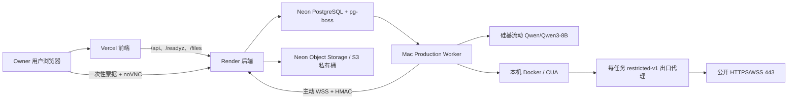

# Artigen 浏览器 Agent Production Beta 交付文档

交付日期：2026-08-07

生产发布提交：`9bcc77d593e0747d5265f96f1f45b1dcb956b0bd`

发布等级：**Production Beta / owner-only**

## 1. 最终结论

Artigen 浏览器 Agent 已完成生产部署和真实端到端验收，不再是“代码能编译但环境没配置”的状态。

当前生产链路已经满足：

- 模型使用硅基流动云端 `Qwen/Qwen3-8B`，没有下载本地 Qwen 模型；
- Mac 上的 Docker/CUA Worker 已通过 LaunchAgent 常驻运行；
- 生产数据库迁移到 `020_agent_secure_browser_relay`；
- 交付物使用私有共享 S3，不回退到 Worker 本地文件；
- 浏览器受 `restricted-v1` 出口代理保护；
- noVNC 远程接管经 Render 临时 WebSocket 中继工作；
- 登录会话可以按用户和精确 Origin 加密保存、恢复、撤销和擦除；
- 只允许 owner 账号使用 Production Beta，其他用户会收到 `AGENT_BETA_ACCESS_DENIED`；
- 生产邮箱验证码登录已经开启，owner 账号旧会话过期后仍可重新登录；
- 最终生产登录捕获和恢复两个真实任务均为 `succeeded`，4 个交付物全部通过独立验证并上传 S3。

这仍然不是 24×7 商业级 SLA。Render 使用 Free 实例，Mac 是实际 Worker；Render 休眠、Mac 关机/合盖/退出登录或 Docker Desktop 停止时，任务会排队等待。

## 2. 当前线上状态

| 层级 | 最终状态 | 证据 |
|---|---:|---|
| 生产前端 | 在线 | `https://artigen-fengfan.vercel.app/artigen` 返回 200 |
| Agent 工作台 | 在线 | `https://artigen-fengfan.vercel.app/artigen/agent` |
| 生产后端 | 在线 | Render deploy `dep-d9qs08ijnfac73e3icn0` 为 `live` |
| 生产提交 | 一致 | `/api/meta` 返回完整 SHA `9bcc77d593e0747d5265f96f1f45b1dcb956b0bd` |
| 生产数据库 | 通过 | `/readyz`：`020_agent_secure_browser_relay` |
| 共享对象存储 | 通过 | `/readyz`：`driver=s3`、`shared=true` |
| 云端模型 | 通过 | `Qwen/Qwen3-8B`、provider `siliconflow` |
| CUA 沙箱 | 通过 | `local`，镜像 `artigen/cua-xfce:0.1.15-tools-v2` |
| Worker | 在线 | `workerOnline=true` |
| 浏览器 | 就绪 | `browserReady=true` |
| 安全出口 | 已探测 | `egressVerified=true` |
| 桌面中继 | 就绪 | `desktopRelayReady=true` |
| Beta 权限 | 生效 | `accessMode=owner-only-v1` |
| 邮箱 OTP 登录 | 生效 | `/readyz`：OTP、签名邮件中继、Turnstile 全部通过 |
| 队列 | 空闲 | `queueDepth=0`、`availabilityNote=ready` |

线上自检：

```bash
curl -fsS https://artigen-fengfan.vercel.app/api/meta
curl -fsS https://artigen-fengfan.vercel.app/readyz
curl -fsS https://artigen-fengfan.vercel.app/api/agent/status
```

健康结果必须同时包含：

```text
gitSha=9bcc77d593e0747d5265f96f1f45b1dcb956b0bd
database.migration=020_agent_secure_browser_relay
storage.driver=s3
storage.shared=true
workerOnline=true
browserReady=true
egressVerified=true
desktopRelayReady=true
accessMode=owner-only-v1
availabilityNote=ready
```

## 3. 生产架构



关键边界：

- Render 后端不运行 CUA，也没有开启 Agent Worker；`AGENT_WORKER_ENABLED=0`。
- Mac Worker 主动连接生产数据库和 Render 中继，不需要公网 IP、端口映射或 Cloudflare Tunnel。
- CUA/VNC 端口只绑定 Mac 的 `127.0.0.1`。
- 每个浏览器任务独立创建 CUA 容器、出口代理、控制 sidecar 和内部网络；任务终止后统一清理。
- Worker 并发固定为 1，避免本机同时运行多个重型浏览器沙箱。

## 4. 域名和部署位置

| 用途 | 地址/位置 | 负责人或平台 |
|---|---|---|
| 生产主站 | `https://artigen-fengfan.vercel.app/artigen` | Vercel |
| 生产 Agent | `https://artigen-fengfan.vercel.app/artigen/agent` | Vercel + Render API |
| 生产登录 | `https://artigen-fengfan.vercel.app/login` | Vercel + Render API |
| 生产后端 | `https://artigen-app-fengfan.onrender.com` | Render Virginia |
| 生产就绪检查 | `https://artigen-fengfan.vercel.app/readyz` | Vercel 转发 Render |
| 生产元信息 | `https://artigen-fengfan.vercel.app/api/meta` | Vercel 转发 Render |
| DEV | `https://dev-artigen-app-fengfan.onrender.com/artigen` | Render Virginia |
| 邮件中继 | `https://artigen-mail-relay.vercel.app` | Vercel |
| 生产数据库 | Neon 项目 `Artigen Production`、数据库 `neondb` | Neon |
| DEV 数据库 | 同一 Neon 项目的 `dev_artigen` | Neon |
| 交付物桶 | `artigen-assets`，Private | Neon Object Storage |
| Production Worker | 当前 Mac + Docker Desktop | macOS LaunchAgent |

`vercel.json` 把 `/api/*`、`/files/*`、`/healthz` 和 `/readyz` 转发到 Render；其余路径由 Vercel 上的 Vue 单页应用处理。当前使用平台自带 HTTPS 域名，没有额外购买域名或证书。

## 5. 账号与登录方式

### 5.1 Artigen Production Beta owner

| 项目 | 值 |
|---|---|
| Owner 邮箱 | `876458930@qq.com` |
| Owner 用户 UUID | `f9ff116a-fbce-47ef-85c7-dc68c8ac7388` |
| Beta 模式 | `owner-only-v1` |
| 登录方式 | 邮箱验证码 |
| Agent 页面 | `https://artigen-fengfan.vercel.app/artigen/agent` |

登录步骤：

1. 打开 `https://artigen-fengfan.vercel.app/login`；
2. 输入 `876458930@qq.com`；
3. 完成 Cloudflare Turnstile；
4. 请求并输入 QQ 邮箱收到的一次性验证码；
5. 登录后打开 `/artigen/agent`。

该用户没有密码 hash，因此不要尝试用“邮箱 + 固定密码”登录。生产 `AUTH_EMAIL_OTP_ENABLED=true`，`/readyz` 已确认 OTP 密钥、签名邮件中继和 Turnstile 配置完整。

未带 Turnstile token 的生产登录请求返回 `TURNSTILE_REQUIRED`，而不是旧的 `OTP_DELIVERY_UNAVAILABLE`，证明 OTP 路由已经开启且会 fail-closed。自动验收没有绕过 Turnstile，也没有擅自发送验证码邮件；首次实际登录仍需你在网页完成 Turnstile 并接收 QQ 邮箱验证码。

另一名现有用户不在 Beta 白名单中。即使成功登录，也不能创建 Agent 任务；这是预期的 owner-only 限制。

### 5.2 GitHub

| 项目 | 值 |
|---|---|
| 账号/组织 | `FengFan-1997` |
| 仓库 | `FengFan-1997/Artigen` |
| 发布 PR | `#11` feature → dev、`#12` dev → main |

本机 `gh` 已有可用登录状态。日常使用：

```bash
gh auth status
gh repo view FengFan-1997/Artigen
```

如网页或 CLI 登录失效，使用 GitHub 自己的登录/2FA；不要把 GitHub Token 发到聊天、Markdown 或 `.env`。

### 5.3 Render

| 项目 | 值 |
|---|---|
| 账号邮箱 | `sorates1997@163.com` |
| Workspace | `artigen` |
| 生产服务 | `artigen-app-fengfan` |
| Service ID | `srv-d9cr73r7uimc73etc4j0` |
| DEV Service ID | `srv-d9gpgs61a83c73f7k8s0` |

现有运维记录使用 GitHub 登录 Render。网页登录后进入 workspace `artigen`。本机 CLI 检查：

```bash
render whoami
render services --output json
render deploys list srv-d9cr73r7uimc73etc4j0 --output json
```

Mac 的 SSH 公钥已添加到 Render，名称为 `Artigen Production Mac Worker`。Render Free Web Service 不支持 SSH，这是平台限制，不是密钥故障；该公钥可以保留供以后升级套餐使用。

### 5.4 Neon

| 项目 | 值 |
|---|---|
| 邮箱 | `sorates1997@163.com` |
| Login | `sorates1997` |
| GitHub | `@fengfan-1997` |
| Organization | `Artigen` |
| 数据库项目 | `Artigen Production` |
| 对象存储项目 | `Artigen Object Storage` |

网页登录 Neon 后进入组织 `Artigen`。本机可用：

```bash
neonctl me
neonctl projects list
```

### 5.5 Vercel

| 项目 | 值 |
|---|---|
| Team | `FengFan's projects` |
| 当前 CLI 账号记录 | `876458930-7565` |
| 前端项目 | `artigen-fengfan` |
| 邮件中继项目 | `artigen-mail-relay` |

GitHub 对提交 `9bcc77d` 的 `Vercel – artigen-fengfan` 状态为 success。现有资料不能可靠证明网页端具体使用 GitHub还是邮箱登录，因此只使用当前已登录会话；失效时按 Vercel 页面提示完成登录/2FA，不要在文档中保存密码。

### 5.6 硅基流动

- 登录：`https://account.siliconflow.cn/zh/login`
- 控制台：`https://cloud.siliconflow.cn`
- API：`https://api.siliconflow.cn/v1`
- Agent 唯一模型：`Qwen/Qwen3-8B`

复用 Artigen 深度思考链路现有的硅基流动 API Key。没有下载 Qwen 本地模型，也没有使用 OpenAI API Key。

### 5.7 Docker/CUA

不需要 Docker Hub 登录，也不需要 CUA 云账号或 `CUA_API_KEY`。必须保持 Docker Desktop 运行。

## 6. 密钥存放位置

任何真实值都不在 Git、本文档或聊天中。生产 Worker 使用 macOS Keychain：

```text
service: artigen-agent-production-worker
```

该 service 下必须存在以下 account 标签：

```text
DATABASE_URL
AGENT_PAYLOAD_ENCRYPTION_KEY
SILICONFLOW_API_KEY
AGENT_WORKER_RELAY_SECRET
AGENT_WORKER_RELAY_URL
S3_ENDPOINT
S3_BUCKET
S3_REGION
S3_ACCESS_KEY_ID
S3_SECRET_ACCESS_KEY
AGENT_BETA_USER_IDS
```

受控 DEV 登录验收页密码独立存放在：

```text
service: Artigen Dev Access Password
account: artigen-dev
```

Render 保存同环境的生产数据库、S3、Agent 加密和中继 Secret。Mac Worker 的 `DATABASE_URL` 与 Render 的运行/迁移 URL 均使用 Neon direct hostname，不使用 `-pooler` 地址。

只检查标签是否存在，不打印值：

```bash
for account in DATABASE_URL AGENT_PAYLOAD_ENCRYPTION_KEY SILICONFLOW_API_KEY \
  AGENT_WORKER_RELAY_SECRET AGENT_WORKER_RELAY_URL S3_ENDPOINT S3_BUCKET \
  S3_REGION S3_ACCESS_KEY_ID S3_SECRET_ACCESS_KEY AGENT_BETA_USER_IDS; do
  security find-generic-password -s artigen-agent-production-worker -a "$account" >/dev/null
done
```

## 7. Mac Production Worker 运维

LaunchAgent：

```text
~/Library/LaunchAgents/com.artigen.agent-worker-production.plist
```

日志：

```text
~/Library/Logs/Artigen/com.artigen.agent-worker-production.log
~/Library/Logs/Artigen/com.artigen.agent-worker-production.error.log
```

安装并启动：

```bash
cd /Users/fengfan/Public/personal/Artigen
pnpm --filter backend install:agent-worker:production-mac
launchctl bootstrap gui/$(id -u) "$HOME/Library/LaunchAgents/com.artigen.agent-worker-production.plist"
```

查看状态：

```bash
launchctl print gui/$(id -u)/com.artigen.agent-worker-production
curl -fsS https://artigen-fengfan.vercel.app/api/agent/status
```

安全重启：

```bash
launchctl kickstart -k gui/$(id -u)/com.artigen.agent-worker-production
```

停止：

```bash
launchctl bootout gui/$(id -u)/com.artigen.agent-worker-production
```

重新启用时再次执行 `launchctl bootstrap`。Production Worker 使用 `caffeinate -i -s` 降低接通电源时的空闲睡眠风险，但无法阻止关机、退出登录或合盖睡眠。

## 8. 真实生产验收证据

### 8.1 最终成功任务

| 阶段 | Run ID | 结果 |
|---|---|---|
| 登录接管并保存会话 | `0bfa9eef-a989-4400-9fcd-0bcb043c211d` | `succeeded` |
| 自动恢复已保存会话 | `20317cd5-77e8-40ca-ac74-ad845385bf96` | `succeeded` |

完整链路：

```text
owner-only 权限校验
→ outsider 拒绝
→ 创建任务
→ Mac Worker 领取
→ 创建 CUA + 出口代理 + 内部网络
→ Qwen 请求 enter_password blocked takeover
→ Render 签发 60 秒一次性票据
→ viewer / Worker HMAC 配对
→ RFB 003.008
→ 用户接管输入登录
→ 模型恢复且只读取登录后页面
→ 生成 Markdown + PDF
→ ClamAV、格式、来源、SHA-256 独立验证
→ 上传共享 S3
→ 加密保存单站会话
→ 第二个任务自动恢复会话
→ 再次生成并验证交付物
→ 撤销 profile 并覆盖密文
→ 清理容器、代理和网络
```

### 8.2 交付物

| 文件 | 大小 | 验证 | 存储 |
|---|---:|---:|---|
| `artigen-login-session.md` | 152 bytes | passed | S3 |
| `artigen-login-session.pdf` | 2,657 bytes | passed | S3 |
| `artigen-login-restore.md` | 247 bytes | passed | S3 |
| `artigen-login-restore.pdf` | 2,766 bytes | passed | S3 |

烟测从共享 S3 重新读取每个对象，并比对数据库登记的字节数与 SHA-256。

### 8.3 隐私验证

真实 DEV 访问密码的原文已对以下生产数据和本机日志做精确匹配扫描，结果全部为 false：

- `agent_events`
- `agent_steps`
- `agent_approvals`
- `agent_artifacts`
- `agent_model_checkpoints`
- Production Worker stdout/stderr 日志

因此该密码没有进入模型上下文、审计事件、步骤摘要、交付物记录、模型断点或 Worker 日志。OTP、验证码和密码字段仍由 policy 强制走 takeover。

### 8.4 发布过程中的安全失败

- 第一次 Render 部署 `dep-d9qrbjijnfac73e2f0cg` 因 `DATABASE_URL` 使用 Neon pooler 被 fail-closed 拒绝，旧实例没有切流量；改为与迁移 URL 相同的 direct hostname 后部署成功。
- 第一次生产登录烟测失败于一次浏览器动作，任务退款且沙箱清理；错误诊断保留方式已修正。
- 第二次烟测中 Qwen 临时写自定义 ReportLab 脚本并超过 120 秒，沙箱超时安全终止，内部 charged credits 为 0；验收提示现强制使用预装的 `artigen-report-pdf`，最终复跑通过。
- 这些失败没有重复提交外部操作、没有暴露凭据、没有遗留活动沙箱。

## 9. 测试基线

本次发布前后已通过：

- 后端完整测试：343 通过、38 跳过、0 失败，共 381；
- 前端单元测试：211/211；
- Agent 质量集：40/40，报告、表格、演示文稿、网站各 10；
- 本地 Playwright 六项目矩阵：405 通过、3 条条件跳过、0 失败；
- GitHub PR #11 与发布 PR #12 的 Core quality、浏览器 E2E 和 Release gate 通过；
- 生产 Vercel Artigen 项目部署状态 success；
- 生产 `/readyz`、`/api/meta`、`/api/agent/status` 通过；
- 生产真实登录捕获、会话恢复、撤销、4 个 S3 交付物通过。

GitHub `main` 合并后曾因 `registry.npmmirror.com` 下载超时导致重复流水线的依赖安装失败；这是 npm 镜像网络失败，不是测试断言失败。失败 jobs 重跑后 Core quality、全部浏览器分片和 Release gate 均为 success。

## 10. 数据库备份与回滚

发布前生产备份：

```text
/Users/fengfan/Library/Application Support/Artigen/backups/artigen-neon-2026-08-07T10-24-11-527Z.dump
/Users/fengfan/Library/Application Support/Artigen/backups/artigen-neon-2026-08-07T10-24-11-527Z.manifest.json
/Users/fengfan/Library/Application Support/Artigen/backups/artigen-neon-2026-08-07T10-24-11-527Z.sha256
```

Dump 大小 76,636 bytes，SHA-256：

```text
e6383e2922c88ebbee8ea6bae08358774ffcb94cee8bf3b38552c4fd854e5baf
```

回滚顺序：

1. 优先在 Render 去掉 `browser` 能力或设置 `AGENT_FEATURE_ENABLED=false`；
2. 停止 Mac Production Worker，保留队列数据；
3. 必要时轮换 `AGENT_WORKER_RELAY_SECRET`，旧 Worker HMAC 立即失效；
4. 在 Render 回滚到部署前 live deploy；
5. 保留迁移 020 的新增表，除非已经备份并确认没有新任务/票据/审计记录，不执行 down migration；
6. 确认活动中继为 0、任务沙箱/代理/网络已清理、旧票据不能重放。

Render 官方支持从 Dashboard 的 Events 页面回滚历史 deploy；Free 服务限制、WebSocket 和回滚行为见：

- `https://render.com/docs/free`
- `https://render.com/docs/websocket`
- `https://render.com/docs/rollbacks`
- `https://render.com/docs/ssh`

## 11. 已知限制

- Render Free 会休眠或重启，官方不建议用免费实例承诺正式生产 SLA。
- Worker 当前绑定这台 Mac。Mac 关机、退出登录、合盖或 Docker 停止时，Agent 任务不能执行。
- Worker 单并发；Beta 阶段有意限制吞吐量。
- 当前只给一个 owner UUID 开放。扩大用户前必须观察队列、失败率、S3 使用量和容器清理。
- 邮箱 OTP 依赖 Vercel 邮件中继、163 SMTP 和 Turnstile；任一平台登录或 Secret 失效都会影响新登录。
- 当前没有自定义域名，使用 Vercel/Render 平台域名。
- 要达到稳定 24×7，后续应升级 Render Starter，并把 Worker 迁移到专用 Linux 主机。

## 12. 日常最小检查清单

每天或发现任务排队时检查：

```bash
docker info
launchctl print gui/$(id -u)/com.artigen.agent-worker-production
curl -fsS https://artigen-fengfan.vercel.app/api/meta
curl -fsS https://artigen-fengfan.vercel.app/readyz
curl -fsS https://artigen-fengfan.vercel.app/api/agent/status
```

可以接单的唯一标准是：

```text
/readyz ok=true
workerOnline=true
browserReady=true
egressVerified=true
desktopRelayReady=true
availabilityNote=ready
```

如果只有网页能打开但 `workerOnline=false`，不要重复提交任务；启动 Docker 和 Production LaunchAgent，原任务会留在持久队列中等待 Worker。
