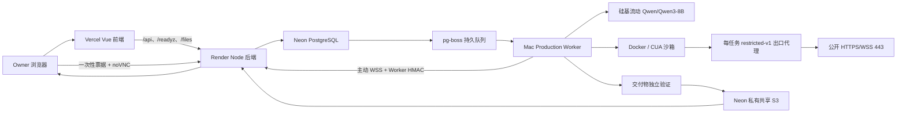

# Artigen 全链路 Agent Handoff

更新时间：2026-08-11（Asia/Shanghai）

文档用途：这是给下一位 AI、工程师或运维接管人的单一入口。即使没有本次聊天记录，也应能从本文理解 Artigen Agent 为什么曾经被判断为“还跑不通”、后来做了什么、现在实际运行在哪里、如何登录和运维、哪些安全边界不能破坏，以及接手后应先检查什么。

项目级正式状态和 Handoff 治理见 [`PROJECT_HANDOFF.zh-CN.md`](./PROJECT_HANDOFF.zh-CN.md)。本文只负责 Agent 专题。

发布等级：**Production Beta / owner-only**

> 安全说明：本文只记录账号标识、平台入口、资源 ID、配置项名称和密钥存放位置，不包含任何密码、API Key、数据库连接串、OTP、恢复码或真实 Secret。接管时也不要把这些值打印到终端、日志、聊天或 Markdown。

## 0. 下一位 AI 先读这里

### 0.1 当前结论

Artigen 浏览器 Agent 已经完成代码合并、生产部署和真实端到端验收。它不再是最初“核心代码通过测试，但数据库、模型、CUA 和 Worker 没配齐”的状态。

截至 2026-08-10 的只读核验结果：

| 项目 | 当前结果 |
|---|---|
| 生产前端 | 在线 |
| 生产后端 | 在线 |
| 生产数据库 | 在线，迁移为 `020_agent_secure_browser_relay` |
| 生产对象存储 | 私有共享 S3，`driver=s3`、`shared=true` |
| Agent 模型 | 硅基流动 `Qwen/Qwen3-8B` |
| 本地模型 | 没有下载 Qwen，不需要 Ollama |
| Mac Worker | 在线，单并发 |
| Docker/CUA | 就绪，镜像 `artigen/cua-xfce:0.1.15-tools-v2` |
| 浏览器 | `browserReady=true` |
| 安全出口 | `egressVerified=true` |
| 桌面中继 | `desktopRelayReady=true` |
| Worker 心跳 | `workerOnline=true` |
| 浏览器能力 | `browserPublicEnabled=true`，但仅 owner 可创建任务 |
| Beta 权限 | `accessMode=owner-only-v1` |
| 队列 | `queueDepth=0`、`availabilityNote=ready` |
| 当前是否需要启动 | **不需要**；Worker 现在在线 |

最终生产代码：

```text
GitHub main SHA: 529b73fffcd2f06323ccd373168a5e009f312b5a
Render service: srv-d9cr73r7uimc73etc4j0
Render deployment: dep-d9qsuam417fc7383uj70
GitHub Actions run: 31178240786
Release gate: success
```

### 0.2 “在线”不等于“有人访问”

`queueDepth=0` 只表示此刻没有等待中的 Agent 任务，不能推导网站没有访客。生产 `/readyz` 显示 `behaviorAnalyticsEnabled=true`，项目也有 `behavior_events` 和管理端行为分析接口，但本轮没有读取真实访客统计，而且生产管理后台当前没有可用管理员入口。

如果用户以后问“最近有没有人访问”，必须单独查询行为分析数据，例如：

- `GET /api/admin/behavior/summary`；
- `GET /api/admin/behavior/events`；
- 或数据库 `behavior_events`；

并先取得合适的管理员授权。不要用队列深度、Worker 心跳、HTTP 200 或 Render uptime 代替访客统计。

### 0.3 这是 Beta，不是 24×7 SLA

当前方案没有新增费用：Render 仍是 Free Web Service，真正执行 Agent 的 Worker 在用户当前这台 Mac 上。以下任意情况都会让新任务排队：

- Render 免费实例休眠或重启；
- Mac 关机、退出登录或合盖睡眠；
- Docker Desktop 停止；
- Production LaunchAgent 停止；
- 本机断网或硅基流动不可用。

要承诺稳定 24×7，需要把 Render 升级到付费实例，并把 Worker 迁移到专用 Linux 主机。这不是当前授权范围，也不是本轮已经完成的事情。

## 1. 这整段对话发生了什么

### 1.1 最初的需求

用户最开始要求阅读 Artigen 代码，说明数据库部署位置、站点和域名、所用账号、登录方式、当前是否在线、是否有人访问以及是否需要启动，并要求以 Markdown 交付。

第一次技术检查得到的结论是：

- Agent 专项测试 28/28；
- 后端完整测试 316 通过、38 跳过、0 失败；
- Agent 质量集 40/40；
- 前端 TypeScript 检查通过；
- 前端 E2E 因本机缺少 Playwright Chromium 而没有真正执行业务断言；
- 当时本机数据库里没有 Agent 所需表；
- 当时 `backend/.env` 没有 Agent 功能开关、模型、CUA 和安全出口配置；
- 当时 Python 环境没有可用 CUA SDK；
- 因此只能说“代码基础通过”，不能说“真实环境已跑通”。

这份早期判断在当时是正确的。它描述的是整改前环境，而不是当前生产状态。

### 1.2 用户把 Agent 设为第一目标

用户明确要求：第一目标是把 Agent 真正弄好，需要什么再说明，并授权按照完整计划继续开发和发布。

此后目标从“审计现状”变成了：

```text
创建任务
→ 持久排队
→ Worker 领取
→ 创建安全浏览器沙箱
→ 调用云端模型
→ 执行工具和人工审批
→ 生成文件
→ 独立验证
→ 上传共享存储
→ succeeded
```

只有这条真实链路成功，才允许说 Agent 跑通。

### 1.3 模型选择的最终决定

用户反复确认只能使用其深度思考功能已经在调用、可持续使用的硅基流动模型。最终决定是：

- Provider：`siliconflow`；
- API Base：`https://api.siliconflow.cn/v1`；
- 唯一允许的 Agent 模型：`Qwen/Qwen3-8B`；
- 复用 Artigen 原有硅基流动凭据；
- 不下载本地 Qwen；
- 不使用 Ollama；
- 不要求 OpenAI API Key；
- 如果模型能力以后确实不足，先向用户说明证据和影响，再决定是否更换，不能自行换模型。

代码在 [`backend/services/agent-config.js`](./backend/services/agent-config.js) 中把硅基流动 Agent 模型锁定为 `Qwen/Qwen3-8B`，配置其他硅基流动模型会 fail-closed。

### 1.4 CUA、Docker 和 Hugging Face 的决定

用户不希望购买 CUA 云服务。最终方案是：

- 用当前 Mac 运行 Production Worker；
- 用 Docker Desktop 创建本地 CUA 浏览器沙箱；
- 不需要 CUA 云账号或 `CUA_API_KEY`；
- CUA/VNC 端口只绑定本机回环地址；
- Render 只运行 API、中继和队列协调，不运行重型浏览器 Worker。

Hugging Face 缓存不是运行硅基流动 Qwen 所必需，但用户明确要求不要胡乱清理。因此：

- 不要删除 Hugging Face 缓存；
- 不要因为磁盘紧张就把它当作默认清理目标；
- 当前也没有为了 Agent 下载本地 Qwen 权重。

### 1.5 磁盘清理讨论

用户曾要求释放本机空间，讨论过以下候选：

- Git 中断操作留下的 `tmp_pack_*` 垃圾；
- npm、uv、pip、Homebrew、pnpm 下载缓存；
- Trae 下载缓存；
- `wechat-md-cli/dist` 构建产物；
- Docker 未使用镜像和构建缓存。

用户的授权边界是：只清不会影响项目和日常使用、能重新下载或重新构建的内容。后续接管不要根据当时的候选大小再次盲删，也不要声称精确释放了多少空间，除非重新做只读盘点并有实际清理记录。

尤其保留：

- 项目源码和 Git 正常对象；
- Python/Node 环境本体；
- PostgreSQL、Redis 数据卷；
- `artigen-assets` 数据；
- Hugging Face 缓存；
- 用户配置和密钥。

### 1.6 最终实现目标

用户批准的完整目标包括：

- 浏览器 SSRF 和 DNS 重绑定防护；
- 每任务独立 Docker 网络和安全出口代理；
- HTTPS Origin 白名单；
- 完整浏览、点击、填表和审批；
- 密码、OTP、验证码人工接管；
- 加密保存、恢复和撤销单站会话；
- Mac Worker 到 Render 的主动 WebSocket 中继；
- noVNC 远程桌面；
- 一次性桌面票据；
- 共享 Neon S3；
- LaunchAgent + Keychain 生产运行；
- DEV 验收后发布 owner-only Production Beta；
- 不增加新费用。

这些目标已经完成实现和真实生产验收。

## 2. 当前生产架构



### 2.1 组件职责和典型故障

| 组件 | 职责 | 常见故障表现 |
|---|---|---|
| Vercel 前端 | 工作台、任务详情、审批、接管、下载 | 页面构建失败、API 转发失败、旧前端版本 |
| Render 后端 | 鉴权、API、状态、队列协调、WebSocket 中继 | Free 实例冷启动、部署失败、数据库或 S3 readiness 失败 |
| Neon PostgreSQL | 任务真相、事件、审批、心跳、票据、配额 | 迁移不完整、连接串使用 pooler 导致发布前置检查失败 |
| pg-boss | 持久任务队列 | Worker 离线时任务保留并排队，不应重复提交 |
| Mac Worker | 单并发领取任务、调用模型、管理沙箱 | Mac/Docker/LaunchAgent 停止时 `workerOnline=false` |
| 硅基流动 | Qwen 模型推理 | Key 失效、额度或网络问题、模型工具规划质量波动 |
| Docker/CUA | 浏览器和工具运行环境 | 镜像缺失、Docker daemon 停止、工具链标签错误 |
| 出口代理 | SSRF、DNS 和端口防护 | 主动探测失败时 `egressVerified=false`，浏览器能力不得宣称就绪 |
| 桌面中继 | noVNC 人工登录接管 | Worker/Viewer 票据配对失败、WebSocket 断开、票据过期 |
| 交付物验证器 | 病毒、类型、大小、来源、摘要校验 | 验证失败时任务不能以成功交付 |
| 私有 S3 | 跨 Render/Mac 保存输入和输出 | `shared=false` 时生产 Agent 必须 fail-closed |

### 2.2 Render 和 Mac 的边界

Render 生产后端设置 `AGENT_WORKER_ENABLED=0`。不要把 Render 同时改成 Worker：免费实例不适合本地 CUA，而且会产生重复领取和资源边界混乱。

Mac Worker 主动连接 Neon 队列和 Render WebSocket 中继，不需要：

- 公网 IP；
- 路由器端口映射；
- Cloudflare Tunnel；
- 对外暴露 VNC。

Worker 并发固定为 1。单任务串行是当前 Beta 的安全和资源控制，不是尚未完成的缺陷。

## 3. 代码导航

### 3.1 前端

| 入口 | 作用 |
|---|---|
| [`frontend/src/agentImg/views/AgentWorkbench.vue`](./frontend/src/agentImg/views/AgentWorkbench.vue) | 创建任务、能力选择、Origin 白名单、会话保存选择、服务状态 |
| [`frontend/src/agentImg/views/AgentRunDetail.vue`](./frontend/src/agentImg/views/AgentRunDetail.vue) | 任务事件、审批、输入、接管、交付物 |
| [`frontend/src/agentImg/services/agentRuns.ts`](./frontend/src/agentImg/services/agentRuns.ts) | Agent API 类型与请求封装 |
| [`frontend/e2e/agent-workbench.spec.ts`](./frontend/e2e/agent-workbench.spec.ts) | 工作台 E2E 契约 |

### 3.2 后端 API 和编排

| 入口 | 作用 |
|---|---|
| [`backend/routes/agent-runs.js`](./backend/routes/agent-runs.js) | Agent HTTP API、SSE、桌面票据、浏览器 profile 和 integration 路由 |
| [`backend/services/agent-run-service.js`](./backend/services/agent-run-service.js) | 创建、状态机、访问控制、审批、会话和任务真相 |
| [`backend/services/agent-queue-service.js`](./backend/services/agent-queue-service.js) | pg-boss 发布、领取与服务 readiness |
| [`backend/services/agent-worker-service.js`](./backend/services/agent-worker-service.js) | Worker 生命周期、工具执行、浏览器、验证、清理 |
| [`backend/services/agent-model-provider.js`](./backend/services/agent-model-provider.js) | Qwen 模型循环、工具协议、上下文和检查点 |
| [`backend/services/agent-policy-service.js`](./backend/services/agent-policy-service.js) | 风险分类、禁止动作、审批和人工接管 |
| [`backend/services/agent-billing-service.js`](./backend/services/agent-billing-service.js) | 预算 hold、结算、失败释放和退款 |
| [`backend/services/agent-artifact-service.js`](./backend/services/agent-artifact-service.js) | 交付物发现、独立校验、登记和共享存储 |
| [`backend/services/agent-payload-service.js`](./backend/services/agent-payload-service.js) | 目标、用户输入、审批上下文和 profile 加密 |
| [`backend/services/agent-config.js`](./backend/services/agent-config.js) | 模型、沙箱、Beta、浏览器和 Worker 配置约束 |

### 3.3 浏览器、CUA 与中继

| 入口 | 作用 |
|---|---|
| [`backend/services/agent-sandbox-provider.js`](./backend/services/agent-sandbox-provider.js) | 创建/销毁 CUA、出口代理、控制 sidecar 和内部网络 |
| [`backend/services/agent-browser-service.js`](./backend/services/agent-browser-service.js) | 浏览器动作和 Origin 校验 |
| [`backend/agent_runtime/cua_bridge.py`](./backend/agent_runtime/cua_bridge.py) | 本地 CUA/Chromium 桥接和 readiness |
| [`backend/agent_runtime/browser_dom.js`](./backend/agent_runtime/browser_dom.js) | DOM、表单、链接、按钮和 Origin 检查 |
| [`backend/agent_runtime/egress_proxy.js`](./backend/agent_runtime/egress_proxy.js) | 只允许受控 HTTPS/WSS 出口 |
| [`backend/agent_runtime/public_network.js`](./backend/agent_runtime/public_network.js) | IP 分类、私网/保留/NAT64/映射地址拒绝 |
| [`backend/agent_runtime/control_proxy.js`](./backend/agent_runtime/control_proxy.js) | 沙箱浏览器控制入口 |
| [`backend/services/agent-desktop-relay-service.js`](./backend/services/agent-desktop-relay-service.js) | Render 侧 Viewer/Worker WebSocket 中继 |
| [`backend/services/agent-desktop-relay-client.js`](./backend/services/agent-desktop-relay-client.js) | Mac Worker 主动连接中继 |

### 3.4 运行、诊断和验收脚本

| 入口 | 作用 |
|---|---|
| [`backend/scripts/doctor-agent.js`](./backend/scripts/doctor-agent.js) | Agent 配置、数据库、Worker 和运行环境体检 |
| [`backend/scripts/start-agent-worker.js`](./backend/scripts/start-agent-worker.js) | 独立 Worker 入口 |
| [`backend/scripts/run-agent-worker-macos.js`](./backend/scripts/run-agent-worker-macos.js) | 从 Keychain 组装 DEV/Production Mac Worker 环境 |
| [`backend/scripts/install-agent-worker-launchagent.js`](./backend/scripts/install-agent-worker-launchagent.js) | 安装 macOS LaunchAgent |
| [`backend/scripts/run-agent-dev-smoke.js`](./backend/scripts/run-agent-dev-smoke.js) | DEV 基础 Agent 烟测 |
| [`backend/scripts/run-agent-dev-relay-smoke.js`](./backend/scripts/run-agent-dev-relay-smoke.js) | DEV 桌面中继烟测 |
| [`backend/scripts/run-agent-dev-login-smoke.js`](./backend/scripts/run-agent-dev-login-smoke.js) | DEV 登录接管和会话烟测 |
| [`backend/scripts/run-agent-production-beta-smoke.js`](./backend/scripts/run-agent-production-beta-smoke.js) | Production Beta 受控烟测 |
| [`backend/scripts/validate-agent-quality-set.js`](./backend/scripts/validate-agent-quality-set.js) | 40 项 Agent 质量集 |

## 4. API、数据和状态机

### 4.1 主要 Agent API

所有用户任务接口都要求有效 Artigen 用户身份，并在 Production Beta 中继续经过 owner-only 校验。

| 方法 | 路径 | 作用 |
|---|---|---|
| `GET` | `/api/agent/status` | Worker、浏览器、出口、中继和队列状态 |
| `POST` | `/api/agent-assets` | 上传任务输入资产，最多 10 个、单文件最多 40 MiB |
| `POST` | `/api/agent-runs/quote` | 任务预算报价 |
| `POST` | `/api/agent-runs` | 创建任务，支持 `Idempotency-Key` |
| `GET` | `/api/agent-runs` | 当前用户任务列表 |
| `GET` | `/api/agent-runs/:runId` | 当前用户任务详情 |
| `GET` | `/api/agent-runs/:runId/events` | SSE 事件流，支持 `Last-Event-ID` |
| `POST` | `/api/agent-runs/:runId/pause` | 请求暂停 |
| `POST` | `/api/agent-runs/:runId/resume` | 恢复任务 |
| `POST` | `/api/agent-runs/:runId/cancel` | 取消任务 |
| `POST` | `/api/agent-runs/:runId/input` | 提交用户输入、审批决定或接管结束信号 |
| `POST` | `/api/agent-runs/:runId/desktop-ticket` | 为任务所有者签发一次性接管票据 |
| `GET` | `/api/agent-runs/:runId/artifacts` | 列出任务交付物 |
| `GET` | `/api/agent-browser-profiles` | 列出当前用户保存的单站会话 |
| `DELETE` | `/api/agent-browser-profiles/:profileId` | 撤销并擦除保存会话 |
| `GET` | `/api/integrations` | 列出 GitHub/Google Drive integration |
| `POST` | `/api/integrations/:provider/connect` | 开始 OAuth 连接 |
| `GET` | `/api/integrations/:provider/callback` | 完成 OAuth 回调 |
| `DELETE` | `/api/integrations/:provider` | 撤销 integration |

前端不会获得原始 VNC 地址。`desktop-ticket` 返回临时 WebSocket URL，实际票据受所有者、任务、审批、Worker 和沙箱绑定。

### 4.2 `browserConfig` 契约

```ts
browserConfig: {
  allowedOrigins?: string[];
  profileId?: string | null;
  persistSession?: boolean;
}
```

约束：

- 开启 `browser` capability 时至少要有一个有效 HTTPS Origin；
- Origin 使用精确的 scheme + host + port 边界；
- `persistSession=true` 时必须且只能提供一个 Origin；
- 已保存的 `profileId` 必须属于当前用户，并且它的 `site_origin` 必须在本次白名单中；
- 不允许用 Origin 白名单绕过出口代理的公网地址校验；
- 顶层跨 Origin 跳转需要被拒绝或重新得到明确授权。

### 4.3 readiness 字段

| 字段 | 含义 |
|---|---|
| `workerOnline` | 数据库存在未过期 Worker heartbeat |
| `browserReady` | Worker 的本地 CUA、浏览器模式和出口探测满足要求 |
| `egressVerified` | `restricted-v1` 已主动探测成功，不是只设置了环境变量 |
| `desktopRelayReady` | Worker 已能使用配置的 Render WebSocket 中继 |
| `browserPublicEnabled` | 公共 capability 列表包含 `browser`；仍受 Beta 用户白名单限制 |
| `imageGenerationPublicEnabled` | 公共 capability 列表包含 `generate_images` 且生图 Provider readiness 已通过；仍受 Beta 用户白名单限制 |
| `availabilityNote` | `ready` 才表示当前可正常接单 |

### 4.3.1 Agent 图片交付契约（开发阶段）

功能分支 `codex/agent-image-generation` 正在增加正式 `image` deliverable。本文在生产验收前只记录已确定的代码契约，不表示功能已经上线：

- Qwen 只在 run 获得 `generate_images` capability 时看到 `generate_image`；Worker 仍以 `AGENT_CAPABILITY_NOT_GRANTED` 作最终授权门禁；
- `Kwai-Kolors/Kolors` 统一负责图片生成：文生图每次 8 点，单参考图图生图每次 12 点；
- `Qwen/Qwen3-8B` 统一负责文字理解、拆解任务和决定工具；Agent 最多使用 1 张已扫描任务参考图，不得调用第三种模型；
- 正式图片交付使用 `role=image`，仅接受 PNG、JPEG、WebP，并经过病毒扫描、ImageMagick 解码、像素限制、非空校验、S3 持久化和 SHA-256 验证；
- `image` 可以单独满足完成条件；失败仍走既有冻结释放，成功仍只结算一次；
- Agent 保持 `owner-only-v1`，本变更不扩大 Agent 用户范围。

在 DEV、Release gate、同 SHA 生产发布和真实 IMAGE run 全部完成前，不得把本节描述成当前生产能力。

网页能打开但 `workerOnline=false` 时，不要重复创建任务。已有任务在 pg-boss/数据库中等待 Worker 恢复。

### 4.4 任务状态机

```text
draft
→ queued
→ provisioning
→ running
→ waiting_user / paused
→ running
→ verifying
→ succeeded
```

终止状态还有：

```text
failed
cancelled
```

重要不变量：

- 同一用户同时最多一个活动任务；
- 创建接口使用用户 + `Idempotency-Key` 防止重复扣费和重复提交；
- Worker 使用 lease 和 heartbeat；
- 任务等待用户输入时模型暂停；
- 只有交付物独立验证完成后才能进入 `succeeded`；
- 失败任务释放/结算预算，生产烟测中的安全失败 charged credits 为 0；
- 任务结束必须清理 CUA、出口代理、控制 sidecar 和临时网络。

### 4.5 数据库迁移 016–020

| 迁移 | 核心内容 |
|---|---|
| `016_agent_runtime` | runs、加密 payload、steps、append-only events、artifacts、approvals、budget holds、免费额度、browser profiles、integrations |
| `017_agent_durable_model_checkpoints` | 加密模型检查点和过期清理 |
| `018_agent_approval_context` | 审批上下文摘要与限制 |
| `019_agent_local_worker` | 队列过期、试用/免费额度拆分、Worker heartbeat |
| `020_agent_secure_browser_relay` | sandbox Worker 绑定、浏览器 readiness、出口探测、中继 readiness、一次性桌面票据 |

核心表：

```text
agent_runs
agent_run_payloads
agent_steps
agent_events
agent_artifacts
agent_approvals
agent_budget_holds
agent_daily_free_usage
agent_trial_usage
agent_model_checkpoints
agent_worker_heartbeats
agent_browser_profiles
agent_desktop_tickets
agent_integrations
agent_integration_secrets
```

安全属性：

- `agent_events` 有数据库触发器，禁止 UPDATE/DELETE，只能追加；
- objective、用户输入、审批上下文、浏览器 profile 和模型检查点使用 AES-256-GCM 形态存储；
- 浏览器 profile 绑定用户和精确 Origin，默认保留不超过 30 天；
- 桌面票据数据库只存 32-byte token hash，不存原始 token；
- integration secret 加密保存，不写入事件或前端；
- 生产数据库迁移以 `020_agent_secure_browser_relay` 为当前基线。

## 5. 浏览器和登录安全边界

### 5.1 SSRF 与 DNS 重绑定

每个浏览器任务使用独立 Docker 内部网络和出口代理。Chromium 不直接使用 Docker 默认出口。

出口策略 `restricted-v1`：

- 只接受 HTTPS/WSS；
- 只允许目的端口 443；
- 拒绝 URL 用户名/密码；
- 拒绝 IP literal 直连；
- 解析全部 A/AAAA 地址；
- 任何一个解析结果是私网、环回、链路本地、保留地址或云元数据地址时整次连接失败；
- 拒绝 IPv4 映射 IPv6；
- 拒绝 NAT64 映射到非公网 IPv4；
- 建立连接时锁定已经校验的 IP；
- 每次新连接和跳转重新解析、重新校验，防止 DNS rebinding；
- Chromium 禁止 DIRECT 回退；
- 禁用 QUIC、非代理 WebRTC、背景联网和隐式 localhost 绕过。

`AGENT_SANDBOX_EGRESS_POLICY=restricted-v1` 本身不等于安全已经成立。只有沙箱主动探测通过并报告 `egressVerified=true`，浏览器才可宣称 ready。

### 5.2 页面 Origin 和交互审批

- 顶层页面必须属于用户明确填写的 `allowedOrigins`；
- 公开 HTTPS CDN 子资源可以经过安全代理加载；
- 普通同站导航可继续；
- 填普通表单需要确认；
- 提交、发送、发布、删除、权限修改等外部状态变化必须确认；
- 购买、安全绕过、任意端口和云元数据访问始终禁止；
- DOM 检查会考虑元素类型、可访问名称、表单 method/action、链接目标和是否提交按钮，不只按按钮文字判断；
- 页面出现可疑提示词注入时可以读取页面，但后续交互自动升级为人工确认。

### 5.3 密码、OTP 和验证码

以下内容必须由用户通过 noVNC 接管处理：

- 密码；
- OTP/邮箱验证码/短信验证码；
- CAPTCHA；
- 浏览器或网站安全警告；
- 任何需要用户确认身份的敏感输入。

接管时模型暂停。用户操作结束后任务重新排队，模型只看到登录后的页面状态。不得把用户键入的敏感值写入：

- 模型上下文；
- `agent_events`；
- `agent_steps`；
- `agent_approvals`；
- `agent_artifacts`；
- `agent_model_checkpoints`；
- Worker 日志或截图摘要。

最终真实烟测已经对上述位置和 Production Worker 日志做过原文精确匹配，结果全部为 false。

### 5.4 一次性桌面票据

桌面票据要求：

- 256 位随机值；
- 数据库只保存 SHA-256 hash；
- 绑定用户、任务、审批、Worker 和沙箱；
- 60 秒内使用；
- 使用一次后失效；
- 过期、重放、跨用户、伪造 Worker、任务结束或沙箱不匹配全部拒绝；
- Render/WebSocket 断线后重新申请票据，不恢复旧票据；
- 任务暂停、取消、完成或用户退出时立即关闭中继。

VNC 服务只绑定 Mac 的 `127.0.0.1`，不向局域网或公网暴露。

### 5.5 下载、上传和交付物

- 浏览器下载只进入沙箱下载目录；
- 限制文件大小和类型；
- 文件经过 ClamAV 和结构检查后才能交给模型；
- 上传到第三方网站只能选择用户已经提交给任务的资产；
- 交付物必须校验类型、大小、来源和 SHA-256；
- Production readiness 要求共享 S3，不能回退到 Mac 本地文件。

## 6. 基础设施、域名和部署位置

### 6.1 线上入口

| 用途 | 地址 |
|---|---|
| 生产主站 | <https://artigen-fengfan.vercel.app/artigen> |
| Agent 工作台 | <https://artigen-fengfan.vercel.app/artigen/agent> |
| 登录页 | <https://artigen-fengfan.vercel.app/login> |
| Render 后端 | <https://artigen-app-fengfan.onrender.com> |
| 生产版本 | <https://artigen-app-fengfan.onrender.com/api/meta> |
| 生产 readiness | <https://artigen-app-fengfan.onrender.com/readyz> |
| Agent 状态 | <https://artigen-app-fengfan.onrender.com/api/agent/status> |
| DEV | <https://dev-artigen-app-fengfan.onrender.com/artigen> |
| 邮件中继 | <https://artigen-mail-relay.vercel.app> |

Vercel 的 `vercel.json` 将 `/api/*`、`/files/*`、`/healthz` 和 `/readyz` 转发到 Render。其他路径由 Vercel 上的 Vue SPA 处理。

目前使用 Vercel/Render 平台自带 HTTPS 域名，没有购买或接入自定义域名，也不需要自行维护 TLS 证书。

### 6.2 服务和数据位置

| 资源 | 位置/标识 |
|---|---|
| 前端 | Vercel 项目 `artigen-fengfan` |
| 邮件中继 | Vercel 项目 `artigen-mail-relay` |
| 生产后端 | Render Virginia，服务 `artigen-app-fengfan` |
| Render Service ID | `srv-d9cr73r7uimc73etc4j0` |
| DEV Service ID | `srv-d9gpgs61a83c73f7k8s0` |
| 生产数据库 | Neon 项目 `Artigen Production`，数据库 `neondb` |
| DEV 数据库 | 同一 Neon 项目中的 `dev_artigen` |
| 对象存储 | Neon 项目 `Artigen Object Storage`，私有桶 `artigen-assets` |
| Production Worker | 当前 Mac + Docker Desktop + LaunchAgent |

## 7. 账号与登录方式

### 7.1 Artigen Production Beta owner

| 项目 | 值 |
|---|---|
| Owner 邮箱 | `876458930@qq.com` |
| Owner UUID | `f9ff116a-fbce-47ef-85c7-dc68c8ac7388` |
| Beta 模式 | `owner-only-v1` |
| 登录方式 | Turnstile + QQ 邮箱一次性验证码 |

登录步骤：

1. 打开 <https://artigen-fengfan.vercel.app/login>；
2. 输入 `876458930@qq.com`；
3. 完成 Cloudflare Turnstile；
4. 请求并输入 QQ 邮箱收到的一次性验证码；
5. 登录后进入 `/artigen/agent`。

这个身份没有密码 hash，不要尝试“邮箱 + 固定密码”。生产登录是 fail-closed：没有真实 Turnstile token 时应返回 `TURNSTILE_REQUIRED`。

其他账号即使登录成功，也会因不在 `AGENT_BETA_USER_IDS` 中收到 `AGENT_BETA_ACCESS_DENIED`。在扩大 Beta 白名单前必须重新评估容量、安全和成本。

### 7.2 GitHub

| 项目 | 值 |
|---|---|
| 用户/组织 | `FengFan-1997` |
| 仓库 | `FengFan-1997/Artigen` |
| 当前本机方式 | `gh` 已有登录状态 |

只读检查：

```bash
gh auth status
gh repo view FengFan-1997/Artigen
```

登录失效时使用 GitHub 官方网页/设备登录和 2FA，不要把 Token 发到聊天。

### 7.3 Render

| 项目 | 值 |
|---|---|
| 账号邮箱 | `sorates1997@163.com` |
| Workspace | `artigen` |
| 生产服务 | `artigen-app-fengfan` |
| Service ID | `srv-d9cr73r7uimc73etc4j0` |
| 既有登录方式 | GitHub 登录记录 |

只读检查：

```bash
render whoami
render services --output json
render deploys list srv-d9cr73r7uimc73etc4j0 --output json
```

Mac SSH 公钥曾以 `Artigen Production Mac Worker` 添加到 Render。Free Web Service 不支持 SSH，这是套餐限制，不代表密钥异常。

### 7.4 Neon

| 项目 | 值 |
|---|---|
| 邮箱 | `sorates1997@163.com` |
| Login | `sorates1997` |
| GitHub | `@fengfan-1997` |
| Organization | `Artigen` |
| 数据库项目 | `Artigen Production` |
| 对象存储项目 | `Artigen Object Storage` |

只读检查：

```bash
neonctl me
neonctl projects list
```

生产 Worker 和 Render 都应使用 Neon direct hostname。发布前曾因使用 `-pooler` URL 被 readiness fail-closed 拒绝，不要再次把 Agent 运行/迁移连接串换成 pooler。

### 7.5 Vercel

| 项目 | 值 |
|---|---|
| Team | `FengFan's projects` |
| 当前 CLI 账号记录 | `876458930-7565` |
| 前端项目 | `artigen-fengfan` |
| 邮件中继 | `artigen-mail-relay` |

现有证据不能可靠证明网页端长期使用 GitHub 还是邮箱登录。优先使用当前已登录会话；失效时按 Vercel 官方页面完成登录/2FA，不要在文档中保存密码。

### 7.6 硅基流动

| 项目 | 值 |
|---|---|
| 登录 | <https://account.siliconflow.cn/zh/login> |
| 控制台 | <https://cloud.siliconflow.cn> |
| API | <https://api.siliconflow.cn/v1> |
| Agent 模型 | `Qwen/Qwen3-8B` |

复用 Artigen 深度思考链路已有凭据。不需要本地 Qwen、OpenAI Key、CUA 云 Key 或 Docker Hub 登录。

## 8. 密钥和本机运行位置

### 8.1 Production Worker Keychain

macOS Keychain service：

```text
artigen-agent-production-worker
```

该 service 下应存在以下 account 标签：

```text
DATABASE_URL
AGENT_PAYLOAD_ENCRYPTION_KEY
SILICONFLOW_API_KEY
AGENT_WORKER_RELAY_SECRET
AGENT_WORKER_RELAY_URL
S3_ENDPOINT
S3_BUCKET
S3_REGION
S3_ACCESS_KEY_ID
S3_SECRET_ACCESS_KEY
AGENT_BETA_USER_IDS
```

只验证标签存在，不打印值：

```bash
for account in DATABASE_URL AGENT_PAYLOAD_ENCRYPTION_KEY SILICONFLOW_API_KEY \
  AGENT_WORKER_RELAY_SECRET AGENT_WORKER_RELAY_URL S3_ENDPOINT S3_BUCKET \
  S3_REGION S3_ACCESS_KEY_ID S3_SECRET_ACCESS_KEY AGENT_BETA_USER_IDS; do
  security find-generic-password \
    -s artigen-agent-production-worker \
    -a "$account" >/dev/null
done
```

受控 DEV 登录验收密码独立存放在：

```text
service: Artigen Dev Access Password
account: artigen-dev
```

不要执行带 `-w` 或类似输出 Secret 的命令并把结果留在聊天/日志中。

### 8.2 LaunchAgent 和日志

```text
LaunchAgent:
~/Library/LaunchAgents/com.artigen.agent-worker-production.plist

日志：
~/Library/Logs/Artigen/com.artigen.agent-worker-production.log
~/Library/Logs/Artigen/com.artigen.agent-worker-production.error.log
```

日志权限应为 `0600`。日志只应记录状态、错误码和经过净化的诊断，不应包含真实密钥、密码或 OTP。

Production Worker 使用 `caffeinate -i -s` 降低接通电源时的空闲睡眠风险，但无法阻止关机、退出登录或合盖。

## 9. 开发和发布历史

### 9.1 Git 时间线

| 时间顺序 | 提交/PR | 作用 |
|---|---|---|
| 1 | `3135016` | 首次交付安全本地浏览器 Agent Beta 核心实现 |
| 2 | PR #8 / `c53b4b9` | 第一批功能合入 `dev` |
| 3 | `5dc0071` | 远程 DEV Agent 运行验证 |
| 4 | `1ab5b90` | 远程接管恢复加固 |
| 5 | PR #9 / `af50290` | 加固合入 `dev` |
| 6 | `4c678ce`、PR #10 | 隔离 DEV relay smoke 配额 |
| 7 | `be30eac`、PR #11 | 登录会话真实验证和 owner-only Beta gate |
| 8 | PR #12 / `9bcc77d` | 首次 Production Beta 基线合入 `main` |
| 9 | `e8597c4` | Production Worker、烟测、文档和运维加固 |
| 10 | PR #13 / `33c4cc9` | 加固重新合入 `dev` |
| 11 | `7e57c63`、`e70a1db`、PR #15 / `59da0a7` | 将发布历史同步回 `dev`，修正文档中不可固定自身 SHA 的问题 |
| 12 | PR #14 / `529b73f` | 最终 `dev` → `main` Production 发布 |
| 13 | `d81d1a1` | 最终发布回执，位于 `codex/agent-release-receipt` |

PR：

- <https://github.com/FengFan-1997/Artigen/pull/8>
- <https://github.com/FengFan-1997/Artigen/pull/9>
- <https://github.com/FengFan-1997/Artigen/pull/10>
- <https://github.com/FengFan-1997/Artigen/pull/11>
- <https://github.com/FengFan-1997/Artigen/pull/12>
- <https://github.com/FengFan-1997/Artigen/pull/13>
- <https://github.com/FengFan-1997/Artigen/pull/14>
- <https://github.com/FengFan-1997/Artigen/pull/15>

### 9.2 正式版本与文档来源

Agent Production Beta 的运行版本：

```text
production main: 529b73fffcd2f06323ccd373168a5e009f312b5a
release receipt commit: d81d1a15deae6523445b3e24befba2351889e4ce
```

发布回执提交只记录验收证据，不改变生产运行代码。文档当前位于哪个工作分支、是否已经合入
目标分支，需要用 GitHub 和本地 Git 重新核对；不要把文档分支 HEAD 当成生产运行 SHA。
生产精确版本始终以 `/api/meta` 为准。

## 10. 测试和真实生产验收

### 10.1 测试基线

最终发布验证：

| 测试 | 结果 |
|---|---|
| 后端完整测试 | 343 通过、38 跳过、0 失败，共 381 |
| 前端单元测试 | 211/211 |
| Agent/RFB/PostgreSQL 专项 | 68/68 |
| Agent 质量集 | 40/40 |
| Playwright 六项目矩阵 | 405 通过、3 条条件跳过、0 失败 |
| GitHub 最终流水线 | `31178240786`，success |
| Release gate | success |
| Vercel `artigen-fengfan` | success |

Agent 质量集包含报告、表格、演示文稿和网站各 10 个任务。

曾出现一次重复流水线 WebKit `Page crashed`。同一 SHA 的正式 PR 分片通过，新 Runner 单独复跑也通过，因此记录为 CI Runner 资源抖动，不是业务断言回归。

GitHub 流水线还曾因 `registry.npmmirror.com` 下载超时失败。重跑后全部通过，属于依赖镜像网络故障。

### 10.2 真实生产任务

| Run ID | 结果 | 说明 |
|---|---|---|
| `6b5061d2-ada6-4347-b027-9465e839d4d5` | failed / refundable | 一次浏览器动作失败，charged credits 为 0，沙箱清理 |
| `4f0052ec-d96f-4f64-9985-e3a209679a25` | failed / refundable | Qwen 临时写 ReportLab 脚本并触发 shell bridge 超时，charged credits 为 0 |
| `0bfa9eef-a989-4400-9fcd-0bcb043c211d` | succeeded | 人工登录接管并加密保存会话 |
| `20317cd5-77e8-40ca-ac74-ad845385bf96` | succeeded | 自动恢复保存会话并完成第二次交付 |

两次安全失败都没有：

- 重复提交外部操作；
- 泄露凭据；
- 遗留活动沙箱；
- 产生内部 charged credits。

第二次失败后的验收提示改为使用镜像预装的 `artigen-report-pdf`，不让模型临时构造不可控 PDF 工具链。最终复跑成功。

### 10.3 成功链路

```text
owner-only 权限校验
→ 非白名单用户拒绝
→ 创建任务
→ Mac Worker 领取
→ 创建 CUA + 出口代理 + 内部网络
→ Qwen 请求 enter_password
→ policy 阻断并进入 waiting_user
→ Render 签发 60 秒一次性票据
→ Viewer / Worker HMAC 配对
→ RFB 003.008
→ 用户接管输入登录信息
→ 模型恢复并读取登录后页面
→ 生成 Markdown + PDF
→ ClamAV、格式、来源、大小、SHA-256 验证
→ 上传共享 S3
→ 加密保存单站会话
→ 第二个任务自动恢复会话
→ 再次生成和验证交付物
→ 撤销 profile 并覆盖密文
→ 清理容器、代理和网络
→ succeeded
```

### 10.4 最终交付物

| 文件 | 大小 | 验证 | 存储 |
|---|---:|---|---|
| `artigen-login-session.md` | 152 bytes | passed | S3 |
| `artigen-login-session.pdf` | 2,657 bytes | passed | S3 |
| `artigen-login-restore.md` | 247 bytes | passed | S3 |
| `artigen-login-restore.pdf` | 2,766 bytes | passed | S3 |

烟测从共享 S3 重新读取四个对象，并比对数据库登记的字节数和 SHA-256。会话随后完成撤销和密文擦除。

## 11. 运维和故障恢复

### 11.1 下一位 AI 的第一轮检查顺序

每次接手先执行只读检查，不要一上来重建环境：

1. 读取 `git status --short --branch`，保护用户未提交内容；
2. 获取 `origin/main`，与生产 `/api/meta` 比较；
3. 检查 `/readyz`；
4. 检查 `/api/agent/status`；
5. 检查 Docker Desktop；
6. 检查 LaunchAgent；
7. 只验证 Keychain 标签存在；
8. readiness 真有问题时再看 Worker 日志；
9. 先定位具体层级，再决定是否重启；
10. 不要通过重复提交任务来测试 Worker 是否恢复。

推荐命令：

```bash
cd /Users/fengfan/Public/personal/Artigen

git status --short --branch
git rev-parse origin/main

curl -fsS https://artigen-fengfan.vercel.app/api/meta
curl -fsS https://artigen-fengfan.vercel.app/readyz
curl -fsS https://artigen-fengfan.vercel.app/api/agent/status

docker info
launchctl print gui/$(id -u)/com.artigen.agent-worker-production
```

健康标准：

```text
/api/meta gitSha = GitHub main 当前部署 SHA
/readyz ok = true
database.migration = 020_agent_secure_browser_relay
storage.driver = s3
storage.shared = true
workerOnline = true
browserReady = true
egressVerified = true
desktopRelayReady = true
accessMode = owner-only-v1
availabilityNote = ready
```

### 11.2 安装和启动 Production Worker

只有 LaunchAgent 没安装时才重新生成：

```bash
cd /Users/fengfan/Public/personal/Artigen
pnpm --filter backend install:agent-worker:production-mac
launchctl bootstrap \
  gui/$(id -u) \
  "$HOME/Library/LaunchAgents/com.artigen.agent-worker-production.plist"
```

正常运行时不需要重复 bootstrap。

### 11.3 安全重启、停止和恢复

重启：

```bash
launchctl kickstart -k \
  gui/$(id -u)/com.artigen.agent-worker-production
```

停止：

```bash
launchctl bootout \
  gui/$(id -u)/com.artigen.agent-worker-production
```

停止后恢复：

```bash
launchctl bootstrap \
  gui/$(id -u) \
  "$HOME/Library/LaunchAgents/com.artigen.agent-worker-production.plist"
```

如果 `workerOnline=false`：

1. 先确认 Mac 已接通电源且用户仍登录；
2. 启动 Docker Desktop并等待 `docker info` 成功；
3. 检查 LaunchAgent；
4. 必要时 `kickstart -k`；
5. 等待 heartbeat 更新；
6. 再核对四项 readiness；
7. 不要重新创建原任务，持久队列会继续处理。

### 11.4 迁移

正常线上已经是 020，不要重复为了“确认”执行迁移。

需要发布新迁移时，生产使用带锁流程：

```bash
pnpm --filter backend db:migrate:locked
```

发布流程必须在监听端口和切流量前完成带锁迁移，失败则停止发布。数据库 URL 必须使用 Neon direct hostname。

### 11.5 生产备份

迁移 020 发布前备份：

```text
/Users/fengfan/Library/Application Support/Artigen/backups/artigen-neon-2026-08-07T10-24-11-527Z.dump
/Users/fengfan/Library/Application Support/Artigen/backups/artigen-neon-2026-08-07T10-24-11-527Z.manifest.json
/Users/fengfan/Library/Application Support/Artigen/backups/artigen-neon-2026-08-07T10-24-11-527Z.sha256
```

Dump 大小：76,636 bytes

SHA-256：

```text
e6383e2922c88ebbee8ea6bae08358774ffcb94cee8bf3b38552c4fd854e5baf
```

当前只有发布前逻辑备份证据。定时备份和完整恢复演练仍是后续运维待办。

### 11.6 回滚顺序

发生生产安全或稳定性事故时：

1. 优先从 Render 移除 `browser` capability，或设置 `AGENT_FEATURE_ENABLED=false`；
2. 停止 Mac Production Worker，保留数据库和队列；
3. 检查活动中继和沙箱是否清理；
4. 必要时轮换 `AGENT_WORKER_RELAY_SECRET`，让旧 Worker HMAC 失效；
5. Render 回滚到已知健康 deploy；
6. 优先向前修复数据库，不盲目执行 down migration；
7. 只有在已有备份、写流量已停止且确认没有新数据时才考虑数据库恢复；
8. 验证旧桌面票据不能重放。

迁移 020 新增的表可以留在数据库中，不应仅因为回滚应用代码就立即删除。

## 12. 已知限制和后续事项

### 12.1 当前限制

- Render Free 会休眠、重启，不适合商业级 SLA；
- Worker 绑定当前 Mac；
- Mac 合盖、关机、退出登录或 Docker 停止都会中断执行；
- Worker 单并发，吞吐量有限；
- 仅 owner UUID 可使用；
- 目前没有自定义域名；
- 邮箱登录依赖 Turnstile、Vercel 邮件中继和 163 SMTP；
- 行为分析已启用，但本轮没有读取访客数据；
- 生产管理后台没有可用管理员；
- 定时数据库备份和恢复演练尚未建立；

### 12.2 扩大 Beta 前必须重新验证

- Worker 连续在线率；
- 队列等待时间；
- 模型失败率和超时率；
- 容器、代理和网络清理成功率；
- S3 用量和成本；
- 登录接管断线率；
- 桌面票据重放和跨用户测试；
- 密码/OTP 泄漏扫描；
- Render Free 冷启动体验；
- 用户额度和失败退款策略。

### 12.3 未来 24×7 方案

如用户以后明确同意产生费用：

1. Render 升级 Starter 或更高；
2. Worker 迁移到专用 Linux 主机；
3. Docker/CUA 镜像在目标架构重建并校验 `toolchain=v2`；
4. 建立监控、报警、定时备份和恢复演练；
5. 保留相同的 restricted egress、一次性票据和共享存储安全边界；
6. 经过灰度验证后再扩大用户。

不要把“付费迁移”当作当前已授权任务。

## 13. 下一位 AI 不要做的事情

1. 不要打印、复制或泄露 Keychain/平台 Secret。
2. 不要把密码、API Key、数据库连接串、OTP 或恢复码写进聊天和 Markdown。
3. 不要删除 Hugging Face 缓存。
4. 不要下载本地 Qwen，也不要自行启用 Ollama。
5. 不要把硅基流动模型从 `Qwen/Qwen3-8B` 换成其他模型。
6. 不要未经用户确认购买 CUA、Render、服务器或其他云服务。
7. 不要把 Render 后端同时配置成 Agent Worker。
8. 不要让 Chromium、CUA 或 sidecar 绕过 `restricted-v1` 出口代理。
9. 不要仅设置环境变量就声称 `egressVerified=true`。
10. 不要绕过密码、OTP、验证码或安全警告的人工接管。
11. 不要向前端返回原始 VNC 地址。
12. 不要放宽 owner-only 白名单。
13. 不要在 Production 回退到本地文件存储。
14. 不要重复执行迁移、重建镜像或重置已有 Secret 来“试试看”。
15. 不要因为网页返回 200 就判断 Agent 可以执行。
16. 不要因为 `queueDepth=0` 就判断无人访问。
17. 不要重新提交正在持久队列里等待的任务。
18. 不要删除生产迁移表或盲目执行 down migration。
19. 不要拿早期聊天中的“未配置”覆盖当前线上事实。

## 14. 信息冲突时的来源优先级

同一事实出现冲突时，按以下顺序判断：

1. 当前线上 `/api/meta`、`/readyz`、`/api/agent/status`；
2. GitHub `main` 和实际 Render/Vercel 部署 SHA；
3. 当前数据库迁移与实际代码；
4. 最终发布回执和完整交付文档；
5. 运维、安全、基础设施文档；
6. 早期聊天结论。

特别注意：文档中写死自身最终 SHA 会形成悖论，因为修改文档本身会产生新 SHA。因此生产精确代码始终以 `/api/meta` 为准，再与 GitHub `main` 和 Render deployment 交叉核验。

## 15. 相关文档

- [Production Beta 完整交付文档](./ARTIGEN_AGENT_BETA_DELIVERY.zh-CN.md)
- [Production Beta 最终发布回执](./ARTIGEN_AGENT_BETA_RELEASE_RECEIPT.zh-CN.md)
- [Agent 本机运行与上线运维手册](./AGENT_OPERATIONS_RUNBOOK.zh-CN.md)
- [浏览器 SSRF 威胁模型、Beta 发布与回滚](./AGENT_BROWSER_SECURITY_AND_BETA_RELEASE.zh-CN.md)
- [数据库、部署、域名、账号与登录接管报告](./ARTIGEN_INFRA_ACCOUNT_AUDIT.zh-CN.md)

## 16. 接管完成判断

下一位 AI 在采取任何变更前，应能回答以下问题：

- 当前生产 SHA 是什么，是否等于 GitHub `main`？
- `/readyz` 的数据库迁移和共享 S3 是否通过？
- Worker、浏览器、出口和桌面中继四项 readiness 是否都为 true？
- 当前任务队列是否有等待任务？
- 目标操作是只读诊断、DEV 变更还是生产发布？
- 是否会触碰用户未提交文件？
- 是否需要读取 Secret，能否只验证标签而不输出值？
- 是否会改变 owner-only、Qwen 模型、restricted egress 或共享 S3 边界？
- 是否已有生产备份和可回滚提交？
- 用户是否明确授权任何新增费用或扩大用户范围？

如果这些问题无法回答，先做只读检查，不要直接修改线上状态。
