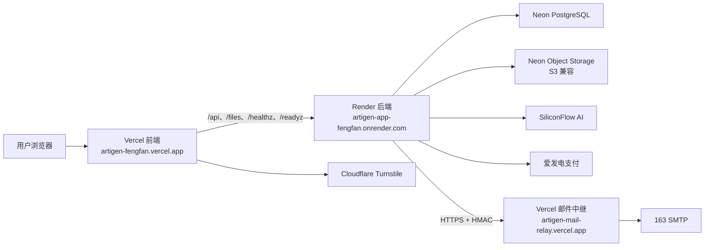
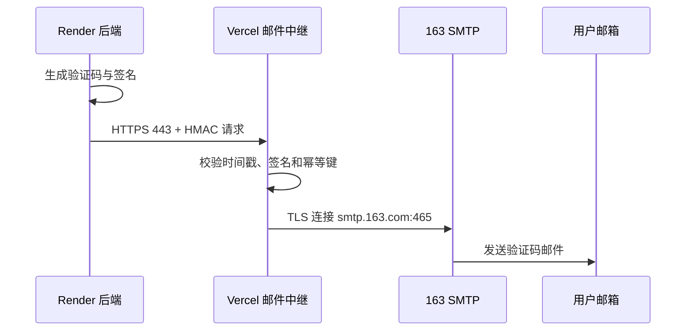

# Artigen 数据库、部署、域名、账号与登录接管报告

> 历史审计免责声明（2026-09-02）：本文主体记录 2026-07-27 至 2026-08-07
> 的旧版生产状态，包含旧的 SiliconFlow/Qwen 与迁移编号。它仅作留档，不能作为当前
> 模型、部署、数据库或 readiness 依据；当前权威状态以 `PROJECT_HANDOFF.zh-CN.md`
> 和 `HANDOFF.local.md` 为准。

> 基础设施核查日期：2026-07-27；Production Beta 最终更新：2026-08-07
> 仓库：`FengFan-1997/Artigen`
> 说明：本文记录已从代码、部署平台 CLI、线上健康检查和数据库只读查询中确认的现状。出于安全原因，文中不包含任何密码、Token、数据库连接串、SMTP 授权码或其他密钥原文。

## 1. 一句话结论

Artigen 当前的生产链路是：



目前网站和生产 API 可以访问。生产浏览器 Agent 已作为 owner-only Production Beta 部署：Render `main` 提交 `9bcc77d`、数据库迁移 020、共享 S3、Production Mac Worker、受限浏览器和远程接管均通过。邮箱验证码登录已开启；付费、支付和标准生成能力当前关闭。生产数据库已有 2026-08-07 发布前逻辑备份，但定时备份与恢复演练仍未建立；生产管理后台没有可用管理员，自定义域名也还没有接入。Agent 的最终交付证据见 [ARTIGEN_AGENT_BETA_DELIVERY.zh-CN.md](./ARTIGEN_AGENT_BETA_DELIVERY.zh-CN.md)。

## 2. 线上地址与域名

### 2.1 用户访问地址

| 用途 | 地址 | 当前状态 |
|---|---|---|
| 生产主站 | <https://artigen-fengfan.vercel.app/artigen> | 可访问 |
| AI 页面 | <https://artigen-fengfan.vercel.app/artigen/ai> | 前端路由 |
| 工具页面 | <https://artigen-fengfan.vercel.app/artigen/tools> | 前端路由 |
| 图片工坊 | <https://artigen-fengfan.vercel.app/artigen/image-workshop> | 前端路由 |
| 市场页面 | <https://artigen-fengfan.vercel.app/artigen/market> | 前端路由 |
| 登录页面 | <https://artigen-fengfan.vercel.app/login> | 前端路由 |
| 管理后台 | <https://artigen-fengfan.vercel.app/console> | 前端路由，目前生产无可用管理员 |
| 生产就绪检查 | <https://artigen-fengfan.vercel.app/readyz> | 经 Vercel 转发到 Render |
| 开发环境 | <https://dev-artigen-app-fengfan.onrender.com/artigen> | Render 开发服务 |

### 2.2 后端和邮件地址

| 用途 | 地址 |
|---|---|
| 生产 Render 服务 | <https://artigen-app-fengfan.onrender.com> |
| 生产健康检查 | <https://artigen-app-fengfan.onrender.com/healthz> |
| 生产就绪检查 | <https://artigen-app-fengfan.onrender.com/readyz> |
| 生产元信息 | <https://artigen-app-fengfan.onrender.com/api/meta> |
| 开发 Render 服务 | <https://dev-artigen-app-fengfan.onrender.com> |
| 邮件中继 | <https://artigen-mail-relay.vercel.app> |
| 邮件中继健康检查 | <https://artigen-mail-relay.vercel.app/api/health> |
| 爱发电 Webhook | <https://artigen-app-fengfan.onrender.com/api/pay/afdian/webhook> |

### 2.3 域名是怎么解决的

生产前端目前使用 Vercel 自动分配的 `artigen-fengfan.vercel.app`，后端使用 Render 自动分配的 `artigen-app-fengfan.onrender.com`，邮件中继使用另一个 Vercel 项目的 `artigen-mail-relay.vercel.app`。

仓库根目录的 [`vercel.json`](./vercel.json) 将以下路径转发到 Render：

- `/api/*`
- `/files/*`
- `/healthz`
- `/readyz`

其他路径回退到前端的 `index.html`，所以 `/artigen/*`、`/login` 和 `/console` 这类地址由单页应用前端路由处理。

当前没有配置自定义域名，也没有自定义证书。Vercel 和 Render 自带域名的 HTTPS 证书由各平台自动维护。

另一个未完成项是 [`frontend/public/sitemap.xml`](./frontend/public/sitemap.xml) 中仍有 `YOUR_DOMAIN_HERE` 占位符。如果以后接入正式域名，需要同步修改 sitemap、Turnstile 允许域名、OAuth 回调地址和相关 CORS/Origin 配置。

## 3. Vercel 部署

### 3.1 前端项目

| 项目 | 当前值 |
|---|---|
| 团队 | `FengFan's projects` |
| CLI 当前账号 | `876458930-7565` |
| 运维文档中的显示名 | `FengFan` |
| 项目名 | `artigen-fengfan` |
| Project ID | `prj_wW0GDr1aNR18rFjlTzH6JAqhNvuL` |
| 生产来源分支 | `main` |
| 当前生产提交 | `9bcc77d593e0747d5265f96f1f45b1dcb956b0bd` |
| 部署状态 | `READY`；GitHub `Vercel – artigen-fengfan` 为 success |

### 3.2 邮件中继项目

| 项目 | 当前值 |
|---|---|
| 项目名 | `artigen-mail-relay` |
| Project ID | `prj_YJWQPPBLSBiPtc9LOifl4EndvKfC` |
| 域名 | `artigen-mail-relay.vercel.app` |
| 健康检查 | 正常 |

### 3.3 Vercel 登录

本机 Vercel CLI 已有登录状态，可在仓库中使用：

```bash
vercel whoami
vercel project ls
vercel inspect https://artigen-fengfan.vercel.app
```

网页端应进入 Vercel 后选择团队 `FengFan's projects`。代码和现有运维材料无法证明网页端究竟采用 GitHub、邮箱还是其他方式登录，因此不要把尚未验证的方式写成既定事实。

## 4. Render 部署

### 4.1 生产服务

| 配置 | 当前值 |
|---|---|
| Workspace | `artigen` |
| 服务名 | `artigen-app-fengfan` |
| Service ID | `srv-d9cr73r7uimc73etc4j0` |
| 套餐 | Free |
| 区域 | Virginia |
| Runtime | Node |
| 实例数 | 1 |
| 部署分支 | `main` |
| 自动部署 | 关闭 |
| 当前 Deployment ID | `dep-d9qs08ijnfac73e3icn0` |
| 当前提交 | `9bcc77d593e0747d5265f96f1f45b1dcb956b0bd` |
| 部署方式 | Manual |
| 状态 | Live |
| 健康检查路径 | `/healthz` |

生产启动由 [`backend/scripts/start-production.js`](./backend/scripts/start-production.js) 负责。它会先用 PostgreSQL advisory lock 串行执行迁移，迁移成功后才启动服务器；迁移失败时不会带着半完成状态继续启动。

### 4.2 开发服务

| 配置 | 当前值 |
|---|---|
| 服务名 | `dev-artigen-app-fengfan` |
| Service ID | `srv-d9gpgs61a83c73f7k8s0` |
| 套餐 | Free |
| 区域 | Virginia |
| 部署分支 | `dev` |
| 自动部署 | 开启 |
| 当前提交 | `9c7bf5d39a081b84be243ab3675c3ef72817d8a3` |
| 状态 | Live |

开发环境的 `/readyz` 显示迁移 020、共享 S3 和 Agent 配置正常；DEV Worker 按需运行。生产 `/readyz` 也已通过迁移 020、共享 S3、owner-only、OTP、邮件中继和 Turnstile 检查。

- 数据库必须可用；
- 当前迁移版本为 `014_operational_records`；
- 付费、支付、邮件 AI 功能关闭；
- 行为分析开启；
- 管理后台开启。

### 4.3 Render 登录

Render CLI 当前识别到：

- 邮箱：`sorates1997@163.com`
- 姓名字段：空

现有运维文档注明使用 GitHub 登录 Render。网页端登录后应进入 workspace `artigen`，再选择相应服务。

常用只读检查：

```bash
render whoami
render services
```

Render Free 服务会休眠。核查时生产 `/api/meta`、`/healthz` 和 `/readyz` 首次请求分别出现约 12～15 秒的冷启动等待，这不是代码请求本身一直需要这么久，而是免费实例从休眠中启动。

## 5. Neon 数据库与对象存储

### 5.1 Neon 账号和组织

| 项目 | 当前值 |
|---|---|
| Neon 邮箱 | `sorates1997@163.com` |
| Neon Login | `sorates1997` |
| 绑定 GitHub | `@fengfan-1997` |
| Organization | `Artigen` |
| Organization ID | `org-dry-hat-80341824` |
| 套餐 | Free |

本机 Neon CLI 已登录，可检查：

```bash
neonctl me
neonctl projects list
```

网页端登录 Neon 后进入组织 `Artigen`。

### 5.2 数据库项目

| 配置 | 当前值 |
|---|---|
| 项目名 | `Artigen Production` |
| Project ID | `green-sea-44918506` |
| 区域 | `aws-us-east-1` |
| PostgreSQL | 16 |
| 生产 Branch ID | `br-bitter-mud-awocuhju` |
| 数据库 | `neondb`、`dev_artigen` |
| 数据库 Owner | `neondb_owner` |

生产和开发数据库位于同一个 Neon 项目、同一个 Neon branch 中，只通过数据库名 `neondb` 与 `dev_artigen` 隔离。这种方式能工作，但隔离强度不如使用不同 branch 或不同项目。

项目目前没有配置允许 IP 列表，公开连接也没有被禁用。因此数据库主要依靠连接凭据和 SSL 保护；建议后续评估 Neon 的网络限制能力。

### 5.3 对象存储项目

| 配置 | 当前值 |
|---|---|
| 项目名 | `Artigen Object Storage` |
| Project ID | `muddy-term-89881598` |
| 区域 | `aws-us-east-2` |
| 生产 Branch ID | `br-polished-silence-aj7wqf2d` |
| Bucket | `artigen-assets` |
| Bucket 可见性 | Private |

后端通过 S3 兼容接口访问该 Bucket，相关抽象位于 [`backend/services/asset-storage.js`](./backend/services/asset-storage.js)。

### 5.4 生产数据库现状

只读核查结果：

- 当前数据库：`neondb`
- 当前角色：`neondb_owner`
- PostgreSQL：16.14
- `public` schema 表数量：45
- 已执行迁移：`001`～`020`
- 用户数量：2
- `administrators` 表：0 条记录
- 爱发电订单：1 条待支付测试记录
- 对象资产：5 条；新增 4 条为最终生产 Agent 登录捕获/恢复烟测交付物
- Agent runs：4 条，其中前两条安全失败且 charged credits 为 0，最终两条为 `succeeded`

生产用户：

| 账号 | 登录身份 | 密码状态 | 钱包 |
|---|---|---|---|
| `876458930@qq.com` | Email | 无密码 hash | 90 可用 / 0 冻结 |
| `sorates1998@gmail.com` | Google | 无密码 hash | 100 可用 / 0 冻结 |

这两位用户当前都不能直接使用“邮箱 + 密码”登录：

- QQ 邮箱用户应使用邮箱验证码登录；
- Gmail 用户应使用 Google 登录；
- 只有完成密码注册或密码重置、数据库里生成密码 hash 后，密码登录才会生效。

生产支付套餐：

| 价格 | 点数 |
|---:|---:|
| ¥9.90 | 400 |
| ¥19.90 | 1000 |
| ¥49.90 | 3000 |
| ¥99.90 | 10000 |

### 5.5 开发和本地数据库

开发数据库：

- 数据库名：`dev_artigen`
- 已执行迁移：`001`～`014`
- 管理用户：`artigen-dev-owner`
- 管理角色：`owner`
- 普通邮箱/密码身份未配置。

本地数据库：

- 数据库名：`artigen_dev`
- 数据库角色：`artigen`
- PostgreSQL：16.14
- 已执行迁移：`001`～`013`
- 本地 `backend/.env` 权限为 `0600` 且被 Git 忽略；
- 本地默认关闭付费、支付、AI 和邮件验证码；
- 本地资产存储使用文件系统。

连接池与数据库 URL 规则见 [`backend/db/pool.js`](./backend/db/pool.js)。生产迁移应使用直连 URL，而不是 pooler URL。

## 6. 账号、登录方式和权限

### 6.1 平台账号总表

| 平台 | 已确认账号 | 登录说明 |
|---|---|---|
| GitHub | `FengFan-1997` | 本机 `gh` 已登录；仓库权限为 `ADMIN` |
| Vercel | `876458930-7565`，显示名 `FengFan` | 本机 CLI 已登录；网页具体认证方式未从代码中确认 |
| Render | `sorates1997@163.com` | 运维材料记录为 GitHub 登录；本机 CLI 已登录 |
| Neon | `sorates1997@163.com`，Login `sorates1997` | 绑定 GitHub `@fengfan-1997`；本机 CLI 已登录 |
| Cloudflare | `sorates1997@163.com` | Turnstile widget 为 `Artigen Production`；密码和 2FA 不在仓库 |
| 163 邮箱 | `sorates1997@163.com` | SMTP 授权码不是邮箱网页登录密码 |
| 爱发电 | 手机号 `17662591191`，创作者 `fengfan1997` | API User ID 和 Token 通过环境变量/钥匙串管理 |
| SiliconFlow | 登录账号未确认 | API Key 已配置；钥匙串账户标签 `fengfan` 不能证明平台登录身份 |
| Google Cloud OAuth | Owner 未记录 | 不能从现有仓库可靠推断登录账号 |

### 6.2 GitHub

- 仓库：`FengFan-1997/Artigen`
- 可见性：Public
- 默认分支：`main`
- 当前本地工作分支：`codex/agent-runtime-local`
- 远程 `dev`：`9c7bf5d39a081b84be243ab3675c3ef72817d8a3`
- 远程 `main`：`9bcc77d593e0747d5265f96f1f45b1dcb956b0bd`
- PR #11：`codex/agent-runtime-local` → `dev`，已合入
- PR #12：`dev` → `main`，已合入

本机 `gh` 使用系统钥匙串保存凭据，Git 操作使用 HTTPS。

### 6.3 开发环境双层登录

开发 Render 服务有两层保护。

第一层是整站 Basic Auth：

- 用户名：`artigen-dev`
- 密码：系统钥匙串服务 `Artigen Dev Access Password`
- 登录成功后服务端创建 Secure、HttpOnly、SameSite=Strict Cookie；
- Cookie 默认有效期约 12 小时。

第二层是 `/console` 管理后台：

- 用户名：`artigen-dev-owner`
- 密码：Render 开发服务环境变量 `CONSOLE_ADMIN_PASSWORD`
- 当前没有在通用系统钥匙串中找到该密码；
- 登录成功后返回 Bearer Token，前端只保存在 JavaScript 内存中；
- Token 默认有效期约 24 小时；
- 刷新页面或浏览器进程重启后通常需要重新登录。

代码中存在仅用于非生产环境的 `admin / admin123456` 回退值，生产环境明确禁止使用，不能把它当作生产账号。

### 6.4 生产管理后台

生产数据库的 `administrators` 表为空，因此当前没有真正可用的生产 `/console` 管理员。即使 Render 中存在管理密码，现行管理认证仍要求数据库里存在对应且启用的管理员角色。

要修复，需要先确定一个用户 UUID，然后在受控环境中执行：

```bash
pnpm --filter backend admin:grant -- <user UUID> owner
```

同时在 Render 生产服务中配置：

- `CONSOLE_ADMIN_USERNAME`
- `CONSOLE_ADMIN_PASSWORD`，至少 16 个字符
- `CONSOLE_ADMIN_TOKEN_SECRET`

角色权限从低到高为：

```text
operator < admin < owner
```

不要直接在聊天、工单、Git 提交或本文中记录管理密码。管理员授权脚本见 [`backend/scripts/grant-admin.js`](./backend/scripts/grant-admin.js)，认证实现见 [`backend/services/admin-auth-service.js`](./backend/services/admin-auth-service.js)。

### 6.5 普通用户登录安全

普通认证实现在 [`backend/routes/auth.js`](./backend/routes/auth.js) 和 [`backend/services/otp-service.js`](./backend/services/otp-service.js)。

当前机制：

- 邮箱验证码为 6 位；
- 验证码有效期 10 分钟；
- 重发冷却 60 秒；
- 最多尝试 5 次；
- 验证成功后一次性作废；
- Session 默认有效期 30 天；
- `auth_token` Cookie 为 HttpOnly、SameSite=Lax，生产环境启用 Secure；
- 服务端保存 HMAC 处理后的 Token hash，并配套 CSRF；
- 密码使用 scrypt；
- 前端会清除旧版本遗留的明文保存密码，见 [`frontend/src/login/storage.ts`](./frontend/src/login/storage.ts)。

## 7. 邮件验证码为什么能在 Render 上发送

Render 免费服务的 SMTP 出站端口受到限制，所以后端没有直接连接 `smtp.163.com`，而是采用 HTTPS 邮件中继：



当前发件人：

```text
Artigen <sorates1997@163.com>
```

安全设计：

- Render 到 Vercel 的请求使用共享密钥 HMAC 签名；
- 签名覆盖版本、时间戳、幂等键、收件人、用途和验证码；
- 允许的时钟偏差为 5 分钟；
- 幂等记录缓存 10 分钟；
- SMTP 使用 465 端口和 TLS；
- 163 SMTP 使用授权码，不使用邮箱网页登录密码。

后端实现见 [`backend/services/mail-service.js`](./backend/services/mail-service.js)，中继实现见 [`mail-relay/lib/handler.js`](./mail-relay/lib/handler.js)。

Turnstile 当前文档中登记的 hostname 包括：

- `artigen-fengfan.vercel.app`
- `artigen-app-fengfan.onrender.com`

## 8. AI 与支付

### 8.1 AI

当前供应商为 SiliconFlow。当前本地代码中严格锁定且仅允许的模型包括：

- `Kwai-Kolors/Kolors`
- `Qwen/Qwen3-8B`

生成配置见 [`backend/services/generation-profiles.js`](./backend/services/generation-profiles.js)。

`Qwen/Qwen3-8B` 用于所有文本理解、结构化输出与工具编排，`Kwai-Kolors/Kolors` 用于所有图片生成。Kolors 接收 0 张图片时执行文生图，接收 1 张图片时执行图生图；多张参考图在调用前拒绝，不依赖本地 Qwen 或 OpenAI。

当前计费大致为：

- 图片生成：10 点；
- 方向建议：5 点；
- 图片工坊：以数据库中的项目配置为准。

消费流程采用预扣、结算、退款机制，减少外部调用失败时误扣点数的风险。

### 8.2 爱发电支付

支付供应商为爱发电，后端实现见 [`backend/services/payment-service.js`](./backend/services/payment-service.js)。

流程：

1. 前端选择套餐；
2. 后端根据服务端套餐表创建待支付订单；
3. 用户在爱发电完成支付；
4. 爱发电调用生产 Webhook；
5. 后端调用供应商查询接口复核订单号、金额、套餐和用户；
6. 验证通过后给钱包增加点数。

套餐价格由服务端决定，前端不能任意提交价格。生产功能就绪检查显示支付能力已开启，但数据库中目前只有一条 ¥9.90 / 400 点的待支付测试订单；尚未发现一次真实支付完整闭环的验证记录。

## 9. 密钥存在哪里，如何安全取用

### 9.1 本地环境文件

`backend/.env`：

- 文件权限为 `0600`；
- 已被 Git 忽略；
- Git 历史中未发现该文件被提交；
- 仓库只跟踪 `.env.example` 模板。

### 9.2 macOS 系统钥匙串

已确认存在以下通用密码项目：

| Keychain Service | Account 标签 | 内容类型 |
|---|---|---|
| `Artigen Neon Production Direct URL` | `Artigen` | 生产数据库直连 URL |
| `Artigen Neon Dev Direct URL` | `artigen-dev` | 开发数据库直连 URL |
| `Artigen Dev Access Password` | `artigen-dev` | 开发环境 Basic Auth 密码 |
| `Artigen SiliconFlow API Key` | `fengfan` | SiliconFlow API Key |
| `Artigen 163 SMTP Authorization Code` | `fengfan` | 163 SMTP 授权码 |
| `Artigen Mail Relay Shared Secret` | `Artigen` | 邮件中继 HMAC 共享密钥 |
| `Artigen Turnstile Site Key` | `Artigen` | Turnstile Site Key |
| `Artigen Turnstile Secret Key` | `Artigen` | Turnstile Secret Key |
| `Artigen Afdian API User ID` | `artigen` | 爱发电 API User ID |
| `Artigen Afdian API Token` | `artigen` | 爱发电 API Token |
| `Artigen OTP HMAC Secret` | `Artigen` | OTP HMAC 密钥 |
| `Artigen Session Token Hash Secret` | `Artigen` | Session Token hash 密钥 |
| `Artigen CSRF Secret` | `Artigen` | CSRF 密钥 |
| `Artigen Task Payload Encryption Key` | `fengfan` | 任务载荷加密密钥 |
| `artigen-agent-dev-relay` | `AGENT_WORKER_RELAY_SECRET` | 本机 DEV 桌面中继 HMAC 密钥 |

远程 DEV Agent 使用独立 Keychain service `artigen-agent-dev-worker`；Production Agent 使用 `artigen-agent-production-worker`。Production 的 `DATABASE_URL`、`AGENT_PAYLOAD_ENCRYPTION_KEY`、`SILICONFLOW_API_KEY`、`AGENT_WORKER_RELAY_SECRET`、`AGENT_WORKER_RELAY_URL`、各项 `S3_*` 和 `AGENT_BETA_USER_IDS` 标签已配置并被 Production LaunchAgent 成功读取。文档只记录标签，不记录值。

在有权限的本机终端中按需读取，示例：

```bash
security find-generic-password -s 'Artigen Dev Access Password' -w
```

把服务名替换为表中对应的 `Keychain Service`。命令会把秘密打印到终端，因此不要录屏、不要把输出粘贴到聊天或提交到 Git。

未找到以下通用钥匙串项：

- `Artigen Console Admin Password`
- `Artigen Admin Password`
- `Artigen Production Admin Password`
- `Artigen Dev Admin Password`
- 对应的 Console Admin Username 项

因此生产管理员密码不能从现有通用钥匙串恢复，开发 Console 管理密码也应从 Render 环境变量或原始密码管理位置确认。

### 9.3 平台环境变量

生产秘密最终由 Vercel 和 Render 的项目环境变量提供。仓库中的 [`render.yaml`](./render.yaml) 和 [`render.dev.yaml`](./render.dev.yaml) 主要描述变量名和安全默认值，不应写入真实 secret。

需要注意：`render.yaml` 模板默认关闭付费能力，但 Render Dashboard 当前生产环境通过实际变量覆盖，已开启付费、支付、邮件验证码和标准 AI。判断生产状态应以 `/readyz` 和 Render 实际环境为准，不能只看模板。

## 10. 线上核查结果

2026-08-07 发布后实际检查：

| 检查 | 结果 |
|---|---|
| Vercel 主站 | HTTP 200 |
| 生产 `/api/meta` | HTTP 200，SHA `9bcc77d593e0747d5265f96f1f45b1dcb956b0bd` |
| 生产 `/healthz` | HTTP 200 |
| 生产 `/readyz` | HTTP 200，`ok: true`、迁移 020、共享 S3、OTP/邮件/Turnstile/Agent 通过 |
| 开发环境健康检查 | HTTP 200，`appEnv: dev` |
| 邮件中继健康检查 | HTTP 200 |

生产 `/readyz` 的能力状态：

| 能力 | 状态 |
|---|---|
| 数据库 | 正常，迁移到 `020_agent_secure_browser_relay` |
| 对象存储 | S3，共享存储正常 |
| 任务载荷加密 | 正常 |
| AI Provider | SiliconFlow，`standard-v1` |
| 输出域名白名单 | 已配置，host 数量 1 |
| 付费能力 | 当前关闭 |
| 爱发电支付 | 当前关闭 |
| 认证密钥 | 正常 |
| 邮件验证码 | 开启，使用签名邮件中继 |
| Turnstile | 正常 |
| AI Design | 当前关闭 |
| Workshop AI | 关闭 |

## 11. 代码版本和部署漂移

2026-08-07 Production Beta 发布后状态：

| 环境 | 代码/数据库状态 |
|---|---|
| 生产 Render/Vercel | `main`，提交 `9bcc77d...`，迁移 `020_agent_secure_browser_relay`，Production Agent 四项状态 true |
| 开发 Render | `dev`，提交 `9c7bf5d...`，迁移 `020_agent_secure_browser_relay` |
| 本地数据库 | 迁移 `020_agent_secure_browser_relay` |
| 当前功能分支 | `codex/agent-runtime-local`；主体经 PR #11 合入 `dev`，再经发布 PR #12 合入 `main` |

生产发布已经由 GitHub PR、Render live deploy、Vercel success 状态、生产 `/api/meta`、`/readyz`、Worker heartbeat 和两个最终 `succeeded` run 交叉确认，不再只依据本机分支判断。

2026-08-07 Production runs `0bfa9eef-a989-4400-9fcd-0bcb043c211d`、`20317cd5-77e8-40ca-ac74-ad845385bf96` 已证明 owner-only、outsider 拒绝、Qwen blocked 接管、60 秒票据、Render WSS、Mac VNC、登录后 DOM、加密会话保存/恢复/撤销、4 个 Markdown/PDF、独立验证和共享 S3 读回完整可用。

因此当前可以对外准确称为 **owner-only Production Beta**；不能称为 24×7 高可用正式生产。

## 12. 备份现状

生产数据库备份自动化目前没有真正解决，但 2026-08-07 已完成发布前手工备份：

- `~/.config/artigen/neon-backup.env` 不存在；
- `~/.config/artigen/neon-restore-verify.env` 不存在；
- 没有对应的 launchd 定时任务；
- 现有备份位于 `~/Library/Application Support/Artigen/backups/`；
- DEV Neon 备份：`artigen-neon-2026-08-07T06-11-11-822Z.dump`，26 张表，附 manifest 与 SHA-256；
- 最新 Production Neon 发布前备份：`artigen-neon-2026-08-07T10-24-11-527Z.dump`，迁移前 23 张表，附 manifest 与 SHA-256；
- 两份备份都位于 `~/Library/Application Support/Artigen/backups/`，没有提交 Git。

该生产 dump 已成功生成，但尚未恢复到隔离数据库验证，因此只能作为发布前逻辑备份，不能替代定时、加密、异地保留和恢复演练。

合理的修复顺序：

1. 配置 Neon 生产直连只读/备份凭据；
2. 建立定时逻辑备份；
3. 对备份加密并设置保留周期；
4. 定期恢复到隔离数据库；
5. 自动比较迁移版本、表数量和关键记录；
6. 记录最后成功备份和最后成功恢复验证时间；
7. 为失败任务配置告警。

## 13. 当前主要问题与处理建议

### P0：生产数据安全

1. **没有生产备份自动化和恢复演练**
   已有 2026-08-07 Neon Production 手工 dump；下一步建立定时、加密、异地保留并恢复到隔离数据库验证。

2. **生产没有管理员**
   确认需要成为 owner 的用户，使用授权脚本写入 `administrators`，并通过安全渠道生成和保存 Console 密码及 Token Secret。

### P1：版本一致性

3. **生产、开发和本地迁移已统一到 `020`**
   生产由 Render 启动流程持 advisory lock 顺序执行 `012`～`020`，没有手工跳迁移。后续仍须先在 DEV 验收，再合入 `main`。

4. **生产分支已统一到 `main`**
   Render 继续保持手动部署，避免未经发布窗口确认的提交自动上线。

### P2：基础设施

5. **开发和生产仅做数据库级隔离**
   建议把 `dev_artigen` 移到独立 Neon branch，条件允许时使用独立项目。

6. **没有自定义域名**
   如果准备正式发布，接入正式域名后同步调整 sitemap、Turnstile、Google OAuth 回调、CORS、Cookie 和监控。

7. **Render Free 有冷启动且没有 SLA**
   若需要稳定的登录、Webhook 和 API 延迟，应升级实例或迁移到不会休眠的运行环境。

8. **生产配置不能只看 `render.yaml`**
   建立配置清单，以 Render/Vercel 实际变量和 `/readyz` 为准，并记录每次变更。

9. **Agent 已作为 owner-only Production Beta 部署**
   当前只允许 owner UUID；扩大白名单前继续观察队列、失败率、对象存储和清理状态。Render Free 与 Mac Worker 仍是可用性限制。

## 14. 建议的接管检查清单

- [ ] 能登录 GitHub `FengFan-1997` 并看到 Artigen 仓库
- [ ] 能进入 Vercel 团队 `FengFan's projects`
- [ ] 能进入 Render workspace `artigen`
- [ ] 能进入 Neon 组织 `Artigen`
- [ ] 能进入 Cloudflare 并看到 Turnstile widget `Artigen Production`
- [ ] 能进入爱发电创作者账号 `fengfan1997`
- [ ] 能登录 163 邮箱 `sorates1997@163.com`
- [ ] 确认 SiliconFlow 的真实平台登录账号
- [ ] 确认 Google Cloud OAuth 项目 Owner
- [ ] 建立生产 Console owner
- [ ] 将现有生产手工备份恢复到隔离库验证，并建立定时备份
- [ ] 统一生产分支和数据库迁移版本
- [ ] 为所有平台启用 2FA，并保存恢复码
- [ ] 把密钥放入统一密码管理器，避免只有单台 Mac 钥匙串可访问
- [ ] 轮换无法确认保管链路的旧密钥
- [ ] 为支付 Webhook、邮件失败、数据库不可用和余额异常配置告警

## 15. 相关仓库文档和实现

- [`AGENT_OPERATIONS_RUNBOOK.zh-CN.md`](./AGENT_OPERATIONS_RUNBOOK.zh-CN.md)
- [`AGENT_BROWSER_SECURITY_AND_BETA_RELEASE.zh-CN.md`](./AGENT_BROWSER_SECURITY_AND_BETA_RELEASE.zh-CN.md)
- [`PROJECT_OPERATIONS_GUIDE.zh-CN.md`](./PROJECT_OPERATIONS_GUIDE.zh-CN.md)
- [`PRODUCTION_RUNBOOK.zh-CN.md`](./PRODUCTION_RUNBOOK.zh-CN.md)
- [`DEV_ENVIRONMENT_RUNBOOK.zh-CN.md`](./DEV_ENVIRONMENT_RUNBOOK.zh-CN.md)
- [`vercel.json`](./vercel.json)
- [`render.yaml`](./render.yaml)
- [`render.dev.yaml`](./render.dev.yaml)
- [`backend/db/pool.js`](./backend/db/pool.js)
- [`backend/scripts/start-production.js`](./backend/scripts/start-production.js)
- [`backend/services/asset-storage.js`](./backend/services/asset-storage.js)
- [`backend/routes/auth.js`](./backend/routes/auth.js)
- [`backend/services/otp-service.js`](./backend/services/otp-service.js)
- [`backend/services/admin-auth-service.js`](./backend/services/admin-auth-service.js)
- [`backend/scripts/grant-admin.js`](./backend/scripts/grant-admin.js)
- [`backend/services/mail-service.js`](./backend/services/mail-service.js)
- [`mail-relay/lib/handler.js`](./mail-relay/lib/handler.js)
- [`backend/services/payment-service.js`](./backend/services/payment-service.js)
- [`backend/services/generation-profiles.js`](./backend/services/generation-profiles.js)
- [`frontend/src/login/storage.ts`](./frontend/src/login/storage.ts)
- [`frontend/public/sitemap.xml`](./frontend/public/sitemap.xml)

---

这份报告适合用于接管和排障，不应替代密码管理器。任何真实密码、Token、数据库 URL、SMTP 授权码和恢复码都应只存在于系统钥匙串、平台 Secret 环境变量或受控密码管理器中。
