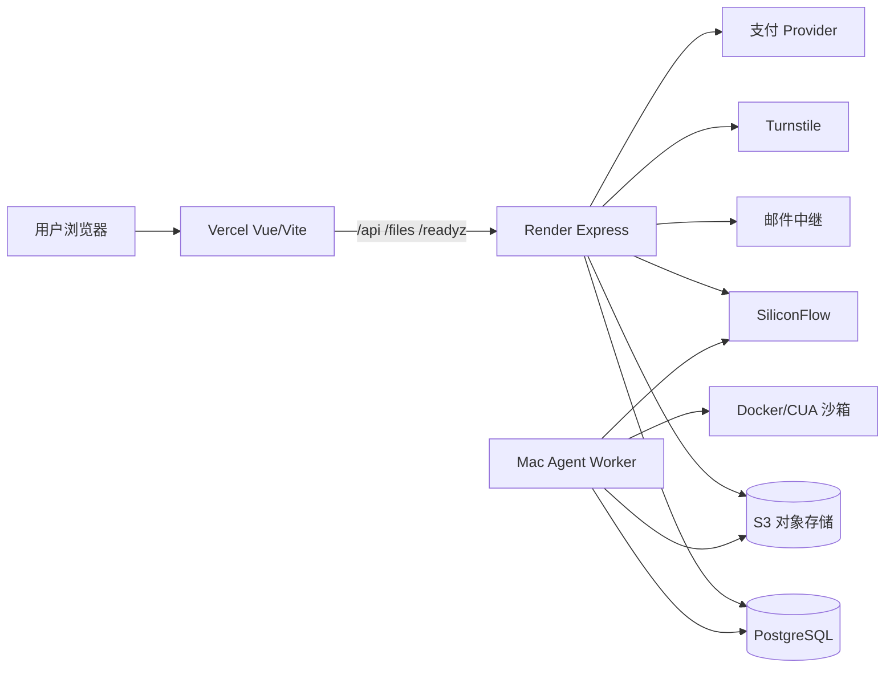

# Artigen 生产环境运行手册

本文是公开安全版生产操作手册，不保存个人账号、真实用户、余额、订单、平台资源 ID、秘密值或动态部署快照。当前生产事实以 [`PROJECT_HANDOFF.zh-CN.md`](./PROJECT_HANDOFF.zh-CN.md) 和实时接口为准。

## 1. 生产入口与架构

- 主站：<https://artigen-fengfan.vercel.app/artigen>
- 统一创作入口：<https://artigen-fengfan.vercel.app/artigen/create>
- 生产 API 直连备用地址：<https://artigen-app-fengfan.onrender.com>
- 深度健康检查：<https://artigen-fengfan.vercel.app/readyz>



Vercel 托管前端并代理服务端路径；Render 运行 API、队列协调和系统任务；PostgreSQL 是业务写源，S3 保存二进制；独立 Mac Worker 提供 Computer Agent 的 CUA、浏览器、Shell、LibreOffice 和图片交付能力。

## 2. 发布前条件

生产发布前必须具备：

- 目标提交已经进入 `main`，required Release gate 通过；
- 对应 DEV 提交和 smoke 证据完整，或 PR 是获批的 docs-only/hotfix；
- 数据库迁移已在 DEV 成功应用；
- 新环境变量已写入示例和部署平台；
- 数据库备份与回滚目标明确；
- Provider、支付、邮件、S3、Agent 或计费变化具有专项验收；
- 发布者明确授权本次人工生产变更。

纯文档、README 素材或 CI 治理变更不需要人工发布产品运行时。

## 3. 只读基线核验

```bash
curl --fail --silent https://artigen-fengfan.vercel.app/healthz
curl --fail --silent https://artigen-fengfan.vercel.app/api/meta
curl --fail --silent https://artigen-fengfan.vercel.app/readyz
curl --fail --silent https://artigen-app-fengfan.onrender.com/api/meta
```

记录但不要写进长期手册：

- `gitSha`、deployment 时间和状态；
- 当前 migration；
- PostgreSQL、S3、Provider、支付、邮件和 Agent readiness；
- 受影响页面/API 的 HTTP 状态；
- Worker、browser、egress、desktop relay、subagents 和 queue depth。

Vercel 与 Render 返回的 `/api/meta.gitSha` 应一致；不一致时停止发布或 smoke。

## 4. 数据库备份

发布迁移、计费、认证或 Agent durability 变更前执行受控备份：

```bash
pnpm db:backup:neon
```

要求：

- dump、manifest 和校验文件存放在受限备份目录；
- 日志不打印数据库连接串；
- 记录备份时间、源环境、目标提交、表数量和校验结果；
- 定期使用隔离数据库执行 `pnpm db:restore:verify`；
- 没有恢复验证的备份不能被描述为完整灾备。

定时备份与隔离恢复演练仍是需要持续维护的运维能力；发现未配置时在正式 Handoff 中记录风险，不伪装为已启用。

## 5. Render API 发布

1. 登录 Render 官方控制台并进入 `artigen-app-fengfan`。
2. 确认目标分支为 `main`，选择已通过门禁的不可变提交。
3. 核对新增/修改变量名称；真实值只在平台 Secret 中处理。
4. 人工触发部署，观察安装、迁移、启动和 readiness 日志。
5. 迁移失败、S3/Provider 不就绪或服务未监听时立即停止，不继续发布其他组件。
6. 部署 live 后重新读取直连和 Vercel 代理的 `/api/meta`、`/readyz`。

生产启动在监听端口前获取 PostgreSQL advisory lock 并应用 pending migration。不要在发布窗口并行运行第二套手工迁移。

## 6. Vercel 前端发布

1. 确认 GitHub 对目标 main 提交的 Artigen Vercel 构建成功。
2. 打开该提交对应的 Preview，检查页面、静态资源和 `/api` 代理。
3. Preview 通过后才显式 promote 为 Production。
4. 等待 Production 状态 Ready，确认主域名指向目标 deployment。
5. 重新加载主站并核对实际资源与 `/api/meta`，不能只看 GitHub 状态。

另一个 Vercel 项目可能用于邮件中继；不要把主站构建和邮件中继混为同一发布对象。

## 7. Agent Worker 发布

只在 Agent 运行时代码、工具链、配置或目标提交变化时切换 Worker。详细命令见 [`AGENT_OPERATIONS_RUNBOOK.zh-CN.md`](./AGENT_OPERATIONS_RUNBOOK.zh-CN.md)。

基本顺序：

1. 从目标生产提交建立不可变 worktree；
2. 安装锁定依赖并确认 Docker/CUA 镜像；
3. 通过安装脚本生成 LaunchAgent，秘密只从安全存储读取；
4. 核对程序路径、工作目录、环境开关和生产数据目标；
5. 停止旧 Worker，启动新 Worker；
6. 读取 Agent status，确认 worker、browser、egress、desktop、subagents 和 queue；
7. 旧 worktree 在回滚窗口内保留，不立即删除。

Worker 离线时任务应排队或 fail-closed，不能在另一台未授权机器上临时启动生产进程。

## 8. 生产 smoke

最低只读 smoke：

- `/artigen`、`/artigen/create`、`/artigen/agent` 和受影响页面可加载；
- `/api/meta` 与目标提交一致；
- `/readyz.ok=true`，必需检查不被 skipped；
- 匿名页面不会读取私有数据；登录态接口不越权；
- 浏览器控制台无新错误；桌面与移动无横向溢出。

只有获得单独授权时才执行真实邮件、支付、图片或 Agent smoke。真实收费测试必须使用明确测试账号、预算上限和完整 hold/结算/退款审计，不能因为部署而默认触发。

## 9. 支付和点数

- 套餐、金额、币种和点数由服务端目录决定。
- Webhook 强制验证并向 Provider 查询规范订单。
- 不通过数据库手工更新钱包；补偿必须走管理员账本服务。
- pending 测试订单、Provider 配置和接口 HTTP 200 不等于真实付款闭环已经验收。
- 支付 smoke 未获批准时只做只读配置与未付款幂等检查。

## 10. 回滚

### 应用回滚

1. 关闭受影响能力开关，阻止新任务；
2. Render 回到上一个已验证提交；
3. Vercel promote 上一个已验证 Production deployment；
4. Agent Worker 切回上一不可变 worktree；
5. 重新核对 `/api/meta`、`/readyz`、页面和 Agent status。

### 数据回滚

- 默认保留兼容的新增表/列，应用回滚优先于 destructive down migration。
- 只有完成备份、影响审计且确认没有新数据依赖时，才能单独批准 down migration。
- 不删除 ambiguous 回执、失败 Run 或账本记录来制造干净状态。

### 秘密或会话事件

- 先关闭受影响能力，撤销会话/票据并轮换对应秘密；
- 不尝试用新密钥解密旧密文；
- 检查日志、事件和交付物是否包含敏感内容；
- 单独评估历史清理和用户通知，不在普通应用回滚中擅自执行。

## 11. 故障接管

| 现象 | 首要检查 |
| --- | --- |
| 首页正常、API 超时 | Render 冷启动、`/healthz`、`/readyz` |
| Vercel/Render 版本不同 | 两端 `/api/meta` 与 deployment |
| 数据库不就绪 | 连接目标、TLS、迁移锁和启动日志 |
| 图片/文件不可读 | S3、所有权、MIME、字节数、SHA-256 |
| Worker 离线 | Mac 登录、Docker、LaunchAgent、数据库和 Provider |
| 浏览器不可用 | CUA 镜像、出口代理探针、沙箱清理 |
| 钱包冻结未释放 | Run/任务终态、hold、回执和正式取消路径 |

排障只做必要的只读检查；删除数据、重放副作用、真实付款、生产模型调用和网络配置修改都需要额外授权。

## 12. 发布记录

一次生产发布完成后，在正式 Handoff 中只记录：

- 发布日期和不可变运行提交；
- 发生持久变化的能力与数据契约；
- 实际通过的 readiness/smoke；
- 风险、限制和回滚结论。

不记录个人账号、平台资源 ID、真实用户数据、逐次调试、Run UUID 或本机绝对路径。
