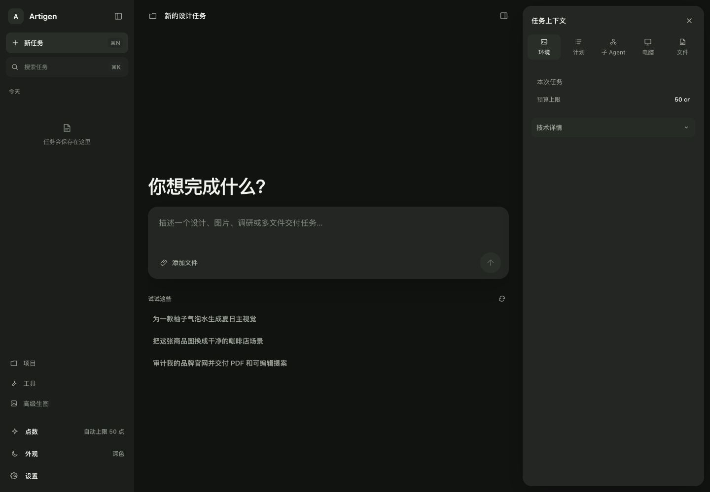
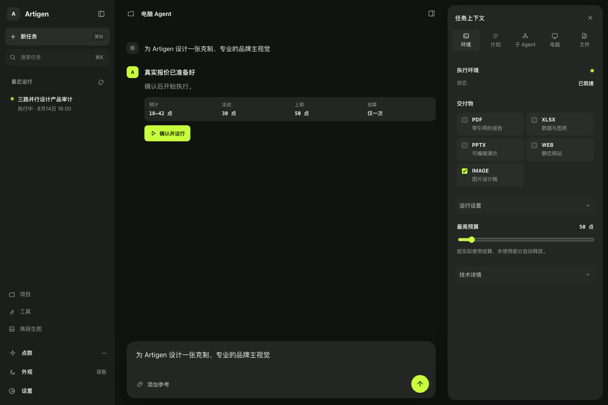
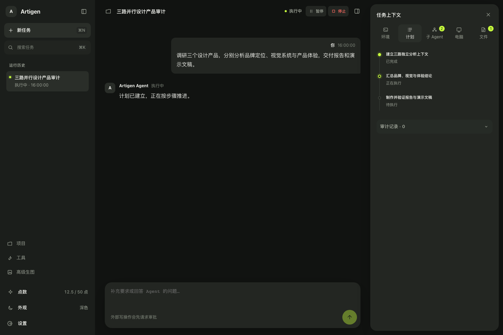
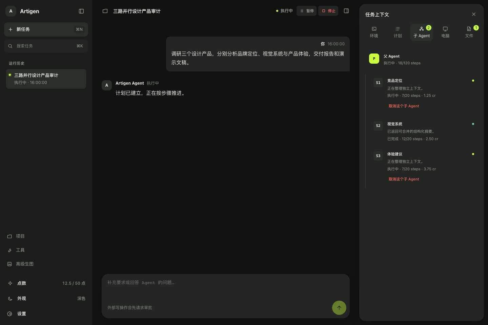
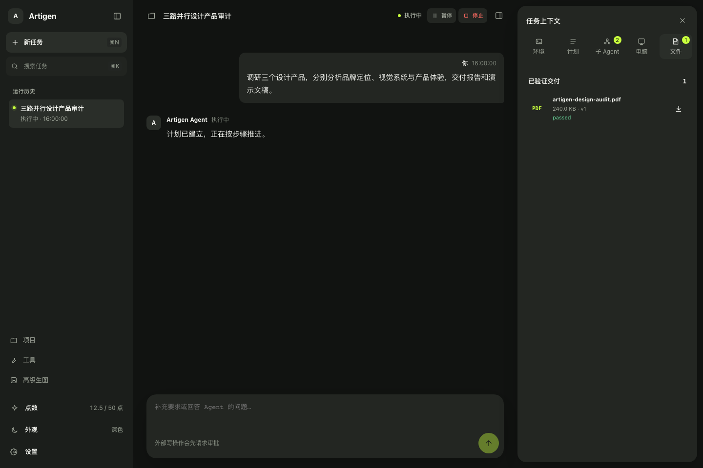
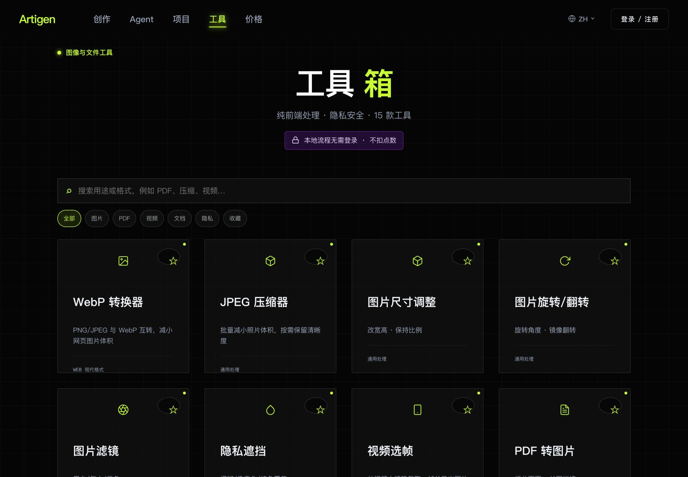
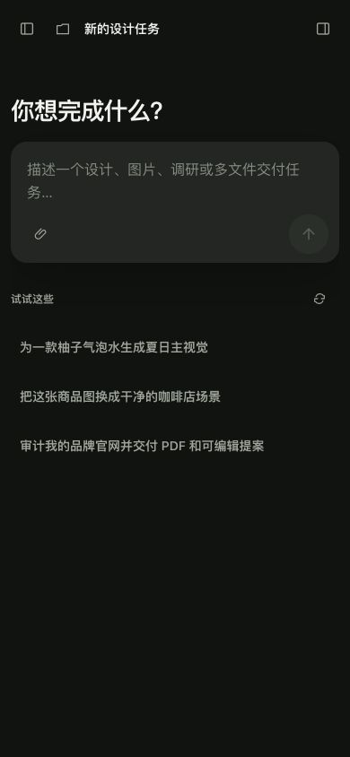
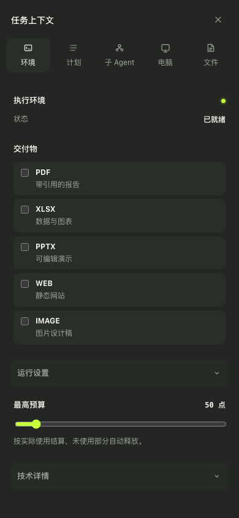
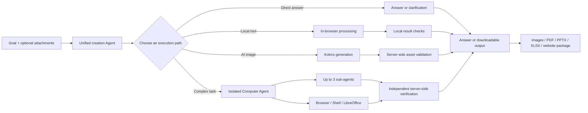
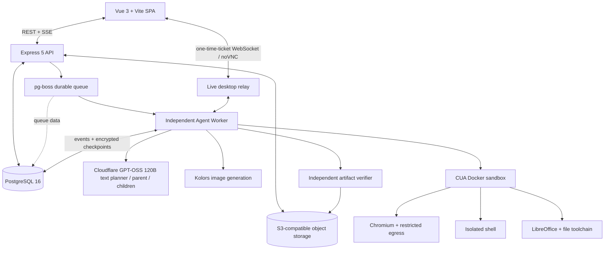

<p align="center">
  <a href="./README.md">简体中文</a> ·
  <a href="./README.en.md">English</a>
</p>

<h1 align="center">Artigen — One goal in, verified creative deliverables out.</h1>

<p align="center">
  Artigen takes a goal and optional attachments, then chooses between a direct answer,
  a browser-local tool, an AI image workflow, or an isolated Computer Agent. Complex work
  can be delegated to sub-agents and delivered as server-verified images, PDFs, PPTX files,
  XLSX workbooks, or website packages.
</p>

<p align="center">
  <a href="https://github.com/FengFan-1997/Artigen/actions/workflows/ci.yml?query=branch%3Amain"></a>
  
  
  
</p>

<p align="center">
  <strong><a href="https://artigen-fengfan.vercel.app/artigen/create">Try Artigen</a></strong>
  · <strong><a href="#quick-start">Run locally</a></strong>
  · <strong><a href="./PROJECT_OPERATIONS_GUIDE.zh-CN.md">Documentation</a></strong>
</p>

> The unified Agent requires sign-in; local tools that need no cloud configuration remain directly available.



<p align="center"><sub>Production UI · Start with one goal</sub></p>

## Artigen in 12 seconds

After a goal is entered, Artigen determines an execution path and budget while keeping the plan,
sub-agents, approvals, cost, and file verification visible. This sequence was captured from the
current `main` code with deterministic demo data; it is not a concept animation.


<p align="center"><sub>Demo data · Goal → routing → planning and execution → verified files</sub></p>

## Core capabilities

| Capability | How Artigen handles it |
| --- | --- |
| **Smart routing** | Start with one request. Artigen selects a direct answer, local tool, specialist AI workflow, or Computer Agent, and asks only for details that materially affect the result. |
| **Isolated computer** | Complex tasks run in an on-demand CUA/Docker sandbox with a restricted browser, isolated shell, and LibreOffice. Sensitive actions remain approval-gated. |
| **Sub-agent delegation** | The parent can delegate research, analysis, and drafting to up to three depth-one contexts while retaining responsibility for synthesis and delivery. |
| **Verified deliverables** | Files are marked `passed` only after format, structure, malware, openability or rendering checks, followed by storage-integrity verification. |
| **Private local tools** | Image batching, redaction, PDF/image conversion, frame picking, GIF, and ICO workflows run in the browser without uploading source files. Faithful Word conversion is an explicit opt-in server exception. |
| **AI image generation** | `Kwai-Kolors/Kolors` handles text-to-image and single-reference generation. Quotes and credit caps are shown before cloud execution, and results are stored as verified private assets. |

## Real product UI, not a concept render

### Desktop Agent

History, conversation, and runtime context stay together in one three-column workspace. Before a
run starts, the Agent presents the current quote, credit hold, and maximum budget.



<p align="center"><sub>Demo data · Goal routed and ready for confirmation</sub></p>

### Plan, sub-agents, and files

There is no need to leave the conversation during execution. The Inspector continuously exposes
plan progress, isolated sub-agents, and deliverables that passed verification.







<p align="center"><sub>Demo data · Plans, sub-agents, cost, and file verification stay visible</sub></p>

### Local tools and mobile

The local-first toolbox covers common image, PDF, video, and privacy workflows. At 390 px, focused
drawers preserve the complete history and Inspector instead of removing runtime context.

<table>
  <tr>
    <td width="72%"></td>
    <td width="28%"></td>
  </tr>
  <tr>
    <td align="center"><sub>Production UI · Local-first toolbox</sub></td>
    <td align="center"><sub>Production UI · Mobile creation entry</sub></td>
  </tr>
</table>

The mobile Computer Agent retains all five Inspector destinations: environment, plan, sub-agents,
computer, and files.

<p align="center">
  
</p>

<p align="center"><sub>Demo data · 390 px Computer Agent Inspector</sub></p>

### Real Kolors outputs

These images come from completed and verified production `Kwai-Kolors/Kolors` runs. Rebuilding this
README did not regenerate them or spend any credits.

<table>
  <tr>
    <td width="50%"></td>
    <td width="50%"></td>
  </tr>
  <tr>
    <td align="center"><sub>Text to image</sub></td>
    <td align="center"><sub>Single reference</sub></td>
  </tr>
</table>

## From goal to delivery



“Verified” means format, structure, scanning, rendering or openability checks plus storage-integrity
verification. It is not a guarantee of factual correctness, truth, or aesthetic quality.

## System architecture



Task planning and run progress return over SSE. WebSocket is primarily used for the one-time-ticket
live desktop/noVNC relay. The Agent Worker is separated from the API process, while queue state,
events, and checkpoints are persisted in PostgreSQL.

## Quick start

Requires Git, Node.js 24, pnpm 10, and local PostgreSQL 16.

```bash
git clone https://github.com/FengFan-1997/Artigen.git
cd Artigen
pnpm install --frozen-lockfile
pnpm run db:local:setup
VITE_APP_ENV=dev pnpm run dev
```

Once started, open:

- Web: <http://localhost:4000/artigen>
- Health: <http://localhost:8080/healthz>
- Readiness: <http://localhost:8080/readyz>

The default local setup is enough to explore the frontend and use local tools that need no cloud
configuration. Accounts, AI image generation, and the Computer Agent fail closed until PostgreSQL,
object storage, providers, and the independent Worker are correctly configured. See the
[development environment guide](./DEV_ENVIRONMENT_RUNBOOK.zh-CN.md) for full setup and troubleshooting.

Before submitting changes:

```bash
pnpm check:workspace
pnpm check
```

## Technology

| Layer | Technology |
| --- | --- |
| Web | Vue 3, TypeScript, Vite, Pinia |
| API | Node.js 24, Express 5 |
| Data and queue | PostgreSQL 16, pg-boss |
| Storage | Private S3-compatible object storage |
| Agent runtime | Independent Worker, Docker/CUA, Chromium/noVNC, LibreOffice |
| Models | Cloudflare `@cf/openai/gpt-oss-120b` (all non-image text), Kwai-Kolors/Kolors (all images) |
| Quality | Vitest, Node test runner, Playwright, GitHub Actions |

## Repository layout

```text
frontend/      Vue SPA, unified workspace, and local tools
backend/       Express API, task system, Agent runtime, and Worker
mail-relay/    Email verification-code relay
shared/        Utilities shared across frontend and backend
scripts/       Repository-level checks
docs/          README assets and project documentation
```

## Quality and privacy

- `Quality Gate` covers the workspace lockfile, lint, types, unit/backend tests, Agent contracts,
  builds, performance budgets, and cross-browser Playwright E2E. Protected branches require the
  aggregate `Release gate` to pass.
- Browser-local tools do not upload source files by default. Cloud models, the Computer Agent, and
  faithful Word conversion enter their explicit server-side paths when needed; sensitive external
  actions remain approval-gated.
- Agent deliverables use private object storage, SHA-256, and independent server-side verification.
  Download URLs expire.
- Paid workflows quote and hold a maximum credit amount before execution, then settle actual use.
  CI uses mocks with paid features disabled.

See [Agent browser security and beta release](./AGENT_BROWSER_SECURITY_AND_BETA_RELEASE.zh-CN.md)
for the security model, browser boundaries, and release constraints.

## Documentation

- [Product requirements and acceptance criteria](./PRD.md)
- [Development environment and local setup](./DEV_ENVIRONMENT_RUNBOOK.zh-CN.md)
- [Project operations guide](./PROJECT_OPERATIONS_GUIDE.zh-CN.md)
- [Agent browser security and beta release](./AGENT_BROWSER_SECURITY_AND_BETA_RELEASE.zh-CN.md)
- [Contributing guide](./CONTRIBUTING.md)

## Contributing

Issues and pull requests are welcome. Read [CONTRIBUTING.md](./CONTRIBUTING.md) first, branch from
the correct target, and include verification evidence proportional to the risk of your change.

<p align="center">
  <a href="https://artigen-fengfan.vercel.app/artigen/create"><strong>Give Artigen a goal →</strong></a>
</p>
