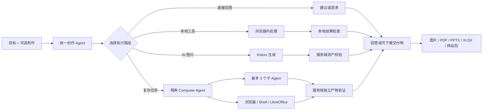
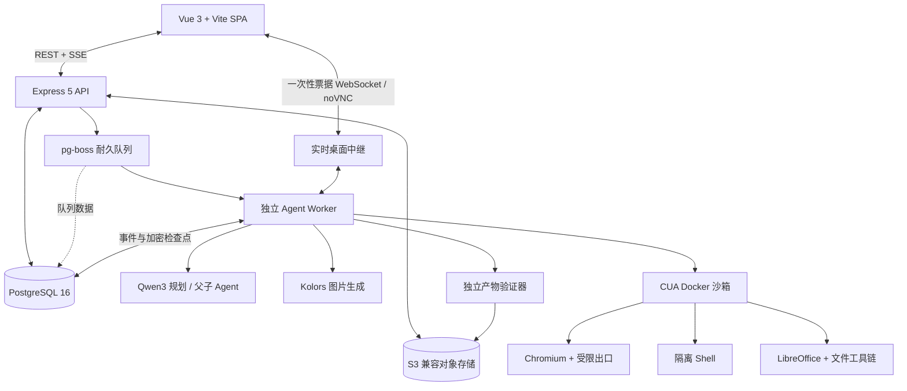

<p align="center">
  <a href="./README.md">简体中文</a> ·
  <a href="./README.en.md">English</a>
</p>

<h1 align="center">Artigen — 从一句话到可验证交付的统一创作 Agent</h1>

<p align="center">
  Artigen 接收一个目标和可选附件，理解需求后，在直接回答、浏览器本地工具、
  AI 图片工作流与隔离 Computer Agent 之间选择执行路径。复杂任务可以拆分给子 Agent，
  并交付经过服务端验证的图片、PDF、PPTX、XLSX 或网站源码包。
</p>

<p align="center">
  <a href="https://github.com/FengFan-1997/Artigen/actions/workflows/ci.yml?query=branch%3Amain"></a>
  
  
  
</p>

<p align="center">
  <strong><a href="https://artigen-fengfan.vercel.app/artigen/create">在线体验</a></strong>
  · <strong><a href="#快速开始">快速开始</a></strong>
  · <strong><a href="./PROJECT_OPERATIONS_GUIDE.zh-CN.md">项目文档</a></strong>
</p>

> 统一 Agent 入口需要登录；无需云端配置的本地工具可直接使用。


<p align="center"><sub>生产界面 · 从一句目标开始</sub></p>

## 12 秒看懂 Artigen

输入目标后，Artigen 先确定执行路径和预算，再让计划、子 Agent、审批、费用与文件验证
保持可见。下面的流程由当前 `main` 代码和确定性演示数据生成，不是概念动画。


<p align="center"><sub>演示数据 · 输入目标 → 自动路由 → 计划与执行 → 验证文件</sub></p>

## 核心能力

| 能力 | Artigen 如何完成 |
| --- | --- |
| **智能路由** | 从一句需求开始，自动选择直接回答、本地工具、专项 AI 工作流或 Computer Agent；只有缺失信息会实质改变结果时才请求澄清。 |
| **隔离电脑** | 复杂任务进入按需创建的 CUA/Docker 沙箱，通过受限浏览器、隔离 Shell 与 LibreOffice 完成调研、网页操作和文件制作；敏感动作保留审批。 |
| **子 Agent 协作** | 父 Agent 可将调研、分析和起草拆给最多 3 个、深度为 1 的独立上下文，最终仍由父 Agent 汇总和交付。 |
| **可验证交付** | 文件必须通过格式、结构、恶意文件扫描、可打开性或可渲染性检查，并在对象存储中校验完整性后才显示为 `passed`。 |
| **本地隐私工具** | 图片批处理、隐私遮挡、PDF/图片互转、视频选帧、GIF 与 ICO 等工作流在浏览器中执行，不上传原文件。Word 保真转换是明确同意后的服务端例外。 |
| **AI 图片生成** | `Kwai-Kolors/Kolors` 负责文生图和单参考图生成；云端执行前展示报价与点数上限，结果作为经过校验的私有资产保存。 |

## 真实界面，不是概念图

### 桌面 Agent

历史、对话和运行上下文保持在同一个三栏工作台中。Agent 在执行前展示真实报价、
冻结点数与预算上限。


<p align="center"><sub>演示数据 · 目标已路由，等待确认执行</sub></p>

### 计划、子 Agent 与文件

执行期间无需离开对话：Inspector 会持续展示计划进度、独立子 Agent 和通过验证的交付物。


<p align="center"><sub>演示数据 · 计划、子 Agent、费用和文件验证持续可见</sub></p>

### 本地工具与移动端

本地优先的工具箱覆盖常见图片、PDF、视频与隐私处理；390 px 移动布局则通过抽屉
保留完整的历史与 Inspector。

<table>
  <tr>
    <td width="72%"></td>
    <td width="28%"></td>
  </tr>
  <tr>
    <td align="center"><sub>生产界面 · 本地优先工具箱</sub></td>
    <td align="center"><sub>生产界面 · 移动端创作入口</sub></td>
  </tr>
</table>

移动端 Computer Agent 同样保留环境、计划、子 Agent、电脑与文件五个 Inspector 入口。

<p align="center">
  
</p>

<p align="center"><sub>演示数据 · 390 px Computer Agent Inspector</sub></p>

### 真实 Kolors 结果

以下图片来自已经完成并验证的生产 `Kwai-Kolors/Kolors` 任务；本次 README 重构没有
重新生成图片，也没有消耗点数。

<table>
  <tr>
    <td width="50%"></td>
    <td width="50%"></td>
  </tr>
  <tr>
    <td align="center"><sub>文生图</sub></td>
    <td align="center"><sub>单参考图</sub></td>
  </tr>
</table>

## 从目标到交付



“验证”指格式、结构、扫描、渲染或可打开性，以及存储完整性检查；它不等同于对内容
真实性、事实正确性或审美质量的保证。

## 系统架构



任务规划和运行进度通过 SSE 返回；WebSocket 主要承载带一次性票据的实时桌面/noVNC
中继。Agent Worker 与 API 进程分离，队列、事件和检查点持久化到 PostgreSQL。

## 快速开始

需要 Git、Node.js 24、pnpm 10 和本地 PostgreSQL 16。

```bash
git clone https://github.com/FengFan-1997/Artigen.git
cd Artigen
pnpm install --frozen-lockfile
pnpm run db:local:setup
VITE_APP_ENV=dev pnpm run dev
```

启动后访问：

- Web：<http://localhost:4000/artigen>
- 健康检查：<http://localhost:8080/healthz>
- 深度就绪检查：<http://localhost:8080/readyz>

默认本地配置可浏览前端并使用无需云端配置的本地工具。账户、AI 图片和 Computer Agent
在数据库、对象存储、Provider 与独立 Worker 未正确配置时会 fail closed。完整配置与排障见
[DEV 环境手册](./DEV_ENVIRONMENT_RUNBOOK.zh-CN.md)。

提交改动前运行：

```bash
pnpm check:workspace
pnpm check
```

## 技术栈

| 层 | 技术 |
| --- | --- |
| Web | Vue 3、TypeScript、Vite、Pinia |
| API | Node.js 24、Express 5 |
| 数据与队列 | PostgreSQL 16、pg-boss |
| 存储 | 私有 S3 兼容对象存储 |
| Agent runtime | 独立 Worker、Docker/CUA、Chromium/noVNC、LibreOffice |
| 模型 | Qwen3-8B、Kwai-Kolors/Kolors |
| 质量 | Vitest、Node test runner、Playwright、GitHub Actions |

## 仓库结构

```text
frontend/      Vue SPA、统一工作台与本地工具
backend/       Express API、任务系统、Agent runtime 与 Worker
mail-relay/    邮箱验证码中继
shared/        前后端共享工具目录
scripts/       仓库级检查脚本
docs/          README 素材与项目文档
```

## 质量与隐私

- `Quality Gate` 覆盖 workspace 锁文件、lint、类型、单元/后端测试、Agent contract、构建、
  性能预算和跨浏览器 Playwright E2E；受保护分支必须通过 `Release gate`。
- 浏览器本地工具默认不上传源文件。需要云端模型、Computer Agent 或 Word 保真转换的流程会
  明确进入对应服务端路径；敏感外部动作仍保留审批。
- Agent 产物使用私有对象存储、SHA-256 与服务端独立验证；下载 URL 有时效。
- 付费工作流先报价并冻结点数上限，再按实际使用结算；CI 使用 Mock 并关闭付费功能。

安全模型、浏览器边界和 Beta 发布约束见
[Agent 浏览器安全说明](./AGENT_BROWSER_SECURITY_AND_BETA_RELEASE.zh-CN.md)。

## 深入文档

- [产品需求与验收口径](./PRD.md)
- [开发环境与本地运行](./DEV_ENVIRONMENT_RUNBOOK.zh-CN.md)
- [项目运维指南](./PROJECT_OPERATIONS_GUIDE.zh-CN.md)
- [Agent 浏览器安全与 Beta 发布](./AGENT_BROWSER_SECURITY_AND_BETA_RELEASE.zh-CN.md)
- [贡献指南](./CONTRIBUTING.md)

## 贡献

欢迎提交 Issue 与 Pull Request。开始前请阅读 [CONTRIBUTING.md](./CONTRIBUTING.md)，
从正确的目标分支创建功能分支，并附上与你的改动风险相匹配的验证证据。

<p align="center">
  <a href="https://artigen-fengfan.vercel.app/artigen/create"><strong>给 Artigen 一个目标 →</strong></a>
</p>
