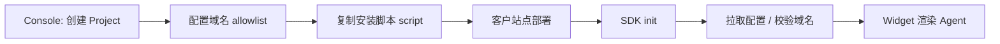
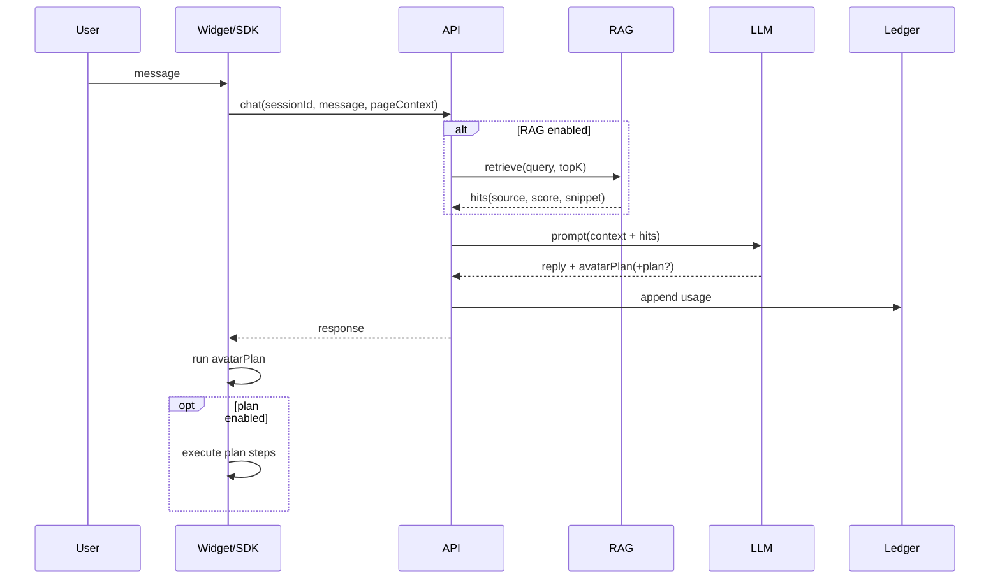
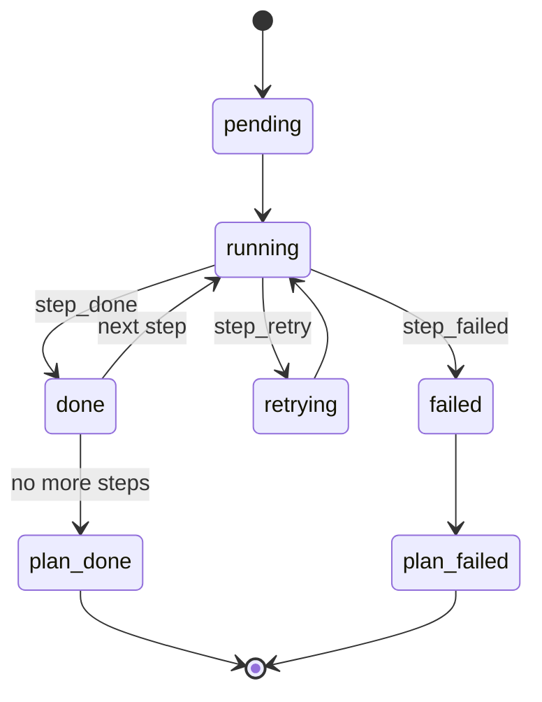

# Avue Agent 商业产品 PRD（不含支付实现）

版本：v1.0  
作者：产品经理（整合现有代码能力与商业化路线）  
最后更新：2026-01-06  

> 目标：把当前“交互式二次元 Agent”打磨成可对外售卖、可交付、可运营、可规模化的商业产品。  
> 说明：你已明确“支付由自有安排”，本文不设计具体支付通道与结算实现，仅定义产品侧的 **Credits/用量模型、套餐结构、对外接口与运营策略**。

---

## 0. 变更记录

- 2026-01-05：前端运行时将“动作/表情优先级仲裁”模块化，为后续企业级可扩展的动作驱动核心做准备（减少在单一组件内堆叠状态与逻辑）。
- 2026-01-05：AvatarPlan 表情统一走仲裁入口；动作仲裁支持按 channel 隔离状态，降低未来扩展成本。
- 2026-01-05：VRM 基线动作从 lerp 迁移到阻尼平滑（damp），降低僵硬感并提升帧率波动下的稳定性。
- 2026-01-05：补齐 VRM 运行期调试入口（bones/box/refit）并在 AgentDebug 增加 VRM 调试面板，提升定位与复现效率。
- 2026-01-06：修复运行时引导高亮矩形的 requestAnimationFrame 循环未清理导致的潜在泄漏问题。
- 2026-01-06：补齐“产品交付缺陷/漏洞/缺失项”审查：直连密钥风险、plan 代操作安全边界、prompt injection 对策、全局 hook 副作用与可追溯要求。
- 2026-01-06：加强 plan 执行安全与稳健性：阻断危险 selector（如 `*` / `:has(...)`）与敏感输入目标；补齐 localStorage 访问容错，避免禁用存储导致崩溃。
- 2026-01-06：修复 VRM 动作播放期抽动：动作/程序化动作期间冻结注视目标（头/眼），避免与动画骨骼争用。
- 2026-01-06：升级 VRM 朝向锁定算法：从硬赋值改为最短角度阻尼收敛，并在动作/程序化动作期间自动暂停以避免骨骼争用。

## 1. 产品概述

### 1.1 一句话定位
一个可嵌入任意网页/后台系统的拟人化 Agent：能实时反应用户行为、能聊天、能基于站内知识回答问题（RAG）、能对用户进行“可控引导/可控代操作”的任务执行；按 Credits 使用量计费。

### 1.2 核心价值（用户为什么愿意买）
- 降低学习成本：把复杂功能用“对话 + 引导操作”交付给新用户
- 降低客服成本：站内知识库问答（RAG）替代大量重复咨询
- 提升转化：在关键漏斗节点触发引导（注册/下单/创建/导出）
- 提升留存：拟人化陪伴与互动增强“停留时长/回访”
- 可观测可迭代：每次 RAG 命中、每次 plan 执行、每次失败归因可追踪

### 1.3 产品边界（必须清晰）
本产品必须硬隔离两条能力线：
- 表现层（avatarPlan）：动作、表情、说话气泡，**永远安全**
- 执行层（plan）：点击/输入/滚动等网页操作，**高风险，必须可控**

在任何商业交付中，默认模式建议是：
- 默认：仅引导（高亮、提示、推荐下一步）
- 可选：允许代操作（需要站点方显式开启并设置风险策略）

### 1.4 竞争格局与差异化（卖出去的关键词）
- 传统客服机器人：强在 FAQ，但弱在“可视化引导”和“站内任务完成”
- 通用聊天机器人：强在对话，但弱在“站点上下文、可观测、可控执行”
- 低代码引导工具：强在流程提示，但弱在“自然语言、知识库、个性化”

我们的差异化卖点（对外话术可直接复用）：
- “一句话接入”：一行 script 上线，5 分钟看到效果
- “能解释与可回放”：每次回答引用来源、每次动作有步骤回放与失败归因
- “默认安全”：默认只引导不代操作，高风险动作二次确认
- “拟人但不打扰”：动作编排、冷却与优先级仲裁，像人一样“懂分寸”

---

## 2. 目标用户与典型场景

### 2.1 用户画像（Personas）
- P1：独立开发者/小团队产品 Owner（自助购买，关注接入速度与效果）
- P2：SaaS 运营/增长（关注转化、留存、漏斗、A/B）
- P3：企业产品/IT（关注安全、权限、审计、稳定性、合规）
- P4：内容站/文档站站长（关注 SEO、内容转化、互动率）

### 2.2 场景（按优先级）
- S1（P0）：站内知识问答（RAG）+ 引用来源 + 拟人动作
- S2（P0）：新手引导（步骤提示、高亮目标、可选代操作）
- S3（P1）：表单辅助（解释字段、纠错提示、填表引导）
- S4（P1）：后台任务代办（重复性路径：创建、导出、配置）
- S5（P2）：营销活动页互动（关键节点触发：停留/滚动到某区/退出意图）
- S6（P2）：多语言站点（按用户语言自动切换）
- S7（P3）：企业知识库隔离（部门/角色可见范围）

### 2.3 购买与使用决策链（谁掏钱、谁接入、谁评估）
- 购买者（Owner/运营）：关心转化与成本、是否“能带来效果”
- 接入者（开发）：关心 5 分钟接入、域名白名单、安全边界、排障回放
- 评估者（企业/IT）：关心权限、审计、数据留存、合规与可私有化

MVP 阶段必须同时满足：
- 购买者能看到“效果数字”（对话解决、引导完成、RAG 命中）
- 开发者能看到“可控与可排障”（域名校验、回放、导出反馈包）
- 评估者能看到“安全策略”（默认不采集、敏感过滤、风险确认）

---

## 3. 成功指标（KPI/OKR）

### 3.1 北极星指标（North Star）
- 每 1000 次会话中“被 Agent 成功解决的问题数”
或
- Agent 引导完成的关键任务数（注册/下单/创建/导出）

### 3.2 产品指标体系
- 激活：接入后 24h 内触发 ≥1 次有效对话（含 RAG）
- 转化：试用→付费转化率、首充/首订转化率（支付实现外置）
- 留存：D7/D30 会话数、触发数、站点回访
- 质量：RAG 命中率、plan 成功率、plan 重试率、失败归因覆盖率
- 成本：每 1k 对话平均 tokens/credits 消耗；缓存命中率
- 安全：高风险操作拦截数、跨域/敏感采集拦截数

### 3.3 商业漏斗指标（卖出去必需）
- 访客→试用：Landing 到 Console 注册转化率
- 试用→接入：注册后 24h 完成安装校验的比例
- 接入→激活：首次 RAG 命中（含来源）的会话占比
- 激活→留存：D7 仍有会话的项目占比
- 留存→扩张：同一 Org 下新增 Project/域名的比例
- 口碑→增长：Demo 分享/嵌入次数、从案例页带来的试用数

---

## 4. 产品形态与交付方式

### 4.1 交付形态（商业化推荐）
1) SaaS 控制台（B 端）：配置、知识库、用量、回放、团队
2) 前端 SDK（嵌入式）：一行 script 即可接入站点
3) Agent Widget（前台）：展示与互动（VRM/Live2D）
4) 后端 API：会话、RAG、策略、用量、密钥、审计

### 4.2 商业交付套餐建议（不含支付实现）
- Free：注册送 credits、单项目、限频
- Starter：小站点，基础问答 + 引导
- Pro：团队、A/B、更多触发策略、回放与标注
- Enterprise：SSO、审计、专属部署、数据驻留（后续）

---

## 5. Credits（用量/计费）模型（不含支付通道）

> 目的：让“成本可控 + 定价可解释 + 用量可追溯”。  
> 支付外置时，credits 仍然是产品内部统一结算单位，支持你后续接任意支付体系。

### 5.1 Credits 扣费对象
- Chat（对话生成）
- RAG（检索 + rerank，可选）
- Embedding（入库索引）
- Plan Steps（网页操作执行步数）
- Background/Idle AI（背景反应/闲置 AI，可控）

### 5.2 用量定义（建议）
- Chat：按 tokens 换算 credits（不同模型可配置倍率）
- RAG 检索：每次检索固定 credits（按向量库成本调整）
- Embedding：按字符数/分块数计费（一次性或按月存储另算）
- Plan Steps：每步固定扣费（click/input/scroll/hover/press/wait）
- 失败扣费策略：失败步可按折扣计费或不计费（运营策略）

建议给出“可解释的价格锚点”（面向售卖话术）：
- 1 credits ≈ 1 次轻量对话或 1 次检索
- 典型一次问题：1 次 RAG + 1 次回答 ≈ 2–6 credits（视模型）
- 典型一次引导：3–8 steps ≈ 3–8 credits（不含对话）

### 5.3 余额策略与降级（必须产品化）
- 余额不足提醒：在 Console 与 Widget 同时提示（但不打断用户）
- 软降级：仅走本地规则（不调用模型），保留形象与基础提示
- 硬停用：拒绝 AI 请求并返回明确错误码（便于站点侧处理）
- 免费试用策略：送固定 credits；限制并发与频率；限制知识库规模

### 5.4 账本与可追溯（必须）
每次扣费要写入一条 Usage Ledger，包含：
- requestId / sessionId / projectId / userId（若有）/ timestamp
- trigger（chat / idle / background / task / admin-test）
- model（provider/modelName）
- tokens（input/output）
- ragHits（sources/topK，若触发）
- planSteps（执行步数、成功/失败、重试次数）
- creditsDelta（扣费变化）

---

## 6. 功能范围（Scope）分期

### 6.1 MVP（4–6 周：可卖出去）
- 账号系统（注册/登录/找回）
- Organization/Project 概念 + 域名白名单
- API Key/Project Key 管理
- SDK 一行接入 + Widget 渲染
- 基础对话 + RAG + 结果可观测
- 基础引导（高亮/提示）+ 可选 plan 执行（默认关闭）
- 控制台：项目配置、知识库上传/索引、会话与回放、用量报表
- Credits 余额/扣费/明细（不含支付）
- 风控：限流、滥用检测、开关降级
- 官网基础 SEO：落地页、Pricing、Docs、Blog 框架

### 6.2 Growth（8–12 周：规模化）
- A/B 测试与触发策略编排
- Plan 失败修复闭环（失败上下文→再规划→继续执行）
- 更强 RAG：URL 抓取同步、版本发布/回滚、rerank
- 多模型路由与成本控制策略（缓存）
- 团队协作与权限（RBAC）
- 回放增强：触发事件 + RAG 命中 + plan 每步状态

### 6.3 Pro/Enterprise（12–20 周）
- SSO、审计日志、数据导出/删除、专属部署
- 权限隔离（部门知识库）
- SLA、告警、IP allowlist、私有化

---

## 7. 用户旅程（User Journey）

### 7.1 新用户从 0 到上线（必须 5 分钟完成）
1) 注册登录
2) 创建 Organization（自动）与 Project
3) 填写站点域名白名单
4) 复制一段安装代码（script）
5) 粘贴到站点并发布
6) 打开站点：Agent 出现
7) 在控制台点击“RAG 测试”：输入问题→看到命中文档片段→看到回答

关键阻塞点与产品解法：
- 阻塞点：不知道“脚本是否生效” → 解法：安装校验页（自动检测脚本、域名、网络）
- 阻塞点：不知道“知识库是否可用” → 解法：RAG 测试页必须展示 topK 片段与来源
- 阻塞点：担心“误操作风险” → 解法：默认仅引导 + 风险确认 + 白名单策略可视化

### 7.2 站点访客的体验路径
- 访客进入页面→Agent 在角落出现（可折叠）
- 访客提问→Agent 回答（可引用来源）
- 访客犹豫/卡住→Agent 触发引导（可配置）
- 访客完成任务→Agent 给予拟人反馈

### 7.3 B 端运营/售后路径（让客户“续费/转介绍”）
- 运营/Owner：看 Dashboard → 找出最有效的触发策略与页面 → 做 A/B（Growth）
- 售后/开发：遇到问题 → 打开回放 → 导出反馈包 → 复现与定位
- 产品迭代：标注 bad case → 匹配原因标签 → 修订知识库/触发策略/安全策略

---

## 8. 信息架构（IA）与页面清单（Console）

### 8.1 全局导航
- Dashboard（总览）
- Projects（项目）
- Knowledge Base（知识库）
- Conversations（会话/回放）
- Triggers（触发策略）
- Usage（用量/credits）
- Team（团队/权限）
- Settings（密钥/安全/导出）

### 8.2 页面与关键功能

#### 8.2.1 Dashboard
- 关键指标卡：
  - 今日会话数、RAG 命中率、plan 成功率、credits 消耗
- 最近异常：
  - 索引失败、用量激增、失败率突增

#### 8.2.2 Projects
- 新建/删除 Project
- 域名 allowlist
- SDK 安装代码生成（带 projectKey）
- Agent 外观配置（模型、大小、位置、主题、语言）
- 安全策略：
  - 仅引导 / 允许代操作
  - 禁止输入敏感字段（密码、验证码等）

#### 8.2.3 Knowledge Base
- Sources：
  - 上传文件（md/pdf/docx）
  - URL 抓取（Growth）
  - 同步（Growth）
- Index：
  - 分块策略（chunkSize、overlap）
  - embedding 进度与版本
- RAG Debug：
  - 输入 query，展示 topK 命中文档片段（source、score、片段预览）
  - 支持一键复制“检索上下文”用于排查

#### 8.2.4 Conversations / Replay
- 会话列表（按时间、用户、页面、触发源）
- 会话详情：
  - messages（用户/agent）
  - ragHits（引用）
  - plan（若有）
  - plan 执行过程（成功/失败/重试）
- 标注系统（Growth）：
  - good/bad、原因标签（RAG不准/执行失败/语气不对/不安全）

#### 8.2.5 Triggers（Growth 可先占位）
- 触发器配置：
  - Idle（闲置时长）
  - Scroll depth
  - Exit intent
  - Funnel step（站点事件上报）
- 策略编排：
  - 条件 + 冷却 + 权重 + 优先级

#### 8.2.6 Usage（Credits）
- 当前余额（credits）
- 用量图表（按天、按触发源、按模型）
- Ledger 明细（可导出 CSV）
- 余额不足策略：
  - 降级：仅本地快轨，不调用 AI
  - 停止：完全禁用 AI 能力，仅显示 Agent 外观

#### 8.2.7 Team / Settings
- 成员邀请、角色（Owner/Admin/Dev/Analyst）
- API Keys 管理（创建/禁用/轮换）
- 安全策略（IP allowlist：Enterprise）
- 数据导出/删除（Enterprise）

---

## 9. Agent 运行时能力（对外卖点 + 内部约束）

### 9.1 能力清单（对外）
- 拟人化形象：VRM/Live2D，可选人物与语气（人设）
- 实时反应：鼠标悬停、拖拽、点击、闲置、页面变化
- 聊天问答：支持多语言
- 知识库问答（RAG）：引用来源，可观测
- 引导/代操作（plan）：可配置，默认关闭
- Debug/回放：可导出反馈包（用于售后）

### 9.2 安全策略（对外合同级）
- 默认不采集输入内容（可配置白名单）
- 禁止密码/验证码输入的代操作
- 禁止跨域导航与外链点击（除非 allowlist）
- 高风险操作（提交/删除/支付/下载）必须二次确认（计划）

### 9.3 与当前代码的映射（现有能力）
- Agent 编排中心： [Agent.vue](file:///g:/AvuePro/newPro/frontend/src/agent/components/Agent.vue)
- plan 执行器： [useTaskExecutor.ts](file:///g:/AvuePro/newPro/frontend/src/agent/composables/useTaskExecutor.ts)
- avatarPlan：同上（Agent 内执行器）
- RAG 能力与调试： [AgentDebug.vue](file:///g:/AvuePro/newPro/frontend/src/views/AgentDebug.vue) 与后端 [server.js](file:///g:/AvuePro/newPro/backend/server.js)

### 9.4 商业化缺口（必须补齐才能“可卖/可交付/可规模化”）

- 多租户与权限体系未闭环：需要 Org/Project/User/Roles 的持久化模型、RBAC、成员邀请与审计可追溯。
- Project 配置与域名校验未产品化：需要可下发配置（allowlist、开关、风控策略、模型路由、限额）、SDK 初始化校验与版本管理。
- API Key/密钥体系未交付级：需要密钥轮换、禁用、泄露处理、按 Project 限额与按 Key 追踪用量。
- Usage Ledger 目前缺乏“可信账本”落地：需要幂等写入（requestId）、可导出、可对账、可按维度聚合（project/session/user/trigger/model）。
- RAG 目前缺乏“入库→检索→引用→评估”闭环：需要分块/embedding/向量库、权限隔离、引用来源展示、离线评估集与命中率监控。
- 可观测性仍偏“开发调试”：商用需要 Trace/Replay/错误分类与告警、黑盒指标（成功率/延迟/成本）与可检索日志。
- 安全与合规边界需要前后端双层硬约束：PII 脱敏、敏感输入永不采集/永不代填、高风险 step 必须二次确认/allowlist、跨域与外链策略不可绕过。
- 成本控制缺少“策略面板”：缓存、限流、并发控制、多模型路由、超限降级与告警阈值，需要可配置且可回放验证。
- 交付与售后缺少标准化资产：安装检查、回放导出、反馈包上传、复现脚本、版本回滚与兼容矩阵（浏览器/框架/站点类型）。

---

## 10. 核心流程图（文字版）

### 10.1 接入流程（Installation）
```text
----------+       +-----------+       +------------------+
|  Console | ----> | Project   | ----> | 生成 script 代码    |
----------+       +-----------+       +------------------+
                                           |
                                           v
                                      客户站点部署
                                           |
                                           v
                                      SDK init + 拉取配置
                                           |
                                           v
                                      Widget 渲染 Agent
```



### 10.2 一次对话（含 RAG 与扣费）
```text
User -> Widget: 输入问题
Widget -> API: chat(sessionId, message)
API -> RAG: retrieve topK（可选）
API -> LLM: prompt(含上下文 + ragHits)
LLM -> API: reply + avatarPlan(+可选plan)
API -> UsageLedger: 记录 tokens/credits/来源/命中
API -> Widget: 返回结果
Widget: 执行 avatarPlan；按策略决定是否执行 plan
```



### 10.3 任务执行（plan）状态机
```text
pending -> running(step_start) -> done(step_done) -> next
                         |
                         v
                    retry(step_retry)
                         |
                         v
                    failed(step_failed) -> plan_failed
```



---

## 11. UI 设计（线框图 + 组件拆解）

> 说明：你要求“UI 设计图”，在 PRD 阶段先用线框图与组件清单表达。后续可把这些线框图直接交给设计师产出 Figma。

### 11.1 官网首页（Landing）
```text
--------------------------------------------------------------+
| LOGO | 产品 | 价格 | 文档 | Blog | 登录 | 立即试用           |
--------------------------------------------------------------+
| 主标题：让你的网站拥有一个会说话、会引导的二次元 Agent        |
| 副标题：RAG 问答 + 引导/代操作 + 可观测，按 Credits 计费      |
| [CTA] 免费试用  [CTA2] 观看演示（30s）                        |
| [Demo] 三段动图：问答/高亮引导/表单辅助                        |
--------------------------------------------------------------+
| 场景卡片：Onboarding / FAQ / Admin task                      |
| 客户案例/评价                                                 |
| FAQ（含结构化数据 schema）                                    |
--------------------------------------------------------------+
```

### 11.1.1 登录/注册（Console）
```text
--------------------------------------------------------------+
| LOGO                                                       |
--------------------------------------------------------------+
| 标题：开始试用 Avue Agent                                   |
| [Email] [Password]                                          |
| [按钮] 登录  [链接] 忘记密码                                |
| 分割线                                                      |
| [按钮] 使用邮箱注册（或第三方登录：后续）                    |
--------------------------------------------------------------+
| 底部：隐私/条款提示（企业客户会看）                           |
--------------------------------------------------------------+
```

### 11.1.2 上线向导（5 分钟 Onboarding Wizard）
```text
Step 1: 创建 Project（名称/站点类型）
Step 2: 配置域名 allowlist（输入域名 + 自动校验）
Step 3: 复制安装脚本（复制按钮 + 安装检查入口）
Step 4: 安装检查（检测脚本是否加载/是否域名匹配/版本）
Step 5: 知识库上传（拖拽上传 + 索引进度）
Step 6: RAG 测试（query -> hits -> answer -> credits）
Step 7: 发布上线（生成 “完成接入” checklist）
```

### 11.2 Console：Project 概览
组件清单：
- ProjectHeader（状态、域名、开关）
- InstallSnippetCard（复制 script、校验域名）
- KPI卡片（会话数、命中率、失败率、credits）
- RecentSessionsTable（进入回放）
- AlertsPanel（异常）

页面必须包含“卖点强化区”（提高试用转化）：
- “下一步建议”：未完成接入时，提示最短路径（例如：先上传 1 个 md）
- “Demo 模板按钮”：一键导入示例知识库与示例触发器（后续）
- “效果提示”：展示“已解决问题数/引导完成数”的累计（哪怕初期为 0）

### 11.3 Knowledge Base
组件清单：
- SourceUploader（拖拽上传/进度）
- SourceList（状态：处理中/失败/已发布）
- ChunkingConfig（可选）
- RagTestPanel（query→topK）
- IndexVersionControl（发布/回滚：Growth）

RagTestPanel 的最低可用交互（售后排障必备）：
- 顶部：query 输入 + topK + model 选择（若多模型）
- 中部：命中片段列表（source、score、片段、复制按钮）
- 底部：最终回答 + 引用列表 + 本次扣费摘要（tokens/credits）

### 11.4 Conversations/Replay
组件清单：
- SessionList（过滤：日期/触发源/页面）
- SessionTimeline（messages + events）
- RagHitsPanel（source/score/片段）
- PlanStepsPanel（每步状态/重试/失败原因）
- ExportButton（导出反馈包）

### 11.5 Usage / Ledger（买单前必须信任）
```text
--------------------------------------------------------------+
| 余额卡片：credits 当前余额 / 近 7 天消耗                      |
--------------------------------------------------------------+
| 折线图：按天 credits 消耗                                    |
| 分布图：按 trigger（chat/rag/task/idle）                      |
--------------------------------------------------------------+
| Ledger 表格：timestamp | requestId | trigger | credits | ... |
| [过滤] 日期、project、sessionId、model、errorOnly             |
| [导出] CSV                                                    |
--------------------------------------------------------------+
```

---

## 12. SEO 与宣发（卖出去的关键）

### 12.1 SEO 基础（必须）
- 站点生成 sitemap.xml / robots.txt
- 关键页（首页/价格/用例/文档）需要可索引与快速加载
- FAQ 结构化数据（FAQPage schema）
- 多语言：hreflang（如果做）
- Core Web Vitals：LCP/CLS 优化（首屏视频/动图要懒加载）

### 12.1.1 SEO 信息架构（建议最小集合）
- /（首页）
- /pricing（不含支付，但可展示套餐与 credits 逻辑）
- /use-cases/*（场景页：文档站、SaaS 后台、电商活动页）
- /docs/*（接入与排障）
- /blog/*（内容增长）
- /security（安全白皮书简版）

### 12.2 内容策略（关键词簇 + 内容计划）
核心关键词簇：
- “网站 AI 助手 / Website AI Agent”
- “文档站 RAG 问答 / RAG for docs”
- “新手引导 AI / onboarding agent”
- “表单填写助手 / form assistant”

内容计划（前 30 篇建议题目模板）：
- “如何在 5 分钟给你的网站加一个 AI Agent（附代码）”
- “RAG 问答：为什么你的机器人答不对？（含调试方法）”
- “从客服到增长：Agent 如何提升转化率”
- “如何安全地做网页代操作（plan）”
- “如何让虚拟角色更拟人：动作编排与仲裁”

### 12.3 宣发渠道（不依赖支付）
- 产品发布平台：Product Hunt、Indie Hackers
- 国内内容：掘金、知乎、小红书、B站
- 海外内容：YouTube Shorts/Twitter demo threads
- Demo 站点：提供可交互的在线体验（最强转化）

### 12.4 素材清单（必须准备）
- 30 秒演示视频（首页首屏）
- 3 个场景动图（问答、引导、表单）
- 10 张控制台截图（配置、知识库、回放、用量）
- 3 个真实案例（哪怕是你自己的站点/样板客户）

### 12.5 上线节奏（从 0 到“有人买”）
- 第 1 周：官网上线 + Demo 站 + 3 篇“接入教程”内容
- 第 2 周：发布 Product Hunt + 国内平台同步 + 引流到试用
- 第 3–4 周：收集 10 个真实站点接入，沉淀 3 个案例页
- 第 5–6 周：做触发策略与回放增强，形成“可度量的增长故事”

---

## 13. 里程碑（超细：60+ 个里程点）

> 说明：你要求“分好几十个里程点”，以下按“可交付成果”拆分，每个里程点都可作为一个 Sprint/Issue。

### Phase A：商业化 MVP（A01–A28）
- A01：账号注册/登录/退出（最小闭环）
- A02：组织（Org）创建与切换
- A03：Project 创建/删除
- A04：Project 域名白名单配置与校验
- A05：Project Key 生成/禁用/轮换
- A06：SDK 最小接入（script 注入 + 拉取配置 + 渲染）
- A07：SDK 域名校验失败提示（防盗用）
- A08：会话 sessionId 管理（刷新/路由变化）
- A09：Agent 配置：位置、大小、语言、主题
- A10：Agent 安全模式：仅引导/允许代操作开关
- A11：知识库上传（md）与存储
- A12：分块策略默认值与可配置项
- A13：embedding 入库任务队列（MVP 可同步/简易队列）
- A14：检索 topK + 注入 prompt
- A15：RAG 可观测：记录 source/score/片段摘要
- A16：对话 API：基础聊天 + persona
- A17：对话 API：添加 credits 计量字段（不含支付）
- A18：Credits 钱包：余额展示
- A19：Usage Ledger：每次请求写入明细
- A20：用量报表：按天聚合（会话数、credits、命中率）
- A21：会话列表：按时间/页面/触发源
- A22：回放页：messages + ragHits + planSteps
- A23：导出反馈包（售后必备）
- A24：限流（project 维度）+ 余额不足降级
- A25：安全过滤：禁止采集敏感输入、禁止跨域导航
- A26：官网落地页（最小）+ docs（最小）+ pricing（文字）
- A27：3 个演示场景页面（Demo）
- A28：Beta 发布：首批客户接入 checklist

### Phase B：增长与稳定（B01–B22）
- B01：多模型路由（按 trigger/复杂度）
- B02：prompt 模板版本化（灰度）
- B03：缓存策略（相似问题缓存、RAG 缓存）
- B04：URL 抓取入库（文档中心）
- B05：知识库版本发布/回滚
- B06：RAG rerank（可选）
- B07：触发策略中心（Idle/scroll/exit intent）
- B08：站点自定义事件（SDK 事件上报）
- B09：漏斗触发（关键行为触发引导）
- B10：plan 执行断言（expect：出现某文案/按钮变更）
- B11：plan 失败归因结构化（DOM 摘要/候选 selector）
- B12：plan 修复闭环（失败→修复 plan→继续）
- B13：回放增强：事件时间线
- B14：标注系统：好/坏 + 原因标签
- B15：运营看板：转化贡献（与站点事件关联）
- B16：团队协作：成员邀请/角色
- B17：审计日志（基础）
- B18：告警：用量激增/失败率激增/索引失败
- B19：状态页（status）
- B20：客户成功：接入向导/检查工具（脚本检测）
- B21：模板库：电商/文档站/后台系统
- B22：案例页与内容 SEO 体系启动（20 篇）

### Phase C：企业化（C01–C18）
- C01：SSO（OIDC/SAML）
- C02：部门级知识库隔离
- C03：IP allowlist
- C04：更细 RBAC（资源级）
- C05：数据导出/删除（合规）
- C06：审计日志增强（谁改了什么）
- C07：专属部署/私有化方案
- C08：SLA/容量规划/队列化
- C09：安全扫描与渗透测试流程
- C10：合同与法务包（隐私/数据处理）
- C11：企业 onboarding 手册（交付）
- C12：多区域部署（数据驻留）
- C13：BYO Key（客户自带模型 Key）
- C14：专属模型/专属向量库配置
- C15：工单系统与客户成功机制
- C16：大客户回放与审计导出
- C17：灾备与恢复演练
- C18：年度路线图与行业方案

---

## 14. 开发拆解（前端/后端/算法/运营）

### 14.1 前端（Console + SDK + Widget）
- Console：
  - Projects/KB/Replay/Usage/Team/Settings 页面
  - 表单系统、权限控制、导出、图表
- SDK：
  - script 注入、配置拉取、事件上报、版本管理、域名校验
- Widget/Agent：
  - 多主题、可折叠、可拖拽、消息气泡、引导高亮
  - 安全模式（仅引导/允许代操作）

### 14.2 后端（API + RAG + Usage）
- Auth/Org/Project/Keys
- Session/Chat/RAG
- KB pipeline（上传/分块/embedding/索引）
- Usage Ledger 与聚合报表
- 风控与限流
- 回放存储与导出

#### 14.2.1 MVP API 清单（建议）
Auth：
- POST /api/auth/register
- POST /api/auth/login
- POST /api/auth/logout
- POST /api/auth/forgot-password

Org/Project：
- GET /api/orgs
- POST /api/projects
- GET /api/projects/:projectId
- PATCH /api/projects/:projectId（域名 allowlist/开关/外观配置）
- POST /api/projects/:projectId/keys（创建 key）
- POST /api/projects/:projectId/keys/:keyId/rotate
- POST /api/projects/:projectId/keys/:keyId/disable

Knowledge Base：
- POST /api/kb/upload（返回 sourceId）
- GET /api/kb/sources（列表与状态）
- POST /api/kb/sources/:sourceId/index（触发索引）
- POST /api/kb/rag/test（返回 hits + answer）
- POST /api/embed/fs（已具备：本地文件索引，用于调试/管理）

Chat/Session：
- POST /api/chat（输入 message/pageContext，输出 reply/avatarPlan/plan/ragHits/usage）
- GET /api/sessions（列表）
- GET /api/sessions/:sessionId（详情）
- GET /api/sessions/:sessionId/export（反馈包导出）

Usage：
- POST /api/usage/ingest（写入/幂等更新，按 requestId）
- GET /api/usage/summary（按天聚合）
- GET /api/usage/ledger（明细）

约定（最小可用）：
- requestId：每次 AI 请求唯一，用于幂等写入与追溯
- sessionId：前端为每个浏览器 tab 生成（用于会话级聚合）
- projectId：默认取当前 host（用于项目级聚合；后续接入 Project/Key 体系可替换）

#### 14.2.2 数据模型（最小表）
- orgs(id, name, createdAt)
- users(id, orgId, email, passwordHash, role, createdAt)
- projects(id, orgId, name, domainAllowlist, settingsJson, createdAt)
- project_keys(id, projectId, keyHash, status, createdAt, rotatedAt)
- kb_sources(id, projectId, type, filename, status, metaJson, createdAt)
- kb_chunks(id, sourceId, chunkIndex, content, embeddingRef, createdAt)
- sessions(id, projectId, visitorId, pageUrl, createdAt)
- session_events(id, sessionId, type, dataJson, createdAt)
- usage_ledger(id, projectId, sessionId, requestId, trigger, creditsDelta, tokensIn, tokensOut, ragMetaJson, planMetaJson, createdAt)

### 14.3 算法（你要“研究算法”的落点）
- RAG：
  - 分块：按标题/段落/代码块规则分块
  - 检索：topK + query rewrite（可选）
  - rerank：只在低置信度时启用（省成本）
- Plan：
  - 断言 expect + 失败归因摘要
  - 修复回路：让模型输出“备选 selector + 解释”
- 行为策略（活感）：
  - Utility-based 行为选择器（可解释得分）
  - softmax 采样（可控随机）
  - 冷却与锁（避免抽动与刷屏）

#### 14.3.1 “拟人但可控”的动作系统定义（产品可讲清楚）
动作系统需要把“真实感”拆成可控参数：
- 触发：来自 user 行为、plan 事件、idle、RAG 命中/失败
- 仲裁：优先级（用户 > 计划 > AI > idle）+ 冷却时间 + 抢占规则
- 序列：一个意图拆成 2–3 个短动作（开场/主动作/收尾），避免僵硬
- 反馈：成功/失败/重试都要有不同反应，降低“机器感”

与当前实现的对应：
- 动作白名单与归一化：见 [Agent.vue](file:///g:/AvuePro/newPro/frontend/src/agent/components/Agent.vue)
- plan 步骤事件：见 [useTaskExecutor.ts](file:///g:/AvuePro/newPro/frontend/src/agent/composables/useTaskExecutor.ts)

### 14.4 运营/售前/交付
- Demo 站点（强转化）
- Onboarding checklist（5 分钟接入）
- 反馈包导出与复现流程（售后）
- 内容 SEO 与案例沉淀

---

## 15. 风险与对策

- 成本失控：
  - tokens 限额、缓存、多模型路由、触发限频
- plan 误操作：
  - 默认仅引导；高风险动作强制确认；敏感 selector 黑名单
- 隐私风险：
  - 默认不采集输入值；敏感字段过滤；域名白名单
- 效果不稳定：
  - RAG 可观测；低置信度提示策略；标注→持续迭代
- 接入困难：
  - 一键复制脚本；站点检测工具；Demo/视频教程
- prompt injection / 越权引导：
  - RAG 片段只作为数据引用；策略层硬约束代操作；高风险动作不可由模型自证
- 账单纠纷（用量不可对账）：
  - Usage Ledger 幂等写入 + 可导出 + 可重算；按 requestId/sessionId/projectId 可追溯
- 多租户数据串扰：
  - 强制 projectId 域隔离；向量库分 namespace；审计日志与数据导出/删除流程
- 线上问题无法复现：
  - Replay + 反馈包标准化；错误分类码统一；关键配置快照随会话落盘
- 合规与数据驻留压力：
  - 企业版支持私有化/专属部署；数据保留策略与删除请求（DSR）流程
- 滥用与攻击（刷 tokens/恶意 plan）：
  - WAF/限流/黑名单；风险策略默认关闭 plan；敏感字段识别与拦截

### 15.1 当前实现对照下的“必须补齐”清单（交付阻塞项）

#### 15.1.1 密钥与模型调用边界（P0）

现状对照：
- 前端存在 `direct` 直连大模型的能力（见 [aiService.ts](file:///g:/AvuePro/newPro/frontend/src/agent/services/aiService.ts)），需要 `VITE_GEMINI_API_KEY`。

交付结论：
- 商业交付默认必须禁用 direct（或仅允许本地/内网环境），线上一律走后端 proxy 持钥。

验收项：
- 线上构建物不包含可用的模型 API Key。
- 后端具备：限流、鉴权、按 project/key 计量、审计、封禁与告警。

#### 15.1.2 plan 代操作默认安全（P0）

现状对照：
- 前端 plan 执行器已实现基础裁剪与敏感输入拦截（见 [useTaskExecutor.ts](file:///g:/AvuePro/newPro/frontend/src/agent/composables/useTaskExecutor.ts)）。

交付缺口：
- 高风险动作确认/禁止仍未达到合同级“默认安全”：提交/删除/下载/支付/发码等必须强制二次确认或默认禁用。
- 缺少项目级策略配置下发（allowlist/denylist、敏感 selector 黑名单、域名策略等）与不可绕过策略执行。

验收项：
- 默认仅引导，未显式开启前不得执行 click/input/press/navigate。
- 开启代操作后，高风险步骤必须触发确认或被强制拒绝，并且记录确认凭证（requestId/sessionId/user）。

#### 15.1.3 prompt injection 与越权引导（P0）

现状对照：
- 前端会上送 `pageContext` 与 `projectKnowledge` 作为模型上下文（见 [pageContext.ts](file:///g:/AvuePro/newPro/frontend/src/agent/utils/pageContext.ts)、[projectKnowledge.ts](file:///g:/AvuePro/newPro/frontend/src/agent/data/projectKnowledge.ts)）。

交付缺口：
- 缺少“外部内容只作数据引用”的系统级防注入提示与裁剪规则。
- 缺少后端/策略层二次校验：模型输出的 plan 不得自证安全，必须经策略判定。

验收项：
- 注入测试样例（页面/知识库含“忽略规则/点击删除/导出数据”等）不能导致危险操作被执行。
- 对被裁剪/被拒绝的 plan 要可追溯：原因码 + 原始字段摘要（脱敏后）。

#### 15.1.4 可观测性与对账（P1）

交付缺口：
- Usage Ledger 需幂等、可导出、可聚合、可对账；并与 requestId/sessionId/projectId 打通。

验收项：
- 任意一次对话或 reaction 都能在 ledger 查询到：触发源、模型、tokens、credits、ragHits（如有）、planSteps（如有）。

---

## 16. 验收标准（上线前必须满足）

### 16.1 MVP 上线验收（硬指标）
- 从注册到站点出现 Agent ≤ 5 分钟
- Knowledge Base 上传后 ≤ 3 分钟可检索（小文档）
- RAG 回答可展示命中来源（至少后台可见）
- plan 默认关闭，开启后有明确风险提示与限制
- 用量可追溯：任意一次对话能在 ledger 查到扣费记录
- 失败可诊断：执行失败能看到 failureContext/重试次数

### 16.2 商业交付验收（客户成功）
- 提供“接入检查清单”
- 提供“导出反馈包”与复现步骤
- 提供“隐私与采集策略说明”

### 16.3 可观测与排障验收（必须能定位问题）
- 任意一次对话可在回放中看到：messages、ragHits、usage、planSteps（若有）
- 任意一次 RAG 可看到：topK 命中列表、source、score、片段预览、query
- 任意一次 plan 失败可看到：失败步、重试次数、failureContext（候选 selector/DOM 摘要）
- 导出反馈包可在离线环境复现基本上下文（不含敏感数据）

### 16.4 安全与风险验收（默认安全可卖）
- 默认仅引导：未显式开启前，Widget 不执行任何点击/输入
- 域名校验生效：非 allowlist 域名加载时明确拒绝并提示
- 敏感输入防护生效：密码/验证码/支付相关字段永不被采集、永不被代填
- 高风险动作确认：提交/删除/下载等动作触发二次确认（或强制禁用）

### 16.5 性能与稳定性验收（可规模化）
- SDK 加载不阻塞主线程：首屏不显著影响 LCP
- Widget 异常不影响站点业务：错误隔离与降级策略生效
- API 限流与熔断可用：超限返回稳定错误码与可读 message
- 成本可控：支持设置 project 级 tokens/credits 上限与告警阈值
