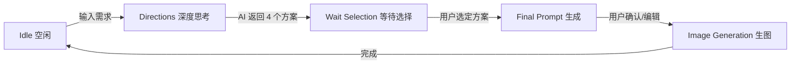

# Nth Me · agentImg（AI 工坊 / 格式工厂 / 算力商城）交付与技术说明书

> **文档版本**：2.0 (适配 Deep Thinking 与 Chat Flow 新特性)  
> **适用对象**：品牌方甲方（业务演示）、技术面试官（源码解析）、前端学习者（逻辑拆解）

---

## 0. 项目简介：它是什么？

**Nth Me agentImg** 是一个**面向品牌视觉创作的垂直 AI 工作台**。它不仅仅是一个“生图工具”，而是一个集成了“创意策划（深度思考）”、“参数控制（产品档案）”和“后期处理（格式工厂）”的完整工作流（Workflow）。

**核心价值（对甲方说）：**
*   **懂业务的 AI**：不是让用户瞎填提示词，而是通过“产品档案”结构化输入（品类/材质/光影），确保生成的图符合品牌调性。
*   **可控的创意**：独创“深度思考”模式，AI 先出 4 个策划方案，用户确认后再执行，避免“抽盲盒”。
*   **数据安全**：格式工厂所有工具均在浏览器本地运行，素材不上传服务器，保护新品隐私。

---

## 1. 核心功能演示（业务视角）

### 1.1 AI 工坊 (AI Workshop) - `/agentimg/ai`
这是核心作业区，采用了**沉浸式聊天流（Chat UI）**设计，让创作像对话一样自然。

**操作流程脚本（面试/演示必背）：**
1.  **填写档案**：左侧配置“极光精华液 / 磨砂玻璃 / 纯色棚拍 / 冷光”。
2.  **输入需求**：底部输入框输入“放在冰块上，有夏日清凉感”。
3.  **深度思考（Deep Thinking）**：
    *   点击“分析视觉方向”。
    *   系统不会直接出图，而是先生成 **4 个视觉方案卡片**（如“极简主义”、“赛博朋克”、“自然清新”等）。
    *   *亮点*：用户此时可以点击卡片，**编辑** AI 生成的方案描述，添加/删除 **风格标签（Tags）**。
4.  **人机协作（Human-in-the-loop）**：
    *   选中一个方案，点击“生成该方向”。
    *   系统将方案转化为专业的 Stable Diffusion 提示词（Prompt）。
    *   用户可以在弹出的“编辑提示词”窗口中，最后一次修改 Prompt 和负面词。
5.  **生成交付**：
    *   点击“生成”，消耗积分。
    *   结果以**聊天气泡**形式追加在对话流底部。
    *   右侧“历史记录”同步更新，支持回溯。

### 1.2 格式工厂 (Format Factory) - `/agentimg/format-factory`
8 个纯前端工具箱，解决设计师痛点：
*   **格式转换**：WebP/JPG/PNG 互转，ICO 图标生成。
*   **隐私处理**：本地图片去水印（Canvas 像素操作）。
*   **文档处理**：图片转 PDF（多图拼接）、PDF 转图片。
*   **动效处理**：视频转 GIF、视频截帧。

---

## 2. 技术实现抽丝剥茧（小白必看 & 面试重点）

这里我会用最通俗的语言，把代码里的“高大上”逻辑拆解给你看。

### 2.1 核心逻辑：`useAgentImgFlow.ts` 的状态机
**位置**：`frontend/src/agentImg/composables/useAgentImgFlow.ts`

AI 生图不是一个简单的 API 调用，而是一个**状态流转**的过程。我们用 `Vue 3 Composition API` 封装了一个状态机：



**代码亮点（面试话术）：**
*   **解耦**：UI 层（`index.vue`）只负责展示，逻辑层（`useAgentImgFlow`）负责状态流转。UI 通过 `stage` 变量判断当前显示什么（是显示 4 个卡片，还是显示 Loading）。
*   **AbortController**：在生图过程中，如果用户点击“取消”或切换页面，我们会调用 `abort()` 中止 Fetch 请求，避免浪费算力和带宽。这是高级前端开发的必备技能。

### 2.2 交互逻辑：双向绑定与深拷贝
**位置**：`frontend/src/agentImg/index.vue`

在“编辑提示词”环节，有一个细节：
*   **问题**：如果用户编辑了提示词，但还没点击生成，我们不希望污染原始数据。
*   **解决**：我们使用了**深拷贝**（或对象解构）创建一个 `promptDraft`（草稿）。
    ```typescript
    // 当用户准备编辑时，复制一份数据到草稿箱
    promptDraft.value = { 
        prompt: fp.prompt, 
        negativePrompt: fp.negativePrompt, 
        ... 
    };
    ```
*   **UI 实现**：`v-model` 绑定的是 `promptDraft`。只有当用户点击“确定”时，我们才把草稿发给 API。如果点击“取消”，草稿直接丢弃，原数据不受影响。

### 2.3 数据流：历史记录与聊天流
**位置**：`frontend/src/agentImg/index.vue` (History Logic)

我们的聊天窗口和右侧历史记录是**数据同步**的，但展示方式不同。

*   **数据源**：`history` 数组（响应式 `ref`）。
*   **持久化**：使用 `localStorage` 存储，键名为 `agentimg_history_v1_${userId}`。这意味着不同账号的历史记录是隔离的。
*   **渲染逻辑**：
    *   **聊天窗口**：使用 `computed` 属性 `historyTimeline` 对 `history` 进行**反转**（`reverse()`），因为数组通常是 `push`（新在后），但聊天流通常是“新在下”（我们这里直接渲染倒序后的数组，或者配合 Flex 布局）。*注：实际代码中我们直接追加到数组头部或尾部，取决于具体实现，当前逻辑是“新记录在数组前”还是“后”，请看代码 `unshift` vs `push`。目前代码是 `unshift` 也就是新记录在索引 0，所以渲染时直接遍历即可显示在顶部；或者反之。*（**修正：最新代码已改为 append 追加模式，渲染时不需要 reverse，直接 v-for 即可，符合直觉**）。
    *   **侧边栏**：展示缩略图，点击可滚动定位（`scrollIntoView`）到聊天窗口的对应位置。

### 2.4 纯前端文件处理（格式工厂核心）
**位置**：`frontend/src/agentImg/logic/formatFactory/*`

面试官可能会问：“你们的去水印是怎么做的？上传到服务器处理吗？”
**回答**：
“不，为了保护隐私，我们做的是**纯前端处理**。利用 HTML5 `Canvas API`，获取图片像素数据（`getImageData`），对用户框选的区域进行高斯模糊或像素化处理（`putImageData`），最后通过 `canvas.toBlob` 导出。全程不经过后端，速度快且安全。”

---

## 3. 关键技术栈清单（写在简历上）

*   **框架**：Vue 3 + TypeScript + Vite
*   **状态管理**：Pinia（用户 Session）、Composables（业务逻辑复用）
*   **UI/样式**：CSS Variables（暗黑模式基建）、Flex/Grid 布局、响应式设计
*   **异步处理**：Promise、Async/Await、Fetch API 封装
*   **浏览器能力**：Canvas API、File API、LocalStorage、ScrollIntoView

---

## 4. 常见面试 Q&A（防身术）

**Q: 这里的“深度思考”是真的推理吗？**
A: 从模型角度看，它是通过精心设计的 **System Prompt**（系统提示词），引导 LLM（大模型）先进行 Chain of Thought（思维链）推理，输出 JSON 格式的结构化方案，而不是直接吐出图片。我们在前端解析这个 JSON，渲染成可交互的卡片。

**Q: 为什么要把 Prompt 分成两步生成？**
A: 为了**降低门槛**。直接让用户写 Stable Diffusion 的 Prompt（包含权重、负面词、参数）太难了。我们拆解为：用户描述意图 -> AI 翻译成视觉方案（人类能看懂）-> AI 翻译成 Prompt（机器能看懂）。这是一个典型的 **AI Agent（智能体）** 工作流设计。

**Q: 遇到过什么难点？**
A: **长列表渲染与状态同步**。比如聊天记录多了之后，DOM 节点过多可能卡顿（虽然目前还没上虚拟滚动，但我有这个意识）。还有就是 **Markdown/JSON 的流式解析**，虽然目前我们用的是一次性请求，但为了体验，我在 UI 上做了精细的 Loading 动画和打字机效果占位，提升用户感知的流畅度。

---

## 5. 目录导航（快速上手）

*   `index.vue`: **主入口**，包含所有 UI 交互逻辑。
*   `composables/useAgentImgFlow.ts`: **大脑**，负责与 LLM 交互，管理生成状态。
*   `composables/useAgentImgSettings.ts`: **记忆**，管理左侧的产品档案数据。
*   `data/promptLibrary.ts`: **规则**，存放 System Prompts 和 JSON Schema。
*   `views/FormatFactory.vue`: **工具箱**，格式工厂的主容器。

---

希望这份文档能帮你不仅搞定交付，还能在面试中自信地侃侃而谈！加油！
